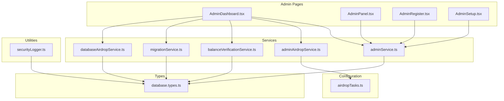
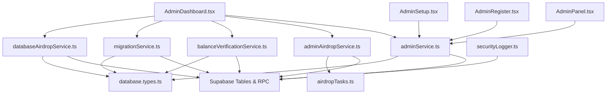
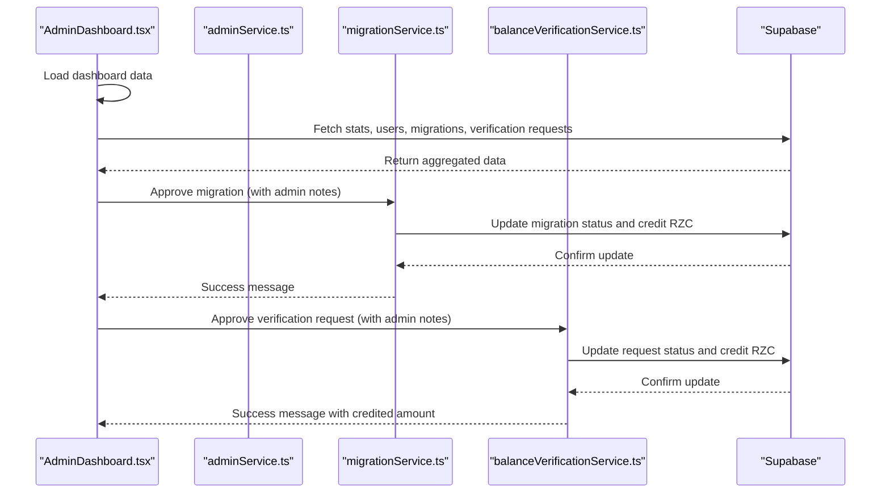
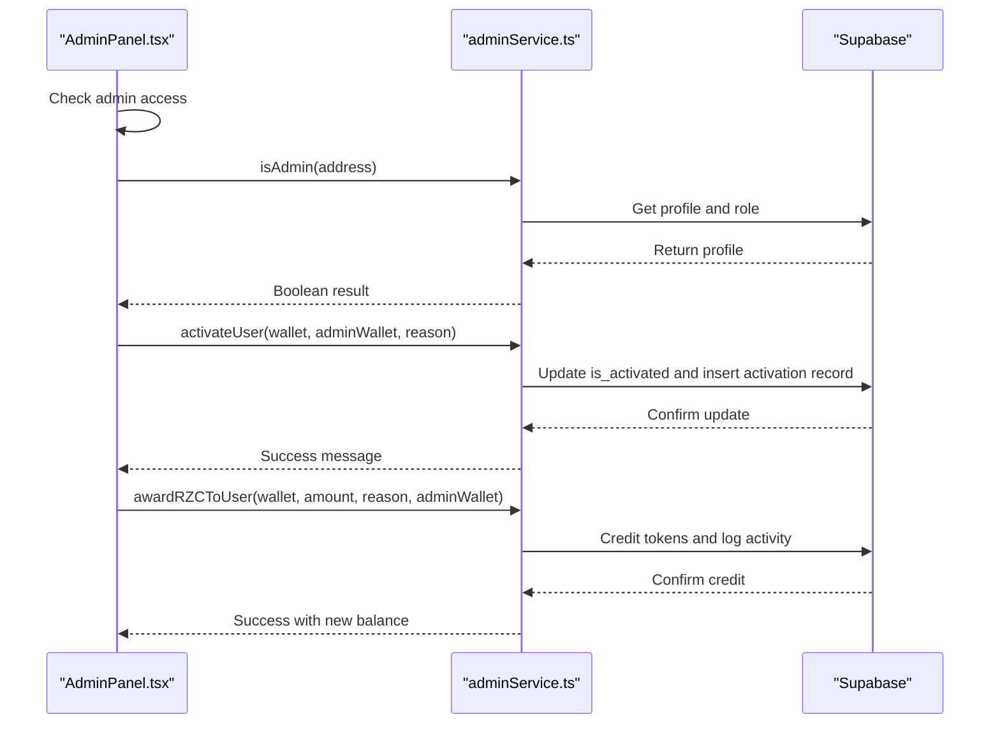
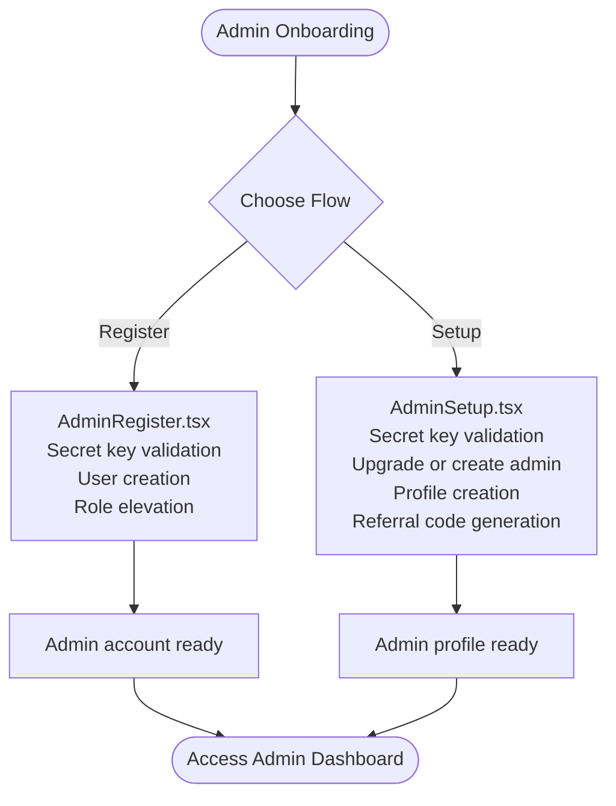
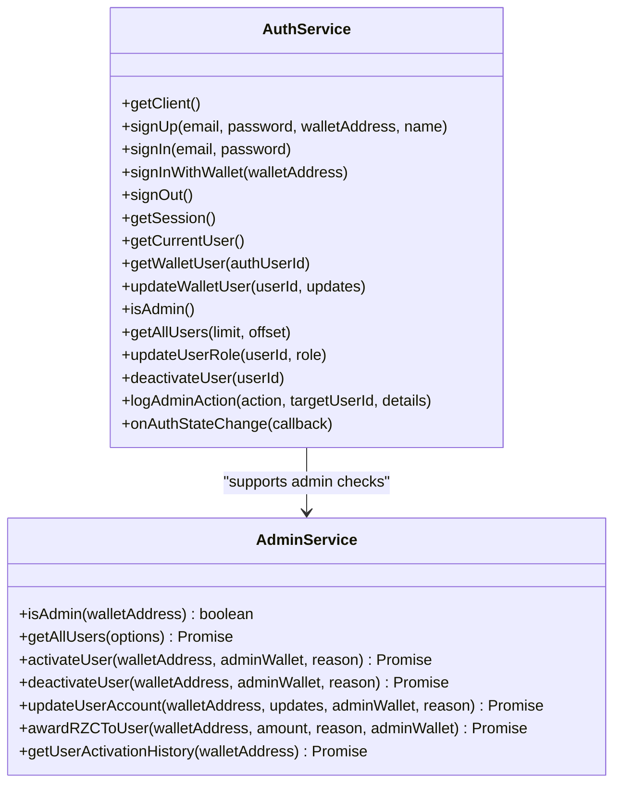
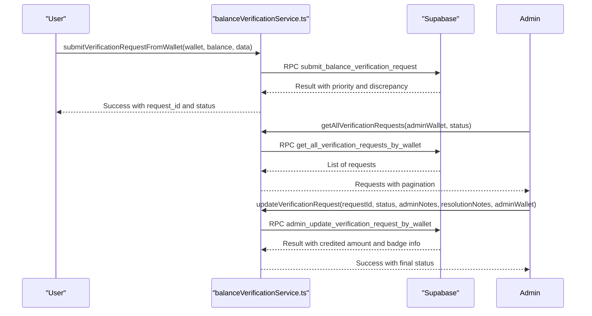
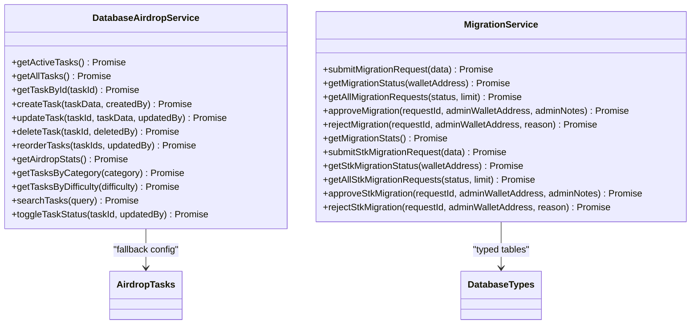
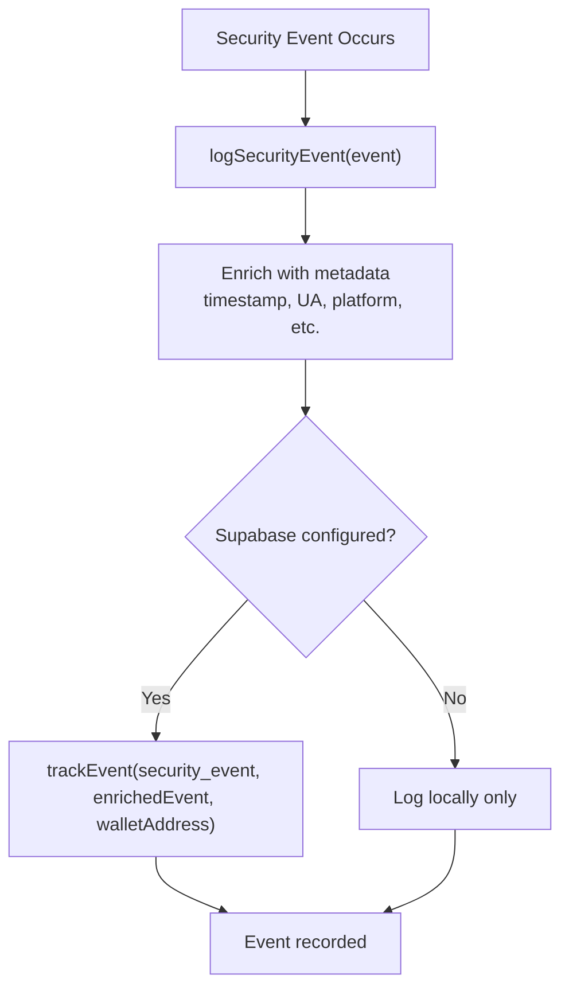
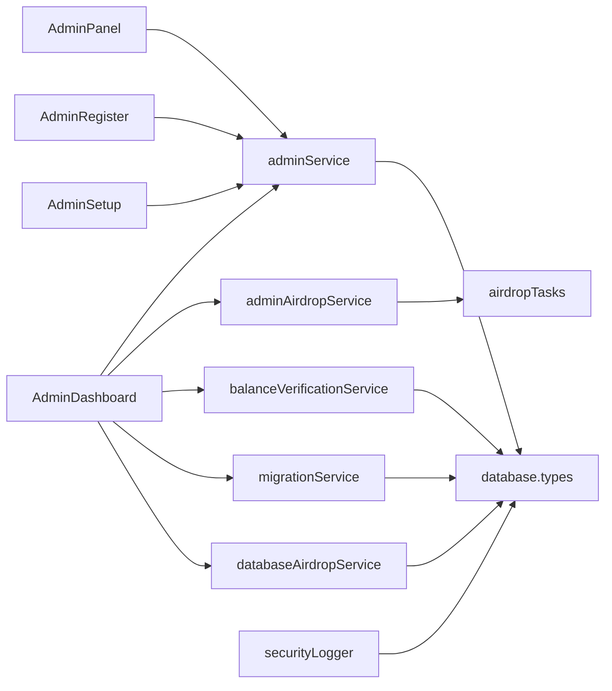

# Admin and Management Tools

<cite>
**Referenced Files in This Document**
- [AdminDashboard.tsx](file://pages/AdminDashboard.tsx)
- [AdminPanel.tsx](file://pages/AdminPanel.tsx)
- [AdminRegister.tsx](file://pages/AdminRegister.tsx)
- [AdminSetup.tsx](file://pages/AdminSetup.tsx)
- [adminService.ts](file://services/adminService.ts)
- [adminAirdropService.ts](file://services/adminAirdropService.ts)
- [balanceVerificationService.ts](file://services/balanceVerificationService.ts)
- [migrationService.ts](file://services/migrationService.ts)
- [databaseAirdropService.ts](file://services/databaseAirdropService.ts)
- [airdropTasks.ts](file://config/airdropTasks.ts)
- [authService.ts](file://services/authService.ts)
- [securityLogger.ts](file://utils/securityLogger.ts)
- [database.types.ts](file://types/database.types.ts)
</cite>

## Table of Contents
1. [Introduction](#introduction)
2. [Project Structure](#project-structure)
3. [Core Components](#core-components)
4. [Architecture Overview](#architecture-overview)
5. [Detailed Component Analysis](#detailed-component-analysis)
6. [Dependency Analysis](#dependency-analysis)
7. [Performance Considerations](#performance-considerations)
8. [Troubleshooting Guide](#troubleshooting-guide)
9. [Conclusion](#conclusion)

## Introduction
This document provides comprehensive documentation for the admin and management tools within the Rhiza Web Wallet platform. It explains the admin dashboard architecture, covering user management, system monitoring, and analytics overview. It documents administrative controls for user verification, data management, and system configuration, including admin registration and setup processes, role-based access control, and administrative workflows. It also covers system administration tools, user oversight capabilities, compliance monitoring features, administrative security measures, audit trails, and administrative reporting. Examples of admin workflows, user management tasks, and system administration procedures are included to guide administrators through typical operations.

## Project Structure
The admin and management functionality is organized around dedicated pages and supporting services:
- Pages: AdminDashboard, AdminPanel, AdminRegister, AdminSetup
- Services: adminService, adminAirdropService, balanceVerificationService, migrationService, databaseAirdropService
- Configuration: airdropTasks
- Utilities: securityLogger
- Types: database.types

**Diagram sources**
- [AdminDashboard.tsx:1-800](file://pages/AdminDashboard.tsx#L1-L800)
- [AdminPanel.tsx:1-800](file://pages/AdminPanel.tsx#L1-L800)
- [AdminRegister.tsx:1-236](file://pages/AdminRegister.tsx#L1-L236)
- [AdminSetup.tsx:1-241](file://pages/AdminSetup.tsx#L1-L241)
- [adminService.ts:1-431](file://services/adminService.ts#L1-L431)
- [adminAirdropService.ts:1-365](file://services/adminAirdropService.ts#L1-L365)
- [balanceVerificationService.ts:1-756](file://services/balanceVerificationService.ts#L1-L756)
- [migrationService.ts:1-686](file://services/migrationService.ts#L1-L686)
- [databaseAirdropService.ts:1-520](file://services/databaseAirdropService.ts#L1-L520)
- [airdropTasks.ts:1-535](file://config/airdropTasks.ts#L1-L535)
- [securityLogger.ts:1-306](file://utils/securityLogger.ts#L1-L306)
- [database.types.ts:1-221](file://types/database.types.ts#L1-L221)

**Section sources**
- [AdminDashboard.tsx:1-800](file://pages/AdminDashboard.tsx#L1-L800)
- [AdminPanel.tsx:1-800](file://pages/AdminPanel.tsx#L1-L800)
- [AdminRegister.tsx:1-236](file://pages/AdminRegister.tsx#L1-L236)
- [AdminSetup.tsx:1-241](file://pages/AdminSetup.tsx#L1-L241)
- [adminService.ts:1-431](file://services/adminService.ts#L1-L431)
- [adminAirdropService.ts:1-365](file://services/adminAirdropService.ts#L1-L365)
- [balanceVerificationService.ts:1-756](file://services/balanceVerificationService.ts#L1-L756)
- [migrationService.ts:1-686](file://services/migrationService.ts#L1-L686)
- [databaseAirdropService.ts:1-520](file://services/databaseAirdropService.ts#L1-L520)
- [airdropTasks.ts:1-535](file://config/airdropTasks.ts#L1-L535)
- [securityLogger.ts:1-306](file://utils/securityLogger.ts#L1-L306)
- [database.types.ts:1-221](file://types/database.types.ts#L1-L221)

## Core Components
This section outlines the primary admin components and their responsibilities:
- AdminDashboard: Central hub for user management, migration requests, balance verification, airdrop task management, analytics, and data export.
- AdminPanel: Administrative user management interface with activation/deactivation controls, RZC awards, user edits, and coin rate overrides.
- AdminRegistration and AdminSetup: Secure onboarding flows for creating admin accounts using secret keys and wallet addresses.
- Services: adminService (user management and auditing), adminAirdropService (airdrop submissions and analytics), balanceVerificationService (verification workflows), migrationService (pre-mine and STK migrations), databaseAirdropService (database-backed airdrop task management).
- Configuration: airdropTasks (centralized task definitions with database-first fallback).
- Utilities: securityLogger (security event logging and audit trail generation).
- Types: database.types (typed Supabase schema definitions).

**Section sources**
- [AdminDashboard.tsx:65-180](file://pages/AdminDashboard.tsx#L65-L180)
- [AdminPanel.tsx:30-108](file://pages/AdminPanel.tsx#L30-L108)
- [AdminRegister.tsx:9-77](file://pages/AdminRegister.tsx#L9-L77)
- [AdminSetup.tsx:10-100](file://pages/AdminSetup.tsx#L10-L100)
- [adminService.ts:31-48](file://services/adminService.ts#L31-L48)
- [adminAirdropService.ts:31-66](file://services/adminAirdropService.ts#L31-L66)
- [balanceVerificationService.ts:47-50](file://services/balanceVerificationService.ts#L47-L50)
- [migrationService.ts:65-65](file://services/migrationService.ts#L65-L65)
- [databaseAirdropService.ts:44-44](file://services/databaseAirdropService.ts#L44-L44)
- [airdropTasks.ts:28-378](file://config/airdropTasks.ts#L28-L378)
- [securityLogger.ts:32-81](file://utils/securityLogger.ts#L32-L81)
- [database.types.ts:9-198](file://types/database.types.ts#L9-L198)

## Architecture Overview
The admin architecture follows a layered design:
- Presentation Layer: AdminDashboard and AdminPanel React pages.
- Service Layer: TypeScript services encapsulating business logic and database interactions.
- Data Layer: Supabase tables and RPC functions backing admin operations.
- Configuration and Types: Centralized task definitions and typed database schemas.

**Diagram sources**
- [AdminDashboard.tsx:1-800](file://pages/AdminDashboard.tsx#L1-L800)
- [AdminPanel.tsx:1-800](file://pages/AdminPanel.tsx#L1-L800)
- [AdminRegister.tsx:1-236](file://pages/AdminRegister.tsx#L1-L236)
- [AdminSetup.tsx:1-241](file://pages/AdminSetup.tsx#L1-L241)
- [adminService.ts:1-431](file://services/adminService.ts#L1-L431)
- [adminAirdropService.ts:1-365](file://services/adminAirdropService.ts#L1-L365)
- [balanceVerificationService.ts:1-756](file://services/balanceVerificationService.ts#L1-L756)
- [migrationService.ts:1-686](file://services/migrationService.ts#L1-L686)
- [databaseAirdropService.ts:1-520](file://services/databaseAirdropService.ts#L1-L520)
- [airdropTasks.ts:1-535](file://config/airdropTasks.ts#L1-L535)
- [securityLogger.ts:1-306](file://utils/securityLogger.ts#L1-L306)
- [database.types.ts:1-221](file://types/database.types.ts#L1-L221)

## Detailed Component Analysis

### AdminDashboard: Central Administration Hub
The AdminDashboard orchestrates multiple administrative functions:
- User Management: Filtering, toggling activation status, exporting user data.
- Migration Requests: Viewing, approving/rejecting pre-mine and STK migrations with admin notes.
- Balance Verification: Approving/rejecting verification requests with automatic RZC crediting and badge assignment.
- Airdrop Task Management: Editing tasks, validating forms, exporting task analytics, bulk actions.
- Analytics and Monitoring: Real-time statistics for users, migrations, verification, and airdrop tasks.
- Data Export: CSV exports for users and airdrop tasks.

**Diagram sources**
- [AdminDashboard.tsx:188-306](file://pages/AdminDashboard.tsx#L188-L306)
- [migrationService.ts:206-294](file://services/migrationService.ts#L206-L294)
- [balanceVerificationService.ts:427-497](file://services/balanceVerificationService.ts#L427-L497)

**Section sources**
- [AdminDashboard.tsx:65-306](file://pages/AdminDashboard.tsx#L65-L306)
- [migrationService.ts:206-294](file://services/migrationService.ts#L206-L294)
- [balanceVerificationService.ts:427-497](file://services/balanceVerificationService.ts#L427-L497)

### AdminPanel: User Management Interface
The AdminPanel provides granular user management:
- Admin access checks and paginated user listings.
- Activation/deactivation controls with reason prompts.
- RZC awarding with reason tracking.
- User editing with reason-required updates.
- Coin rate overrides with live fetch and fallback rates.

**Diagram sources**
- [AdminPanel.tsx:97-175](file://pages/AdminPanel.tsx#L97-L175)
- [adminService.ts:115-198](file://services/adminService.ts#L115-L198)
- [adminService.ts:344-396](file://services/adminService.ts#L344-L396)

**Section sources**
- [AdminPanel.tsx:97-196](file://pages/AdminPanel.tsx#L97-L196)
- [adminService.ts:115-198](file://services/adminService.ts#L115-L198)
- [adminService.ts:344-396](file://services/adminService.ts#L344-L396)

### Admin Registration and Setup
Secure admin onboarding is handled through two flows:
- AdminRegister: Requires a secret key and creates an admin account, then elevates role.
- AdminSetup: Upgrades an existing user to admin or creates a new admin with profile and referral code.

**Diagram sources**
- [AdminRegister.tsx:21-77](file://pages/AdminRegister.tsx#L21-L77)
- [AdminSetup.tsx:20-100](file://pages/AdminSetup.tsx#L20-L100)

**Section sources**
- [AdminRegister.tsx:21-77](file://pages/AdminRegister.tsx#L21-L77)
- [AdminSetup.tsx:20-100](file://pages/AdminSetup.tsx#L20-L100)

### Role-Based Access Control and Authentication
Role-based access control is enforced through:
- Wallet-based admin checks using wallet addresses.
- Supabase-based authentication and session management.
- Admin audit logging for all sensitive operations.

**Diagram sources**
- [authService.ts:28-381](file://services/authService.ts#L28-L381)
- [adminService.ts:31-431](file://services/adminService.ts#L31-L431)

**Section sources**
- [authService.ts:264-294](file://services/authService.ts#L264-L294)
- [adminService.ts:35-48](file://services/adminService.ts#L35-L48)

### User Verification and Compliance Monitoring
The balance verification service supports:
- Submission of verification requests with evidence.
- Admin review workflows with approval/rejection and RZC crediting.
- Priority-based handling and discrepancy calculations.
- Audit-ready status tracking and resolution notes.

**Diagram sources**
- [balanceVerificationService.ts:133-251](file://services/balanceVerificationService.ts#L133-L251)
- [balanceVerificationService.ts:359-422](file://services/balanceVerificationService.ts#L359-L422)
- [balanceVerificationService.ts:427-503](file://services/balanceVerificationService.ts#L427-L503)

**Section sources**
- [balanceVerificationService.ts:133-251](file://services/balanceVerificationService.ts#L133-L251)
- [balanceVerificationService.ts:359-422](file://services/balanceVerificationService.ts#L359-L422)
- [balanceVerificationService.ts:427-503](file://services/balanceVerificationService.ts#L427-L503)

### Data Management and System Configuration
Administrative data management includes:
- Airdrop task management with database-backed persistence and fallback to centralized configuration.
- Migration management for pre-mine and STK tokens with conversion logic and RZC crediting.
- Statistics aggregation for migrations, verification, and airdrop tasks.

**Diagram sources**
- [databaseAirdropService.ts:44-518](file://services/databaseAirdropService.ts#L44-L518)
- [migrationService.ts:65-679](file://services/migrationService.ts#L65-L679)
- [airdropTasks.ts:445-461](file://config/airdropTasks.ts#L445-L461)

**Section sources**
- [databaseAirdropService.ts:44-518](file://services/databaseAirdropService.ts#L44-L518)
- [migrationService.ts:65-679](file://services/migrationService.ts#L65-L679)
- [airdropTasks.ts:445-461](file://config/airdropTasks.ts#L445-L461)

### Administrative Security Measures and Audit Trails
Administrative security and audit capabilities include:
- Security event logging with device and browser metadata.
- Severity classification for events.
- Admin audit logs for role changes, user deactivation, and other sensitive actions.
- Wallet-based RPC functions to avoid JWT requirements for admin operations.

**Diagram sources**
- [securityLogger.ts:32-81](file://utils/securityLogger.ts#L32-L81)
- [authService.ts:354-373](file://services/authService.ts#L354-L373)

**Section sources**
- [securityLogger.ts:32-81](file://utils/securityLogger.ts#L32-L81)
- [authService.ts:354-373](file://services/authService.ts#L354-L373)

## Dependency Analysis
The admin system exhibits strong separation of concerns:
- Pages depend on services for business logic.
- Services depend on Supabase for persistence and RPC functions.
- Configuration and types provide centralized definitions and type safety.
- Utilities support cross-cutting concerns like security logging.

**Diagram sources**
- [AdminDashboard.tsx:1-800](file://pages/AdminDashboard.tsx#L1-L800)
- [AdminPanel.tsx:1-800](file://pages/AdminPanel.tsx#L1-L800)
- [AdminRegister.tsx:1-236](file://pages/AdminRegister.tsx#L1-L236)
- [AdminSetup.tsx:1-241](file://pages/AdminSetup.tsx#L1-L241)
- [adminService.ts:1-431](file://services/adminService.ts#L1-L431)
- [adminAirdropService.ts:1-365](file://services/adminAirdropService.ts#L1-L365)
- [balanceVerificationService.ts:1-756](file://services/balanceVerificationService.ts#L1-L756)
- [migrationService.ts:1-686](file://services/migrationService.ts#L1-L686)
- [databaseAirdropService.ts:1-520](file://services/databaseAirdropService.ts#L1-L520)
- [airdropTasks.ts:1-535](file://config/airdropTasks.ts#L1-L535)
- [securityLogger.ts:1-306](file://utils/securityLogger.ts#L1-L306)
- [database.types.ts:1-221](file://types/database.types.ts#L1-L221)

**Section sources**
- [AdminDashboard.tsx:1-800](file://pages/AdminDashboard.tsx#L1-L800)
- [AdminPanel.tsx:1-800](file://pages/AdminPanel.tsx#L1-L800)
- [adminService.ts:1-431](file://services/adminService.ts#L1-L431)
- [adminAirdropService.ts:1-365](file://services/adminAirdropService.ts#L1-L365)
- [balanceVerificationService.ts:1-756](file://services/balanceVerificationService.ts#L1-L756)
- [migrationService.ts:1-686](file://services/migrationService.ts#L1-L686)
- [databaseAirdropService.ts:1-520](file://services/databaseAirdropService.ts#L1-L520)
- [airdropTasks.ts:1-535](file://config/airdropTasks.ts#L1-L535)
- [securityLogger.ts:1-306](file://utils/securityLogger.ts#L1-L306)
- [database.types.ts:1-221](file://types/database.types.ts#L1-L221)

## Performance Considerations
- Pagination and filtering reduce payload sizes for user lists and verification requests.
- Batch operations (bulk approve, export) should be optimized to avoid long-running UI blocks.
- RPC functions offload computation to the database, improving responsiveness.
- Caching of frequently accessed stats (users, migrations, verification) can improve dashboard load times.
- Debouncing search queries prevents excessive backend calls during typing.

## Troubleshooting Guide
Common issues and resolutions:
- Admin access denied: Verify wallet-based admin role and active status.
- Failed migration approval: Check user profile existence and RZC crediting results.
- Verification request errors: Validate RPC availability and retry submission with manual instructions if needed.
- Airdrop task updates: Ensure database connectivity and RPC permissions.
- Security logging failures: Events are logged locally if Supabase is unavailable.

**Section sources**
- [authService.ts:264-294](file://services/authService.ts#L264-L294)
- [migrationService.ts:295-298](file://services/migrationService.ts#L295-L298)
- [balanceVerificationService.ts:200-245](file://services/balanceVerificationService.ts#L200-L245)
- [adminAirdropService.ts:272-295](file://services/adminAirdropService.ts#L272-L295)
- [securityLogger.ts:62-80](file://utils/securityLogger.ts#L62-L80)

## Conclusion
The admin and management tools provide a robust, secure, and scalable foundation for platform administration. The layered architecture ensures clear separation of concerns, while services encapsulate business logic and database interactions. Role-based access control, comprehensive audit trails, and security event logging reinforce administrative accountability. The dashboard consolidates essential administrative tasks, enabling efficient oversight of users, verifications, migrations, and airdrop operations.