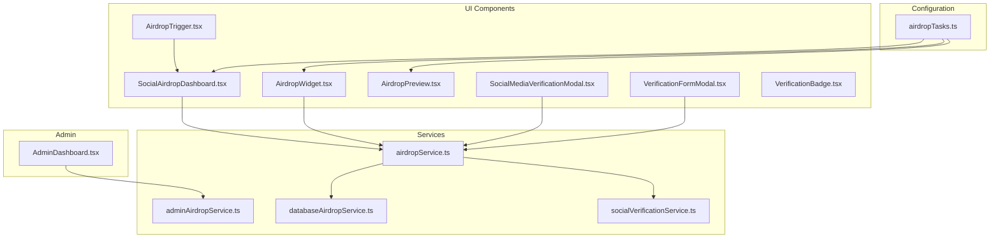
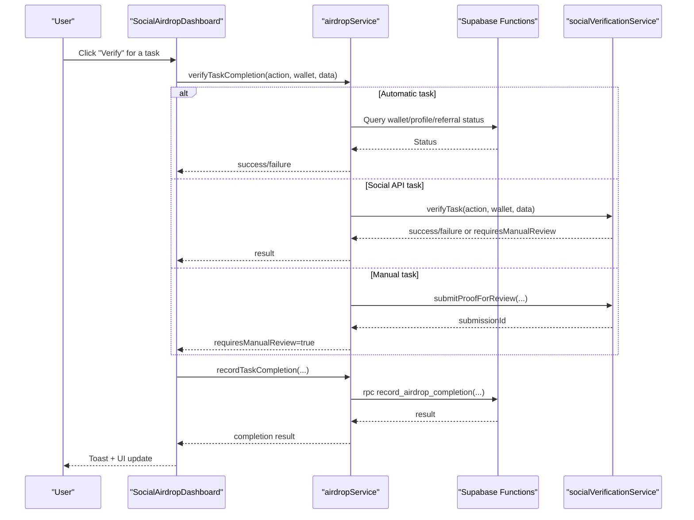
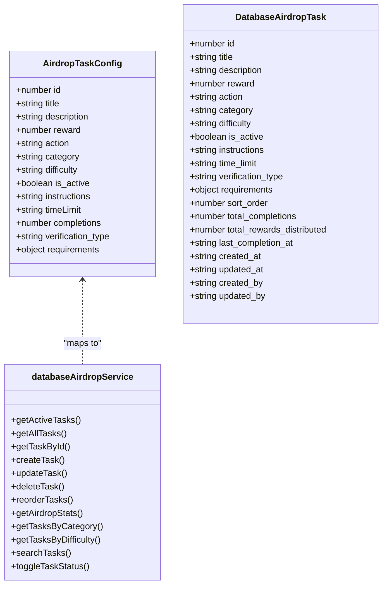
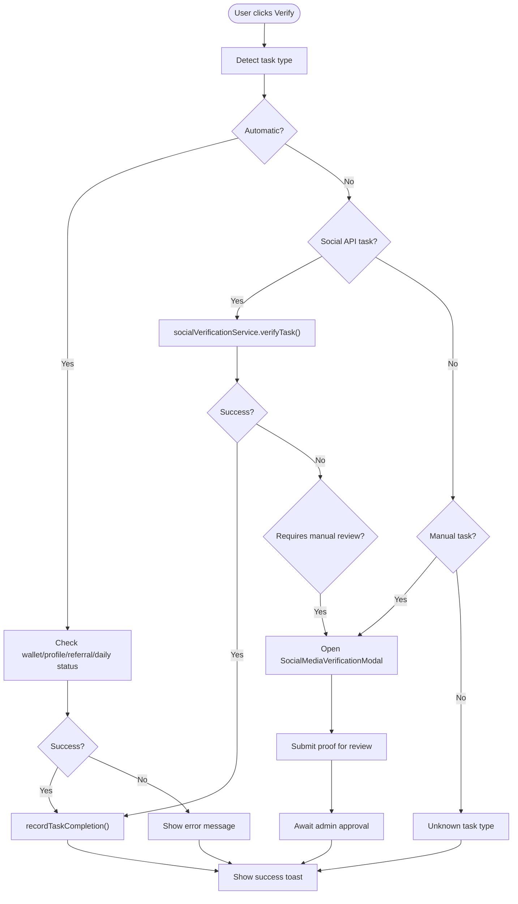
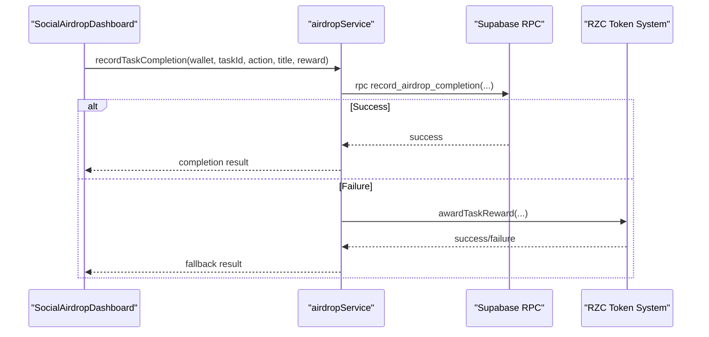
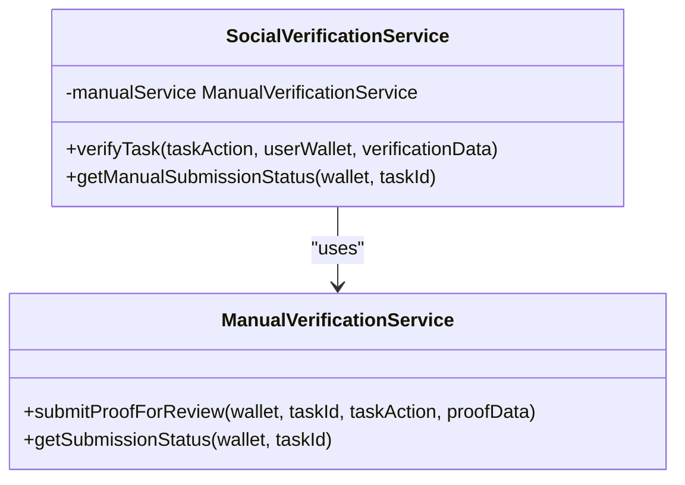
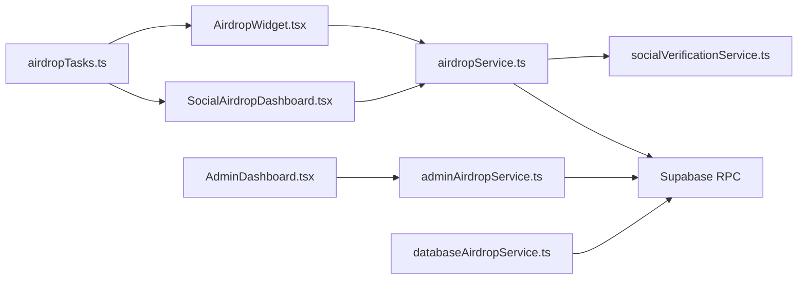

# Airdrop and Incentive System

<cite>
**Referenced Files in This Document**
- [airdropTasks.ts](file://config/airdropTasks.ts)
- [AirdropContext.tsx](file://context/AirdropContext.tsx)
- [airdropService.ts](file://services/airdropService.ts)
- [adminAirdropService.ts](file://services/adminAirdropService.ts)
- [databaseAirdropService.ts](file://services/databaseAirdropService.ts)
- [socialVerificationService.ts](file://services/socialVerificationService.ts)
- [SocialMediaVerificationModal.tsx](file://components/SocialMediaVerificationModal.tsx)
- [VerificationFormModal.tsx](file://components/VerificationFormModal.tsx)
- [VerificationBadge.tsx](file://components/VerificationBadge.tsx)
- [useWalletVerification.ts](file://hooks/useWalletVerification.ts)
- [AdminDashboard.tsx](file://pages/AdminDashboard.tsx)
- [SocialAirdropDashboard.tsx](file://components/SocialAirdropDashboard.tsx)
- [AirdropWidget.tsx](file://components/AirdropWidget.tsx)
- [AirdropPreview.tsx](file://components/AirdropPreview.tsx)
- [AirdropTrigger.tsx](file://components/AirdropTrigger.tsx)
</cite>

## Table of Contents
1. [Introduction](#introduction)
2. [Project Structure](#project-structure)
3. [Core Components](#core-components)
4. [Architecture Overview](#architecture-overview)
5. [Detailed Component Analysis](#detailed-component-analysis)
6. [Dependency Analysis](#dependency-analysis)
7. [Performance Considerations](#performance-considerations)
8. [Troubleshooting Guide](#troubleshooting-guide)
9. [Conclusion](#conclusion)
10. [Appendices](#appendices)

## Introduction
This document explains the airdrop and incentive system, focusing on task definition and management, verification workflows, reward distribution, social media integration, fraud prevention, and administrative controls. It covers both the frontend user experience (task dashboard, widget, and modals) and backend services (database-driven task management, verification, and admin tools).

## Project Structure
The airdrop system spans configuration, services, UI components, and administrative pages:
- Configuration defines task templates and metadata
- Services implement verification, reward distribution, and admin operations
- Components provide the user-facing dashboards and modals
- Admin pages orchestrate oversight and approvals

**Diagram sources**
- [airdropTasks.ts:1-535](file://config/airdropTasks.ts#L1-L535)
- [airdropService.ts:1-760](file://services/airdropService.ts#L1-L760)
- [databaseAirdropService.ts:1-520](file://services/databaseAirdropService.ts#L1-L520)
- [socialVerificationService.ts:1-214](file://services/socialVerificationService.ts#L1-L214)
- [adminAirdropService.ts:1-365](file://services/adminAirdropService.ts#L1-L365)
- [SocialAirdropDashboard.tsx:1-686](file://components/SocialAirdropDashboard.tsx#L1-L686)
- [AirdropWidget.tsx:1-104](file://components/AirdropWidget.tsx#L1-L104)
- [AirdropTrigger.tsx:1-75](file://components/AirdropTrigger.tsx#L1-L75)
- [AirdropPreview.tsx:1-97](file://components/AirdropPreview.tsx#L1-L97)
- [SocialMediaVerificationModal.tsx:1-373](file://components/SocialMediaVerificationModal.tsx#L1-L373)
- [VerificationFormModal.tsx:1-447](file://components/VerificationFormModal.tsx#L1-L447)
- [VerificationBadge.tsx:1-213](file://components/VerificationBadge.tsx#L1-L213)
- [AdminDashboard.tsx:1-800](file://pages/AdminDashboard.tsx#L1-L800)

**Section sources**
- [airdropTasks.ts:1-535](file://config/airdropTasks.ts#L1-L535)
- [airdropService.ts:1-760](file://services/airdropService.ts#L1-L760)
- [databaseAirdropService.ts:1-520](file://services/databaseAirdropService.ts#L1-L520)
- [socialVerificationService.ts:1-214](file://services/socialVerificationService.ts#L1-L214)
- [adminAirdropService.ts:1-365](file://services/adminAirdropService.ts#L1-L365)
- [SocialAirdropDashboard.tsx:1-686](file://components/SocialAirdropDashboard.tsx#L1-L686)
- [AirdropWidget.tsx:1-104](file://components/AirdropWidget.tsx#L1-L104)
- [AirdropTrigger.tsx:1-75](file://components/AirdropTrigger.tsx#L1-L75)
- [AirdropPreview.tsx:1-97](file://components/AirdropPreview.tsx#L1-L97)
- [SocialMediaVerificationModal.tsx:1-373](file://components/SocialMediaVerificationModal.tsx#L1-L373)
- [VerificationFormModal.tsx:1-447](file://components/VerificationFormModal.tsx#L1-L447)
- [VerificationBadge.tsx:1-213](file://components/VerificationBadge.tsx#L1-L213)
- [AdminDashboard.tsx:1-800](file://pages/AdminDashboard.tsx#L1-L800)

## Core Components
- Task configuration and fallback: centralized task definitions with database-first retrieval and fallback to hardcoded tasks
- Verification engine: automatic, manual, and social API verification pathways
- Reward distribution: database-backed completion tracking and token crediting
- Admin tools: pending submissions review, task management, analytics, and exports
- User dashboards: task listing, progress tracking, and verification modals

Key implementation references:
- Task configuration and helpers: [airdropTasks.ts:1-535](file://config/airdropTasks.ts#L1-L535)
- Verification and reward services: [airdropService.ts:1-760](file://services/airdropService.ts#L1-L760)
- Database task management: [databaseAirdropService.ts:1-520](file://services/databaseAirdropService.ts#L1-L520)
- Social verification pipeline: [socialVerificationService.ts:1-214](file://services/socialVerificationService.ts#L1-L214)
- Admin management: [adminAirdropService.ts:1-365](file://services/adminAirdropService.ts#L1-L365)
- User dashboards and widgets: [SocialAirdropDashboard.tsx:1-686](file://components/SocialAirdropDashboard.tsx#L1-L686), [AirdropWidget.tsx:1-104](file://components/AirdropWidget.tsx#L1-L104), [AirdropTrigger.tsx:1-75](file://components/AirdropTrigger.tsx#L1-L75), [AirdropPreview.tsx:1-97](file://components/AirdropPreview.tsx#L1-L97)
- Verification modals: [SocialMediaVerificationModal.tsx:1-373](file://components/SocialMediaVerificationModal.tsx#L1-L373), [VerificationFormModal.tsx:1-447](file://components/VerificationFormModal.tsx#L1-L447)
- Verification badges: [VerificationBadge.tsx:1-213](file://components/VerificationBadge.tsx#L1-L213)

**Section sources**
- [airdropTasks.ts:1-535](file://config/airdropTasks.ts#L1-L535)
- [airdropService.ts:1-760](file://services/airdropService.ts#L1-L760)
- [databaseAirdropService.ts:1-520](file://services/databaseAirdropService.ts#L1-L520)
- [socialVerificationService.ts:1-214](file://services/socialVerificationService.ts#L1-L214)
- [adminAirdropService.ts:1-365](file://services/adminAirdropService.ts#L1-L365)
- [SocialAirdropDashboard.tsx:1-686](file://components/SocialAirdropDashboard.tsx#L1-L686)
- [AirdropWidget.tsx:1-104](file://components/AirdropWidget.tsx#L1-L104)
- [AirdropTrigger.tsx:1-75](file://components/AirdropTrigger.tsx#L1-L75)
- [AirdropPreview.tsx:1-97](file://components/AirdropPreview.tsx#L1-L97)
- [SocialMediaVerificationModal.tsx:1-373](file://components/SocialMediaVerificationModal.tsx#L1-L373)
- [VerificationFormModal.tsx:1-447](file://components/VerificationFormModal.tsx#L1-L447)
- [VerificationBadge.tsx:1-213](file://components/VerificationBadge.tsx#L1-L213)

## Architecture Overview
The system integrates frontend dashboards with backend services and database functions. Tasks are fetched from the database with a fallback to configuration. Verification routes vary by task type: automatic checks against user state, social API verification, or manual review with proof uploads.

**Diagram sources**
- [SocialAirdropDashboard.tsx:248-306](file://components/SocialAirdropDashboard.tsx#L248-L306)
- [airdropService.ts:301-385](file://services/airdropService.ts#L301-L385)
- [socialVerificationService.ts:116-196](file://services/socialVerificationService.ts#L116-L196)

**Section sources**
- [SocialAirdropDashboard.tsx:248-306](file://components/SocialAirdropDashboard.tsx#L248-L306)
- [airdropService.ts:301-385](file://services/airdropService.ts#L301-L385)
- [socialVerificationService.ts:116-196](file://services/socialVerificationService.ts#L116-L196)

## Detailed Component Analysis

### Task Definition and Management
- Centralized configuration defines tasks with metadata (category, difficulty, reward, verification type, requirements)
- Database-first retrieval with fallback to configuration ensures resilience
- Admin can create, update, reorder, and toggle tasks; analytics and exports supported

**Diagram sources**
- [airdropTasks.ts:7-26](file://config/airdropTasks.ts#L7-L26)
- [databaseAirdropService.ts:3-24](file://services/databaseAirdropService.ts#L3-L24)
- [databaseAirdropService.ts:44-518](file://services/databaseAirdropService.ts#L44-L518)

**Section sources**
- [airdropTasks.ts:1-535](file://config/airdropTasks.ts#L1-L535)
- [databaseAirdropService.ts:1-520](file://services/databaseAirdropService.ts#L1-L520)

### Verification System Implementation
- Automatic verification: wallet creation, referrals, profile completion, daily check-in
- Social API verification: follow, retweet, post, engagement via socialVerificationService
- Manual verification: uploads and proof submission stored in airdrop_manual_submissions
- Real-time feedback and manual review gating

**Diagram sources**
- [airdropService.ts:301-385](file://services/airdropService.ts#L301-L385)
- [socialVerificationService.ts:116-196](file://services/socialVerificationService.ts#L116-L196)
- [SocialMediaVerificationModal.tsx:65-123](file://components/SocialMediaVerificationModal.tsx#L65-L123)

**Section sources**
- [airdropService.ts:301-385](file://services/airdropService.ts#L301-L385)
- [socialVerificationService.ts:116-196](file://services/socialVerificationService.ts#L116-L196)
- [SocialMediaVerificationModal.tsx:65-123](file://components/SocialMediaVerificationModal.tsx#L65-L123)

### Reward Distribution Mechanisms
- Database-backed completion tracking via rpc record_airdrop_completion
- Fallback reward crediting to RZC tokens when database unavailable
- Leaderboard and statistics via database functions

**Diagram sources**
- [airdropService.ts:447-513](file://services/airdropService.ts#L447-L513)
- [airdropService.ts:398-442](file://services/airdropService.ts#L398-L442)

**Section sources**
- [airdropService.ts:447-513](file://services/airdropService.ts#L447-L513)
- [airdropService.ts:398-442](file://services/airdropService.ts#L398-L442)

### Social Media Verification Integration
- Platform-specific logic: Twitter/X posts, retweets, comments; Facebook, LinkedIn, Instagram posts; Reddit, Discord sharing; content creation (video, article, meme, audio)
- Trust model for simple social tasks; manual review for complex or unverifiable tasks
- Enhanced modal captures usernames, tweet IDs, URLs, and uploaded proof files

**Diagram sources**
- [socialVerificationService.ts:109-212](file://services/socialVerificationService.ts#L109-L212)
- [socialVerificationService.ts:4-106](file://services/socialVerificationService.ts#L4-L106)

**Section sources**
- [socialVerificationService.ts:109-212](file://services/socialVerificationService.ts#L109-L212)
- [SocialMediaVerificationModal.tsx:1-373](file://components/SocialMediaVerificationModal.tsx#L1-L373)

### Fraud Prevention Measures
- Manual verification for complex tasks requiring proof
- File upload validation (types and sizes) in the verification modal
- Admin review pipeline for pending submissions
- Database-backed audit trail via airdrop_manual_submissions and RPC functions

**Section sources**
- [SocialMediaVerificationModal.tsx:139-182](file://components/SocialMediaVerificationModal.tsx#L139-L182)
- [adminAirdropService.ts:35-107](file://services/adminAirdropService.ts#L35-L107)

### Airdrop Widget Functionality
- Displays completion progress and earned rewards
- Integrates with localStorage and database completion tracking
- Opens the airdrop modal on click

**Section sources**
- [AirdropWidget.tsx:1-104](file://components/AirdropWidget.tsx#L1-L104)
- [AirdropTrigger.tsx:1-75](file://components/AirdropTrigger.tsx#L1-L75)
- [AirdropPreview.tsx:1-97](file://components/AirdropPreview.tsx#L1-L97)

### User Task Completion Tracking and Progress Monitoring
- Unified loading merges local, database, and auto-completion sources
- Daily streak tracking persisted in localStorage
- Progress bar and stats computed from completed tasks

**Section sources**
- [SocialAirdropDashboard.tsx:66-127](file://components/SocialAirdropDashboard.tsx#L66-L127)
- [SocialAirdropDashboard.tsx:314-363](file://components/SocialAirdropDashboard.tsx#L314-L363)

### Incentive Automation System and Real-Time Updates
- Automatic task verification for supported actions
- Real-time daily check-in and streak updates
- Notification logging for completed tasks

**Section sources**
- [airdropService.ts:166-225](file://services/airdropService.ts#L166-L225)
- [SocialAirdropDashboard.tsx:276-289](file://components/SocialAirdropDashboard.tsx#L276-L289)

### System Administration
- Admin dashboard aggregates users, migrations, balance verification requests, and airdrop submissions
- Approve/reject manual submissions and update task definitions
- Export data and view analytics

**Section sources**
- [AdminDashboard.tsx:65-306](file://pages/AdminDashboard.tsx#L65-L306)
- [adminAirdropService.ts:35-208](file://services/adminAirdropService.ts#L35-L208)

## Dependency Analysis
The system exhibits clear separation of concerns:
- Configuration depends on services for runtime task resolution
- Services depend on Supabase for database functions and external APIs for social verification
- UI components depend on services for state and actions
- Admin components depend on admin services and database functions

**Diagram sources**
- [airdropTasks.ts:1-535](file://config/airdropTasks.ts#L1-L535)
- [SocialAirdropDashboard.tsx:1-686](file://components/SocialAirdropDashboard.tsx#L1-L686)
- [AirdropWidget.tsx:1-104](file://components/AirdropWidget.tsx#L1-L104)
- [airdropService.ts:1-760](file://services/airdropService.ts#L1-L760)
- [socialVerificationService.ts:1-214](file://services/socialVerificationService.ts#L1-L214)
- [AdminDashboard.tsx:1-800](file://pages/AdminDashboard.tsx#L1-L800)
- [adminAirdropService.ts:1-365](file://services/adminAirdropService.ts#L1-L365)
- [databaseAirdropService.ts:1-520](file://services/databaseAirdropService.ts#L1-L520)

**Section sources**
- [airdropTasks.ts:1-535](file://config/airdropTasks.ts#L1-L535)
- [airdropService.ts:1-760](file://services/airdropService.ts#L1-L760)
- [socialVerificationService.ts:1-214](file://services/socialVerificationService.ts#L1-L214)
- [adminAirdropService.ts:1-365](file://services/adminAirdropService.ts#L1-L365)
- [databaseAirdropService.ts:1-520](file://services/databaseAirdropService.ts#L1-L520)
- [SocialAirdropDashboard.tsx:1-686](file://components/SocialAirdropDashboard.tsx#L1-L686)
- [AirdropWidget.tsx:1-104](file://components/AirdropWidget.tsx#L1-L104)
- [AdminDashboard.tsx:1-800](file://pages/AdminDashboard.tsx#L1-L800)

## Performance Considerations
- Parallel verification for multiple task statuses reduces latency
- Local caching of completions minimizes repeated network calls
- Database functions centralize computation and reduce frontend load
- Modal-based proof uploads defer heavy processing until submission

[No sources needed since this section provides general guidance]

## Troubleshooting Guide
Common issues and resolutions:
- Database not configured: services fall back to hardcoded tasks and direct reward crediting
- Verification failures: check task type routing and social API availability; use manual review pathway
- Admin approvals: ensure pending submissions are visible and properly routed to approve/reject handlers
- File uploads: validate types and sizes in the verification modal; handle errors gracefully

**Section sources**
- [airdropService.ts:462-471](file://services/airdropService.ts#L462-L471)
- [airdropService.ts:492-512](file://services/airdropService.ts#L492-L512)
- [socialVerificationService.ts:202-211](file://services/socialVerificationService.ts#L202-L211)
- [AdminDashboard.tsx:591-619](file://pages/AdminDashboard.tsx#L591-L619)
- [SocialMediaVerificationModal.tsx:139-182](file://components/SocialMediaVerificationModal.tsx#L139-L182)

## Conclusion
The airdrop and incentive system combines robust task management, flexible verification pathways, and strong administrative oversight. Its database-first design with resilient fallbacks ensures reliability, while social and manual verification modes provide comprehensive coverage. The UI components deliver a seamless user experience, and admin tools enable effective monitoring and governance.

## Appendices

### Examples and References
- Task configuration examples: [airdropTasks.ts:29-378](file://config/airdropTasks.ts#L29-L378)
- Verification workflows: [airdropService.ts:301-385](file://services/airdropService.ts#L301-L385), [socialVerificationService.ts:116-196](file://services/socialVerificationService.ts#L116-L196)
- Reward distribution: [airdropService.ts:447-513](file://services/airdropService.ts#L447-L513)
- Admin operations: [adminAirdropService.ts:35-208](file://services/adminAirdropService.ts#L35-L208), [AdminDashboard.tsx:591-619](file://pages/AdminDashboard.tsx#L591-L619)
- User dashboards: [SocialAirdropDashboard.tsx:144-306](file://components/SocialAirdropDashboard.tsx#L144-L306), [AirdropWidget.tsx:1-104](file://components/AirdropWidget.tsx#L1-L104)