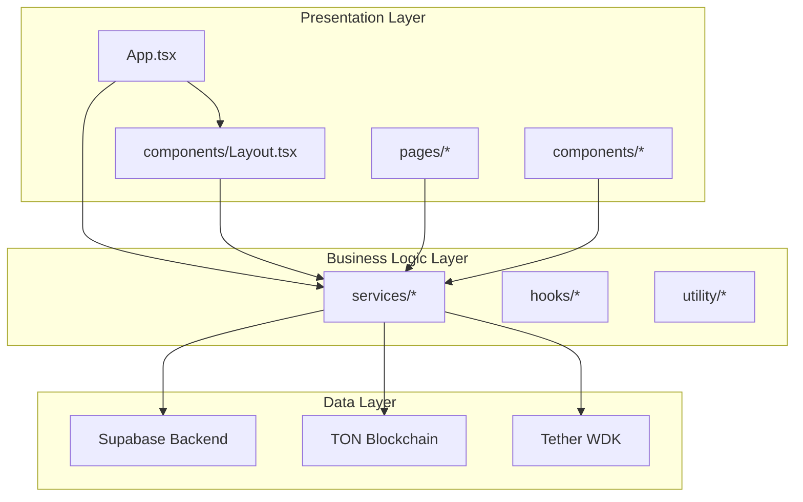
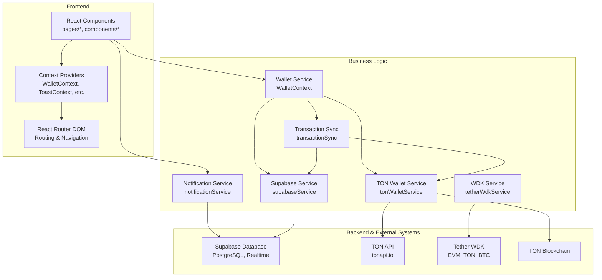
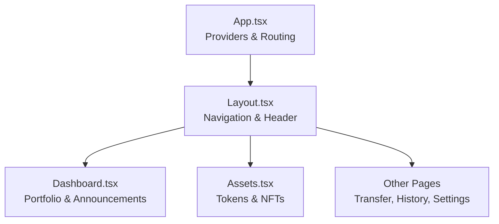
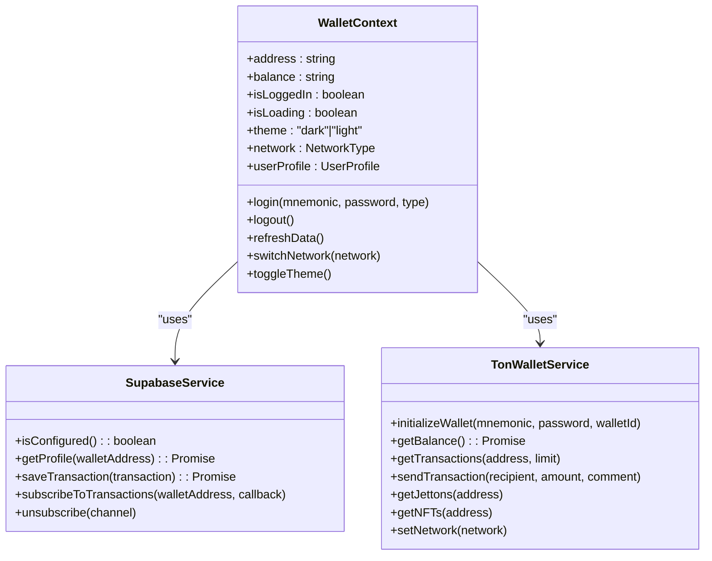
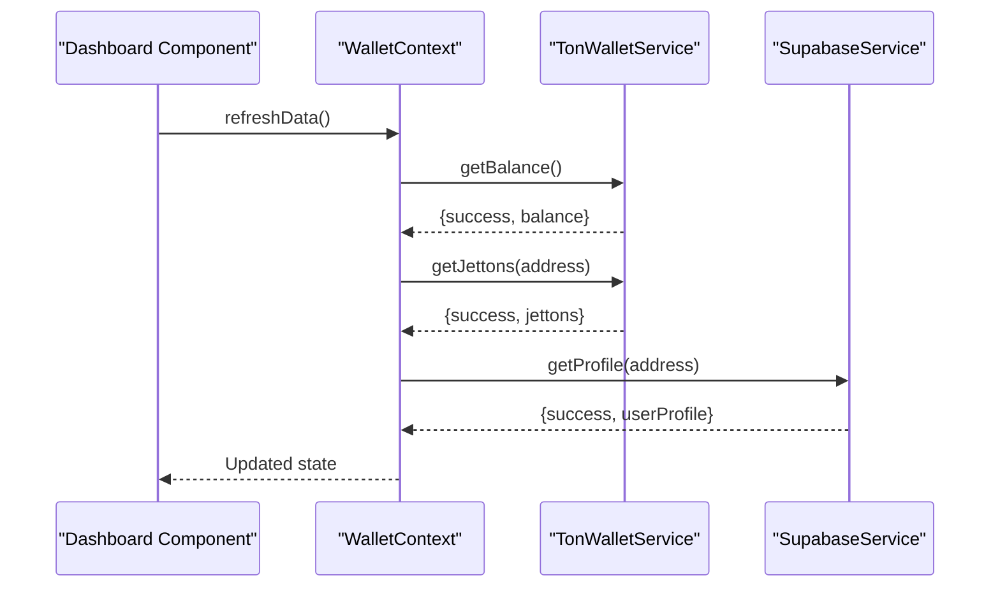
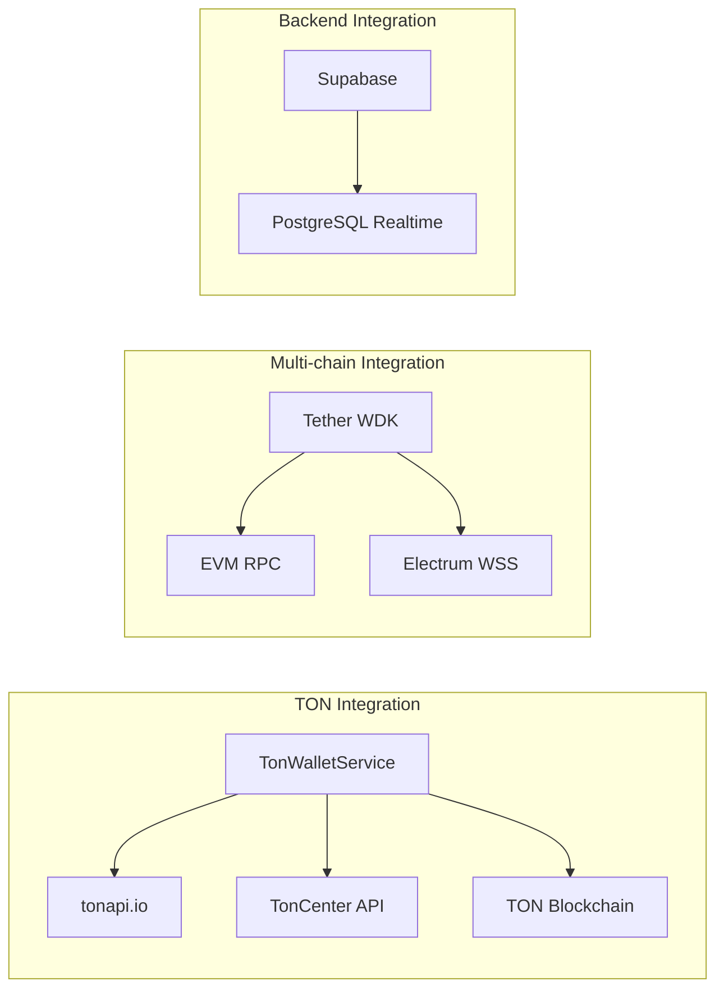
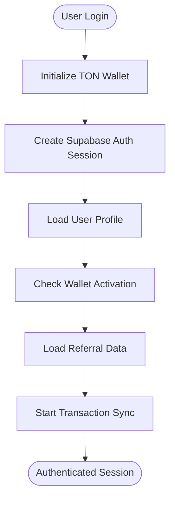
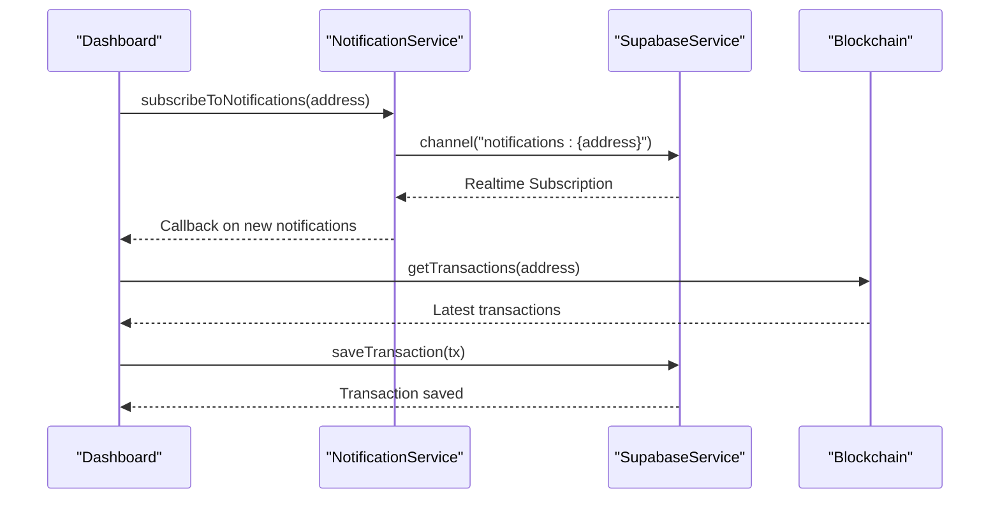
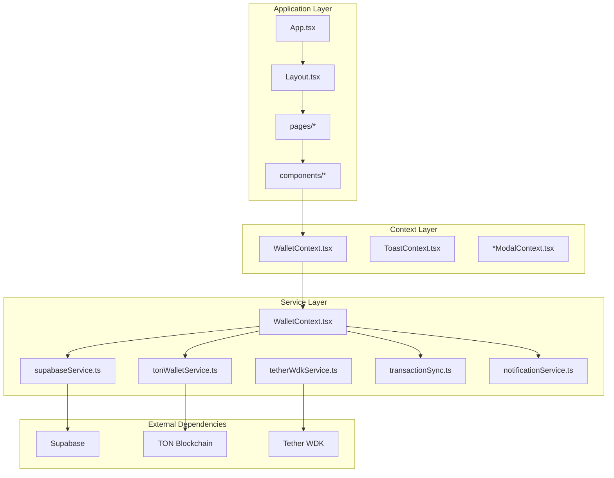

# Architecture Overview

<cite>
**Referenced Files in This Document**
- [App.tsx](file://App.tsx)
- [Layout.tsx](file://components/Layout.tsx)
- [WalletContext.tsx](file://context/WalletContext.tsx)
- [supabaseService.ts](file://services/supabaseService.ts)
- [tonWalletService.ts](file://services/tonWalletService.ts)
- [tetherWdkService.ts](file://services/tetherWdkService.ts)
- [transactionSync.ts](file://services/transactionSync.ts)
- [notificationService.ts](file://services/notificationService.ts)
- [Dashboard.tsx](file://pages/Dashboard.tsx)
- [Assets.tsx](file://pages/Assets.tsx)
</cite>

## Table of Contents
1. [Introduction](#introduction)
2. [Project Structure](#project-structure)
3. [Core Components](#core-components)
4. [Architecture Overview](#architecture-overview)
5. [Detailed Component Analysis](#detailed-component-analysis)
6. [Dependency Analysis](#dependency-analysis)
7. [Performance Considerations](#performance-considerations)
8. [Troubleshooting Guide](#troubleshooting-guide)
9. [Conclusion](#conclusion)

## Introduction
This document presents the architectural design of RhizaWebWallet, a React-based web application integrating with Supabase for backend services and multi-chain wallet capabilities via TON and Tether WDK. The system follows a clear separation of concerns:
- Presentation layer: React components organized under pages and components directories
- Business logic layer: Service classes encapsulating domain operations
- Data layer: Supabase-backed persistence with real-time subscriptions and transaction synchronization

The architecture emphasizes modularity, real-time updates, robust authentication, and seamless integration with external blockchain networks.

## Project Structure
The project is organized into distinct layers:
- Entry point and routing: App.tsx configures routing, protected routes, and global providers
- Layout and navigation: components/Layout.tsx manages wallet-side navigation, notifications, and real-time updates
- Context providers: context/* files implement state management for wallet, modals, and toasts
- Services: services/* files encapsulate business logic for blockchain interactions, database operations, notifications, and multi-chain support
- Pages: pages/* files represent route-specific views
- Hooks and utilities: hooks/* and utility/* directories provide reusable logic and helpers

**Diagram sources**
- [App.tsx:303-325](file://App.tsx#L303-L325)
- [Layout.tsx:119-195](file://components/Layout.tsx#L119-L195)
- [supabaseService.ts:89-119](file://services/supabaseService.ts#L89-L119)
- [tonWalletService.ts:174-213](file://services/tonWalletService.ts#L174-L213)
- [tetherWdkService.ts:59-73](file://services/tetherWdkService.ts#L59-L73)

**Section sources**
- [App.tsx:1-68](file://App.tsx#L1-L68)
- [Layout.tsx:1-80](file://components/Layout.tsx#L1-L80)

## Core Components
The system's core components include:

- Application shell and routing: App.tsx defines routes, protected routes, global modals, and provider hierarchy
- Layout and navigation: Layout.tsx renders wallet-side navigation, header controls, and real-time notification updates
- Wallet state management: WalletContext.tsx centralizes wallet session, balances, profiles, and network switching
- Supabase integration: supabaseService.ts provides database operations, real-time subscriptions, and analytics
- TON blockchain integration: tonWalletService.ts handles wallet initialization, balances, transactions, and multi-chain operations
- Multi-chain support: tetherWdkService.ts integrates Tether WDK for EVM, TON, and BTC operations
- Transaction synchronization: transactionSync.ts synchronizes blockchain transactions with Supabase
- Notifications: notificationService.ts manages in-app notifications and user activity logging

**Section sources**
- [App.tsx:70-90](file://App.tsx#L70-L90)
- [Layout.tsx:119-195](file://components/Layout.tsx#L119-L195)
- [WalletContext.tsx:60-403](file://context/WalletContext.tsx#L60-L403)
- [supabaseService.ts:89-119](file://services/supabaseService.ts#L89-L119)
- [tonWalletService.ts:174-213](file://services/tonWalletService.ts#L174-L213)
- [tetherWdkService.ts:59-73](file://services/tetherWdkService.ts#L59-L73)
- [transactionSync.ts:10-191](file://services/transactionSync.ts#L10-L191)
- [notificationService.ts:66-458](file://services/notificationService.ts#L66-L458)

## Architecture Overview
RhizaWebWallet employs a layered architecture with clear separation of concerns:

**Diagram sources**
- [App.tsx:303-325](file://App.tsx#L303-L325)
- [WalletContext.tsx:60-403](file://context/WalletContext.tsx#L60-L403)
- [tonWalletService.ts:174-213](file://services/tonWalletService.ts#L174-L213)
- [supabaseService.ts:89-119](file://services/supabaseService.ts#L89-L119)
- [tetherWdkService.ts:59-73](file://services/tetherWdkService.ts#L59-L73)
- [transactionSync.ts:10-191](file://services/transactionSync.ts#L10-L191)
- [notificationService.ts:66-458](file://services/notificationService.ts#L66-L458)

### Component Hierarchy
The component hierarchy starts at the application root and flows through layout and page components:

**Diagram sources**
- [App.tsx:240-298](file://App.tsx#L240-L298)
- [Layout.tsx:119-195](file://components/Layout.tsx#L119-L195)
- [Dashboard.tsx:62-91](file://pages/Dashboard.tsx#L62-L91)
- [Assets.tsx:73-91](file://pages/Assets.tsx#L73-L91)

### Data Flow Patterns
The system implements several data flow patterns:

1. **Authentication and Session Management**
   - WalletContext initializes sessions, manages login/logout, and synchronizes across browser tabs
   - Supabase authentication is integrated during wallet login for unified user sessions

2. **Real-time Updates**
   - Supabase real-time subscriptions for notifications and profile updates
   - Automatic transaction synchronization with configurable intervals
   - Live migration and verification status updates

3. **Multi-chain Operations**
   - TON blockchain operations via tonWalletService
   - Multi-chain support via tetherWdkService for EVM, TON, and BTC
   - Centralized network switching and configuration

**Section sources**
- [WalletContext.tsx:107-127](file://context/WalletContext.tsx#L107-L127)
- [supabaseService.ts:697-764](file://services/supabaseService.ts#L697-L764)
- [transactionSync.ts:158-183](file://services/transactionSync.ts#L158-L183)
- [tetherWdkService.ts:82-139](file://services/tetherWdkService.ts#L82-L139)

## Detailed Component Analysis

### Context Provider Pattern
The application uses React Context extensively for state management:

**Diagram sources**
- [WalletContext.tsx:35-53](file://context/WalletContext.tsx#L35-L53)
- [supabaseService.ts:89-119](file://services/supabaseService.ts#L89-L119)
- [tonWalletService.ts:174-213](file://services/tonWalletService.ts#L174-L213)

The Context Provider pattern enables:
- Centralized state management across components
- Cross-component communication without prop drilling
- Real-time state updates through React's subscription model
- Modular composition through nested providers

**Section sources**
- [WalletContext.tsx:60-403](file://context/WalletContext.tsx#L60-L403)
- [App.tsx:303-325](file://App.tsx#L303-L325)

### Service Layer Architecture
The service layer encapsulates business logic and external integrations:

**Diagram sources**
- [Dashboard.tsx:62-91](file://pages/Dashboard.tsx#L62-L91)
- [WalletContext.tsx:138-170](file://context/WalletContext.tsx#L138-L170)
- [tonWalletService.ts:265-287](file://services/tonWalletService.ts#L265-L287)
- [supabaseService.ts:176-209](file://services/supabaseService.ts#L176-L209)

Key service responsibilities:
- WalletContext: Session management, state synchronization, and cross-service coordination
- TonWalletService: TON blockchain operations, balance retrieval, transaction sending
- SupabaseService: Database operations, real-time subscriptions, analytics
- TransactionSync: Blockchain-to-database transaction synchronization
- NotificationService: In-app notifications and user activity tracking

**Section sources**
- [WalletContext.tsx:138-170](file://context/WalletContext.tsx#L138-L170)
- [tonWalletService.ts:265-392](file://services/tonWalletService.ts#L265-L392)
- [supabaseService.ts:176-209](file://services/supabaseService.ts#L176-L209)
- [transactionSync.ts:18-74](file://services/transactionSync.ts#L18-L74)
- [notificationService.ts:66-117](file://services/notificationService.ts#L66-L117)

### Integration Patterns with External Services
The system integrates with external services through well-defined patterns:

**Diagram sources**
- [tonWalletService.ts:289-333](file://services/tonWalletService.ts#L289-L333)
- [tetherWdkService.ts:12-24](file://services/tetherWdkService.ts#L12-L24)
- [supabaseService.ts:697-764](file://services/supabaseService.ts#L697-L764)

Integration highlights:
- TON blockchain operations via tonWalletService with tonapi.io and TonCenter APIs
- Multi-chain support through Tether WDK for EVM, TON, and BTC networks
- Supabase real-time subscriptions for instant updates
- Secure session management with encryption and device-key generation

**Section sources**
- [tonWalletService.ts:151-172](file://services/tonWalletService.ts#L151-L172)
- [tetherWdkService.ts:82-139](file://services/tetherWdkService.ts#L82-L139)
- [supabaseService.ts:697-764](file://services/supabaseService.ts#L697-L764)

### Authentication and Authorization
The authentication system combines wallet-based authentication with Supabase:

**Diagram sources**
- [WalletContext.tsx:172-316](file://context/WalletContext.tsx#L172-L316)
- [supabaseService.ts:133-171](file://services/supabaseService.ts#L133-L171)

Authentication features:
- Wallet-based login with mnemonic support
- Supabase authentication integration
- Session persistence with encryption
- Cross-tab session synchronization
- Auto-login for persistent sessions

**Section sources**
- [WalletContext.tsx:172-316](file://context/WalletContext.tsx#L172-L316)

### Real-time Updates and Notifications
The system implements comprehensive real-time capabilities:

**Diagram sources**
- [notificationService.ts:432-457](file://services/notificationService.ts#L432-L457)
- [supabaseService.ts:697-725](file://services/supabaseService.ts#L697-L725)
- [Dashboard.tsx:425-468](file://pages/Dashboard.tsx#L425-L468)

Real-time features:
- Instant notification delivery via Supabase Postgres changes
- Live transaction confirmation tracking
- Automatic transaction synchronization
- Migration and verification status updates

**Section sources**
- [notificationService.ts:432-457](file://services/notificationService.ts#L432-L457)
- [transactionSync.ts:158-174](file://services/transactionSync.ts#L158-L174)

## Dependency Analysis
The system exhibits low coupling and high cohesion through its layered architecture:

**Diagram sources**
- [App.tsx:51-68](file://App.tsx#L51-L68)
- [WalletContext.tsx:60-403](file://context/WalletContext.tsx#L60-L403)
- [tonWalletService.ts:174-213](file://services/tonWalletService.ts#L174-L213)
- [supabaseService.ts:89-119](file://services/supabaseService.ts#L89-L119)
- [tetherWdkService.ts:59-73](file://services/tetherWdkService.ts#L59-L73)

Dependency characteristics:
- Low coupling between presentation and business logic through service abstractions
- Clear separation between data access and business operations
- External dependencies isolated in dedicated service classes
- Context providers mediate state access across component boundaries

**Section sources**
- [App.tsx:51-68](file://App.tsx#L51-L68)
- [WalletContext.tsx:60-403](file://context/WalletContext.tsx#L60-L403)

## Performance Considerations
The architecture incorporates several performance optimizations:

- **Lazy loading**: Services are dynamically imported to reduce initial bundle size
- **Automatic synchronization**: Configurable intervals prevent excessive API calls
- **Real-time subscriptions**: Efficient push-based updates minimize polling overhead
- **Session caching**: Local storage reduces repeated authentication attempts
- **Network switching**: Efficient client reinitialization when changing networks

Recommendations:
- Implement request deduplication for frequently called endpoints
- Add exponential backoff for failed API requests
- Consider implementing local caching strategies for frequently accessed data
- Optimize image loading for token icons and NFT previews

## Troubleshooting Guide
Common issues and resolutions:

**Authentication Issues**
- Session expiration: Check session timeout configuration and implement automatic re-authentication
- Multi-tab conflicts: Verify BroadcastChannel implementation for session synchronization
- Wallet initialization failures: Validate mnemonic format and network configuration

**Blockchain Integration Problems**
- Transaction confirmation delays: Monitor blockchain API rate limits and implement retry logic
- Balance synchronization issues: Verify tonapi.io and TonCenter API availability
- Multi-chain connectivity: Check WDK manager initialization and network configurations

**Database Connectivity**
- Real-time subscription failures: Verify Supabase realtime configuration and connection status
- Transaction sync errors: Check database permissions and trigger configurations
- Notification delivery issues: Validate channel subscriptions and filter parameters

**Performance Issues**
- Slow dashboard loading: Implement pagination for transaction lists and optimize image loading
- Memory leaks: Ensure proper cleanup of subscriptions and intervals
- Network latency: Add loading states and optimistic UI updates

**Section sources**
- [WalletContext.tsx:107-127](file://context/WalletContext.tsx#L107-L127)
- [tonWalletService.ts:423-582](file://services/tonWalletService.ts#L423-L582)
- [supabaseService.ts:770-800](file://services/supabaseService.ts#L770-L800)

## Conclusion
RhizaWebWallet demonstrates a well-architected React application with clear separation of concerns and robust integration patterns. The system successfully combines:

- A modular component hierarchy with React Router for navigation
- A comprehensive Context Provider pattern for state management
- A layered service architecture for business logic encapsulation
- Seamless integration with Supabase for backend services and real-time updates
- Multi-chain wallet capabilities through TON and Tether WDK

The architecture supports scalability through lazy loading, efficient real-time updates, and modular service design. The separation between presentation, business logic, and data layers enables maintainability and facilitates future enhancements such as additional blockchain integrations or advanced analytics features.