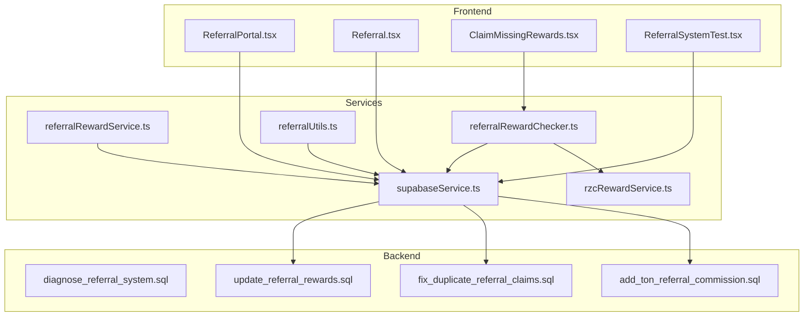
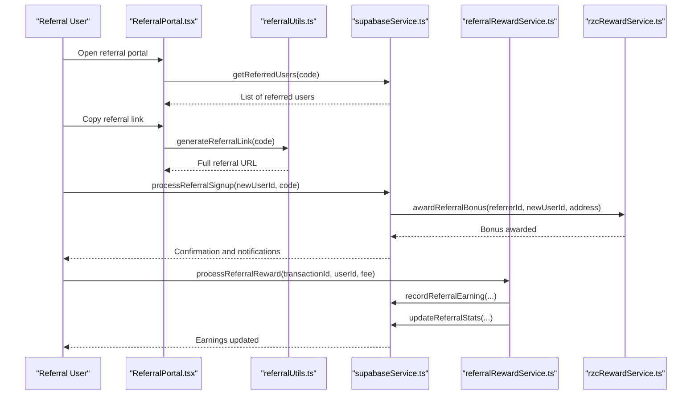
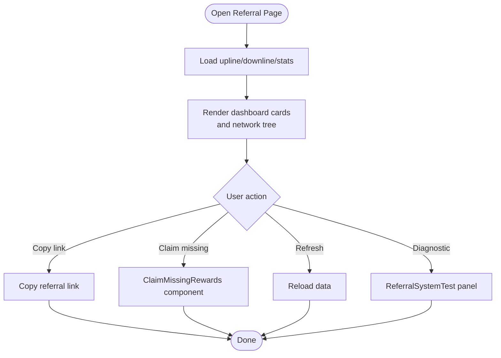
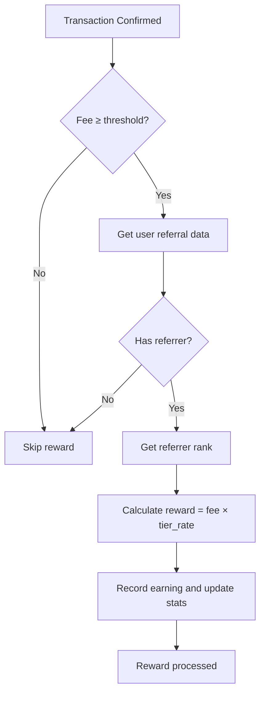
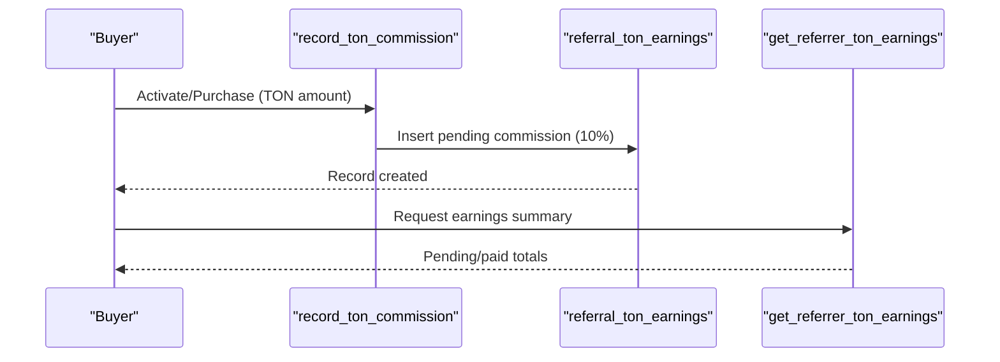
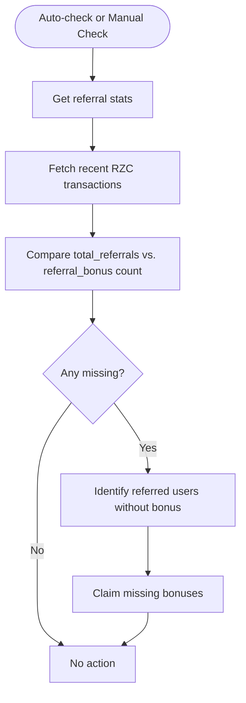
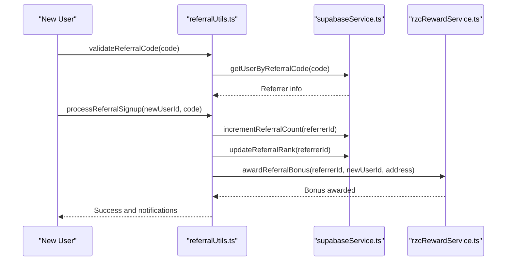
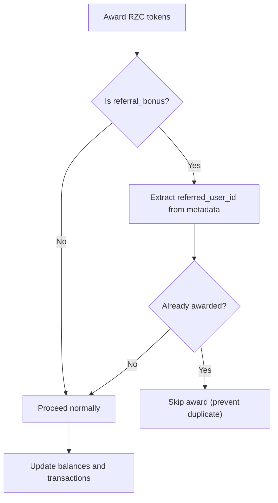
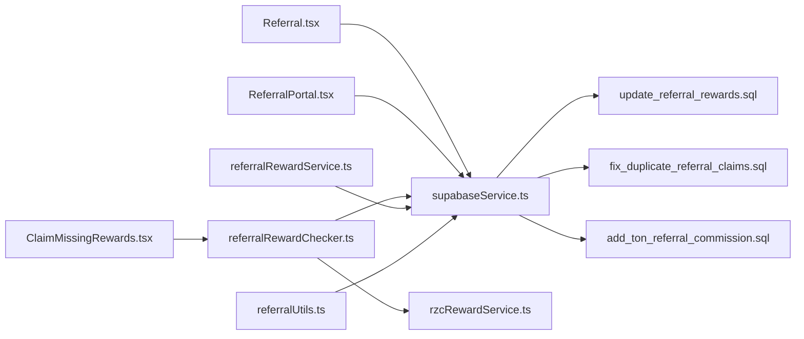

# Community and Referral System

<cite>
**Referenced Files in This Document**
- [Referral.tsx](file://pages/Referral.tsx)
- [ReferralPortal.tsx](file://pages/ReferralPortal.tsx)
- [referralRewardService.ts](file://services/referralRewardService.ts)
- [referralRewardChecker.ts](file://services/referralRewardChecker.ts)
- [rzcRewardService.ts](file://services/rzcRewardService.ts)
- [supabaseService.ts](file://services/supabaseService.ts)
- [referralUtils.ts](file://utils/referralUtils.ts)
- [ClaimMissingRewards.tsx](file://components/ClaimMissingRewards.tsx)
- [ReferralSystemTest.tsx](file://components/ReferralSystemTest.tsx)
- [diagnose_referral_system.sql](file://diagnose_referral_system.sql)
- [update_referral_rewards.sql](file://update_referral_rewards.sql)
- [fix_duplicate_referral_claims.sql](file://fix_duplicate_referral_claims.sql)
- [add_ton_referral_commission.sql](file://add_ton_referral_commission.sql)
- [securityLogger.ts](file://utils/securityLogger.ts)
</cite>

## Table of Contents
1. [Introduction](#introduction)
2. [Project Structure](#project-structure)
3. [Core Components](#core-components)
4. [Architecture Overview](#architecture-overview)
5. [Detailed Component Analysis](#detailed-component-analysis)
6. [Dependency Analysis](#dependency-analysis)
7. [Performance Considerations](#performance-considerations)
8. [Troubleshooting Guide](#troubleshooting-guide)
9. [Conclusion](#conclusion)
10. [Appendices](#appendices)

## Introduction
This document explains the community and referral system, covering referral code generation, multi-level reward structure, performance tracking, and the referral portal. It documents user onboarding via referrals, reward distribution mechanisms, automated reward processing, and the reward checker functionality. It also addresses fraud prevention, reward verification, compliance considerations, and provides examples of workflows and administrative tasks.

## Project Structure
The referral system spans frontend pages, services, utilities, and backend SQL functions. Key areas:
- Frontend pages for user-facing referral dashboards and portals
- Services for reward calculation, distribution, and verification
- Utilities for referral validation and onboarding
- Database scripts for reward logic, anti-fraud, and TON commission tracking

**Diagram sources**
- [ReferralPortal.tsx:1-373](file://pages/ReferralPortal.tsx#L1-L373)
- [Referral.tsx:1-837](file://pages/Referral.tsx#L1-L837)
- [ClaimMissingRewards.tsx:1-116](file://components/ClaimMissingRewards.tsx#L1-L116)
- [ReferralSystemTest.tsx:1-385](file://components/ReferralSystemTest.tsx#L1-L385)
- [referralRewardService.ts:1-154](file://services/referralRewardService.ts#L1-L154)
- [referralRewardChecker.ts:1-197](file://services/referralRewardChecker.ts#L1-L197)
- [rzcRewardService.ts:1-281](file://services/rzcRewardService.ts#L1-L281)
- [supabaseService.ts:1-200](file://services/supabaseService.ts#L1-L200)
- [referralUtils.ts:1-209](file://utils/referralUtils.ts#L1-L209)
- [diagnose_referral_system.sql:1-243](file://diagnose_referral_system.sql#L1-L243)
- [update_referral_rewards.sql:1-343](file://update_referral_rewards.sql#L1-L343)
- [fix_duplicate_referral_claims.sql:1-157](file://fix_duplicate_referral_claims.sql#L1-L157)
- [add_ton_referral_commission.sql:1-120](file://add_ton_referral_commission.sql#L1-L120)

**Section sources**
- [Referral.tsx:1-837](file://pages/Referral.tsx#L1-L837)
- [ReferralPortal.tsx:1-373](file://pages/ReferralPortal.tsx#L1-L373)
- [referralRewardService.ts:1-154](file://services/referralRewardService.ts#L1-L154)
- [referralRewardChecker.ts:1-197](file://services/referralRewardChecker.ts#L1-L197)
- [rzcRewardService.ts:1-281](file://services/rzcRewardService.ts#L1-L281)
- [supabaseService.ts:1-200](file://services/supabaseService.ts#L1-L200)
- [referralUtils.ts:1-209](file://utils/referralUtils.ts#L1-L209)
- [diagnose_referral_system.sql:1-243](file://diagnose_referral_system.sql#L1-L243)
- [update_referral_rewards.sql:1-343](file://update_referral_rewards.sql#L1-L343)
- [fix_duplicate_referral_claims.sql:1-157](file://fix_duplicate_referral_claims.sql#L1-L157)
- [add_ton_referral_commission.sql:1-120](file://add_ton_referral_commission.sql#L1-L120)

## Core Components
- Referral dashboard and portal: display referral links, stats, and network structure
- Reward services: calculate and distribute referral rewards (RZC and TON)
- Reward checker: detect and claim missing referral bonuses
- Utilities: validate referral codes, generate links, and process onboarding
- Database functions: enforce anti-fraud, track TON commissions, and manage payouts

Key responsibilities:
- Generate and validate referral codes
- Track upline/downline relationships
- Compute tiered commission rates
- Record and verify rewards
- Prevent duplicate claims
- Support admin workflows for TON payouts

**Section sources**
- [Referral.tsx:48-821](file://pages/Referral.tsx#L48-L821)
- [ReferralPortal.tsx:8-373](file://pages/ReferralPortal.tsx#L8-L373)
- [referralRewardService.ts:19-151](file://services/referralRewardService.ts#L19-L151)
- [referralRewardChecker.ts:9-197](file://services/referralRewardChecker.ts#L9-L197)
- [rzcRewardService.ts:27-281](file://services/rzcRewardService.ts#L27-L281)
- [referralUtils.ts:17-209](file://utils/referralUtils.ts#L17-L209)
- [supabaseService.ts:43-83](file://services/supabaseService.ts#L43-L83)

## Architecture Overview
The system integrates frontend UI with Supabase for data and PostgreSQL functions for reward logic and anti-fraud.

**Diagram sources**
- [ReferralPortal.tsx:19-50](file://pages/ReferralPortal.tsx#L19-L50)
- [referralUtils.ts:66-83](file://utils/referralUtils.ts#L66-L83)
- [supabaseService.ts:1-200](file://services/supabaseService.ts#L1-L200)
- [referralRewardService.ts:24-112](file://services/referralRewardService.ts#L24-L112)
- [rzcRewardService.ts:105-174](file://services/rzcRewardService.ts#L105-L174)

## Detailed Component Analysis

### Referral Dashboard and Portal
- Displays referral statistics, network structure, and performance metrics
- Generates and copies referral links
- Integrates with reward services and utilities
- Provides diagnostic tools and missing reward claiming

**Diagram sources**
- [Referral.tsx:84-128](file://pages/Referral.tsx#L84-L128)
- [ClaimMissingRewards.tsx:24-64](file://components/ClaimMissingRewards.tsx#L24-L64)
- [ReferralSystemTest.tsx:49-194](file://components/ReferralSystemTest.tsx#L49-L194)

**Section sources**
- [Referral.tsx:48-821](file://pages/Referral.tsx#L48-L821)
- [ReferralPortal.tsx:8-373](file://pages/ReferralPortal.tsx#L8-L373)
- [ClaimMissingRewards.tsx:1-116](file://components/ClaimMissingRewards.tsx#L1-L116)
- [ReferralSystemTest.tsx:1-385](file://components/ReferralSystemTest.tsx#L1-L385)

### Referral Reward Calculation and Distribution
- Tiered commission rates based on referrer rank
- Minimum transaction fee threshold to prevent spam
- Records earnings and updates cumulative totals
- Supports preview and estimation

**Diagram sources**
- [referralRewardService.ts:24-112](file://services/referralRewardService.ts#L24-L112)

**Section sources**
- [referralRewardService.ts:19-151](file://services/referralRewardService.ts#L19-L151)

### Automated Reward Processing and TON Commissions
- Records 10% TON commission for referrers upon buyer activation
- Tracks pending and paid amounts per referrer
- Admin can query and payout via backend functions

**Diagram sources**
- [add_ton_referral_commission.sql:41-119](file://add_ton_referral_commission.sql#L41-L119)

**Section sources**
- [add_ton_referral_commission.sql:1-120](file://add_ton_referral_commission.sql#L1-L120)

### Reward Checker and Missing Bonus Recovery
- Detects missing referral bonuses by comparing expected vs. actual
- Claims missing bonuses in bulk
- Supports auto-check on login

**Diagram sources**
- [referralRewardChecker.ts:13-88](file://services/referralRewardChecker.ts#L13-L88)
- [ClaimMissingRewards.tsx:24-64](file://components/ClaimMissingRewards.tsx#L24-L64)

**Section sources**
- [referralRewardChecker.ts:9-197](file://services/referralRewardChecker.ts#L9-L197)
- [ClaimMissingRewards.tsx:1-116](file://components/ClaimMissingRewards.tsx#L1-L116)

### Referral Onboarding and Validation
- Validates referral codes and resolves referrer profiles
- Generates referral links and extracts codes from URLs
- Processes onboarding to increment counts, update ranks, and award bonuses

**Diagram sources**
- [referralUtils.ts:17-209](file://utils/referralUtils.ts#L17-L209)
- [supabaseService.ts:1-200](file://services/supabaseService.ts#L1-L200)
- [rzcRewardService.ts:105-174](file://services/rzcRewardService.ts#L105-L174)

**Section sources**
- [referralUtils.ts:17-209](file://utils/referralUtils.ts#L17-L209)
- [rzcRewardService.ts:27-174](file://services/rzcRewardService.ts#L27-L174)

### Anti-Fraud and Reward Verification
- Prevents duplicate referral bonuses by checking metadata
- Adds database-level constraints and policies
- Provides diagnostic queries for system health

**Diagram sources**
- [fix_duplicate_referral_claims.sql:9-90](file://fix_duplicate_referral_claims.sql#L9-L90)

**Section sources**
- [fix_duplicate_referral_claims.sql:1-157](file://fix_duplicate_referral_claims.sql#L1-L157)
- [diagnose_referral_system.sql:1-243](file://diagnose_referral_system.sql#L1-L243)

## Dependency Analysis
The system exhibits clear separation of concerns:
- Pages depend on services and utilities for data and logic
- Services encapsulate reward computation and database interactions
- Utilities provide shared referral helpers
- SQL scripts define backend functions and policies

**Diagram sources**
- [Referral.tsx:24-30](file://pages/Referral.tsx#L24-L30)
- [ReferralPortal.tsx:4-6](file://pages/ReferralPortal.tsx#L4-L6)
- [ClaimMissingRewards.tsx:3-4](file://components/ClaimMissingRewards.tsx#L3-L4)
- [referralRewardChecker.ts:1-2](file://services/referralRewardChecker.ts#L1-L2)
- [referralRewardService.ts:1-1](file://services/referralRewardService.ts#L1-L1)
- [referralUtils.ts:1-1](file://utils/referralUtils.ts#L1-L1)
- [update_referral_rewards.sql:1-343](file://update_referral_rewards.sql#L1-L343)
- [fix_duplicate_referral_claims.sql:1-157](file://fix_duplicate_referral_claims.sql#L1-L157)
- [add_ton_referral_commission.sql:1-120](file://add_ton_referral_commission.sql#L1-L120)

**Section sources**
- [Referral.tsx:24-30](file://pages/Referral.tsx#L24-L30)
- [ReferralPortal.tsx:4-6](file://pages/ReferralPortal.tsx#L4-L6)
- [ClaimMissingRewards.tsx:3-4](file://components/ClaimMissingRewards.tsx#L3-L4)
- [referralRewardChecker.ts:1-2](file://services/referralRewardChecker.ts#L1-L2)
- [referralRewardService.ts:1-1](file://services/referralRewardService.ts#L1-L1)
- [referralUtils.ts:1-1](file://utils/referralUtils.ts#L1-L1)
- [update_referral_rewards.sql:1-343](file://update_referral_rewards.sql#L1-L343)
- [fix_duplicate_referral_claims.sql:1-157](file://fix_duplicate_referral_claims.sql#L1-L157)
- [add_ton_referral_commission.sql:1-120](file://add_ton_referral_commission.sql#L1-L120)

## Performance Considerations
- Minimize database round-trips by batching operations where possible
- Use indexing on frequently queried columns (e.g., referral tables)
- Cache frequently accessed referral stats on the client-side
- Apply pagination for large downline lists
- Debounce user-triggered refresh actions

## Troubleshooting Guide
Common issues and resolutions:
- Duplicate referral bonuses: resolved by database-level duplicate prevention
- Missing referral bonuses: use the reward checker to detect and claim
- Referral count mismatches: run diagnostics and sync counts
- TON commission visibility: verify earnings via backend functions

Operational tasks:
- Run diagnostic queries to inspect referral data and transactions
- Apply SQL patches to update reward logic and anti-fraud measures
- Monitor security events for suspicious activity

**Section sources**
- [fix_duplicate_referral_claims.sql:1-157](file://fix_duplicate_referral_claims.sql#L1-L157)
- [diagnose_referral_system.sql:1-243](file://diagnose_referral_system.sql#L1-L243)
- [securityLogger.ts:1-306](file://utils/securityLogger.ts#L1-L306)

## Conclusion
The community and referral system combines robust frontend dashboards with reliable backend services and SQL-driven reward logic. It supports multi-level rewards, automated processing, fraud prevention, and admin-friendly workflows for TON payouts. The modular design enables easy maintenance, scalability, and compliance with operational standards.

## Appendices

### Example Workflows

- Referral onboarding flow
  - User shares referral link
  - New user signs up via link
  - System validates code, increments counts, updates rank, awards bonus, notifies referrer

- Transaction-based reward flow
  - Transaction confirmed
  - System checks fee threshold and referrer presence
  - Calculates tiered commission
  - Records earning and updates stats

- Missing bonus recovery
  - User opens dashboard or auto-check runs on login
  - System compares expected vs. actual bonuses
  - Claims missing bonuses and updates records

- TON commission tracking
  - Buyer activates/purchases
  - Backend records 10% commission as pending
  - Referrer views pending/paid totals
  - Admin approves and pays out

**Section sources**
- [referralUtils.ts:104-209](file://utils/referralUtils.ts#L104-L209)
- [referralRewardService.ts:24-112](file://services/referralRewardService.ts#L24-L112)
- [referralRewardChecker.ts:13-88](file://services/referralRewardChecker.ts#L13-L88)
- [add_ton_referral_commission.sql:41-119](file://add_ton_referral_commission.sql#L41-L119)

### Administrative Tasks
- Apply reward updates and new features via SQL scripts
- Monitor and resolve referral discrepancies using diagnostic queries
- Enforce anti-fraud measures with database-level checks
- Configure row-level security and policies for sensitive data

**Section sources**
- [update_referral_rewards.sql:1-343](file://update_referral_rewards.sql#L1-L343)
- [diagnose_referral_system.sql:1-243](file://diagnose_referral_system.sql#L1-L243)
- [fix_duplicate_referral_claims.sql:1-157](file://fix_duplicate_referral_claims.sql#L1-L157)
- [add_ton_referral_commission.sql:1-120](file://add_ton_referral_commission.sql#L1-L120)