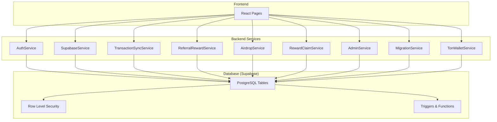
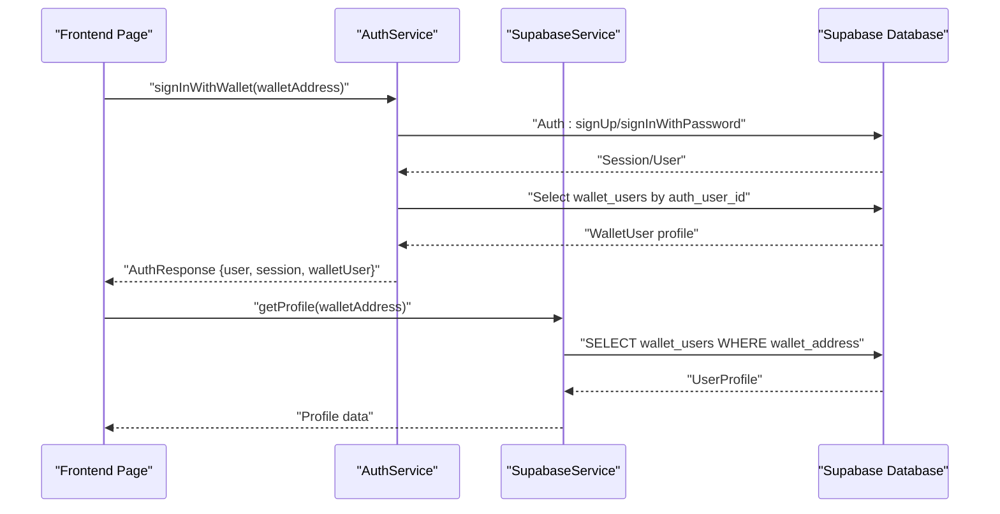
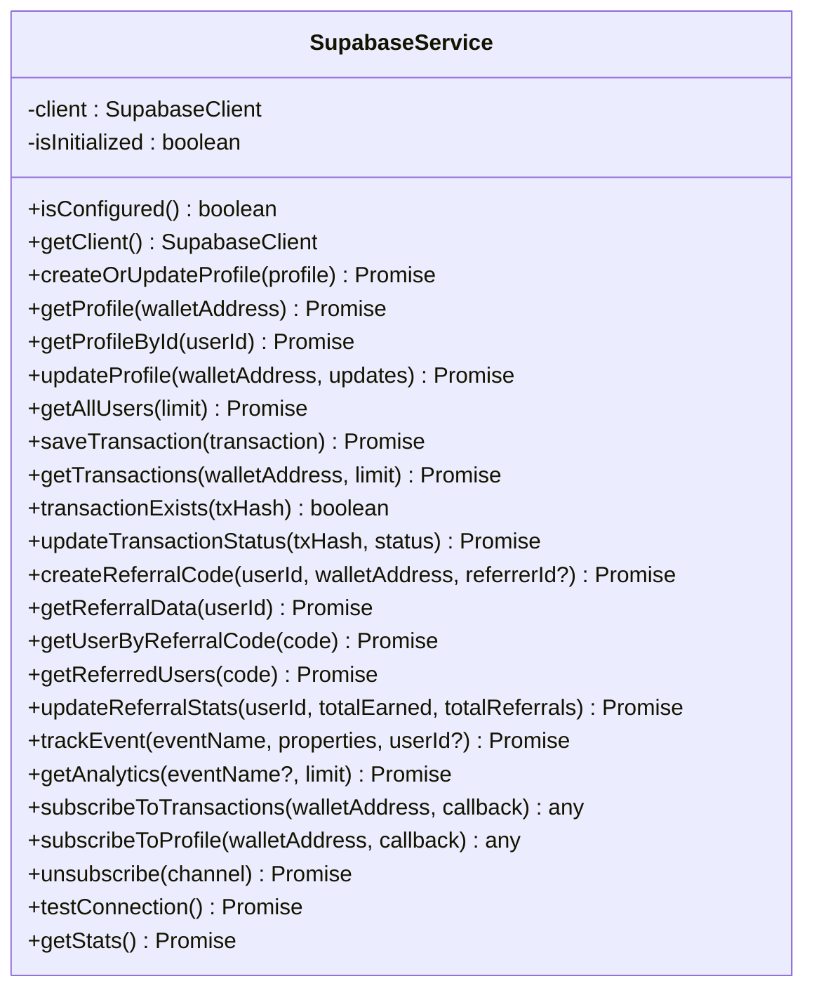
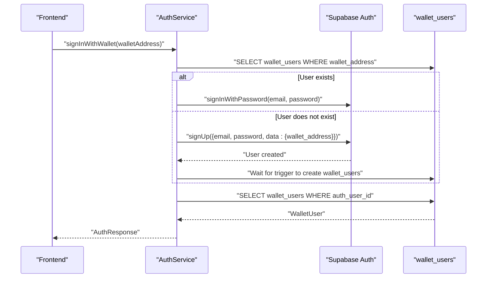
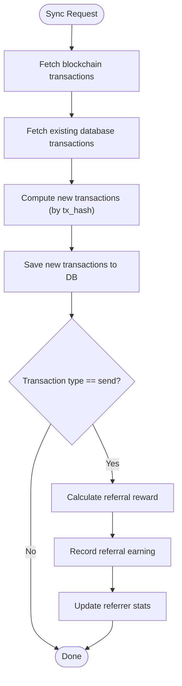
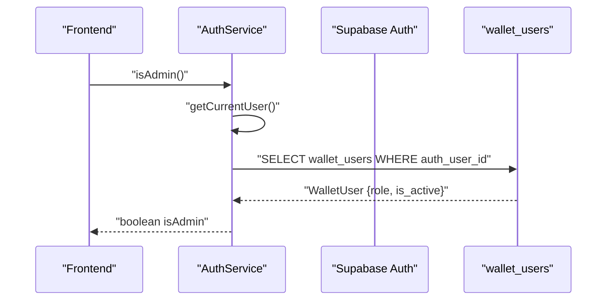
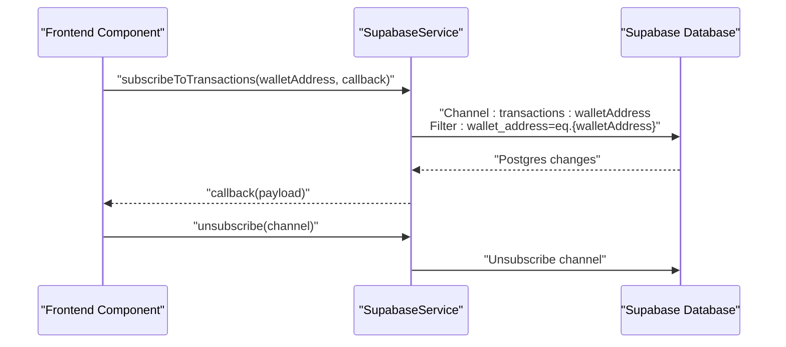
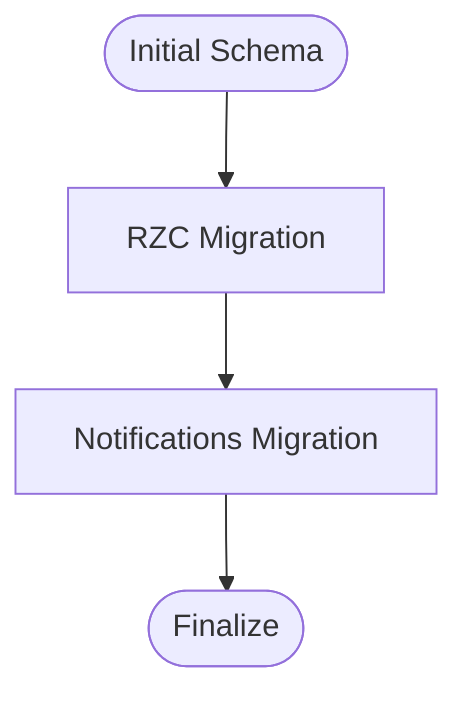
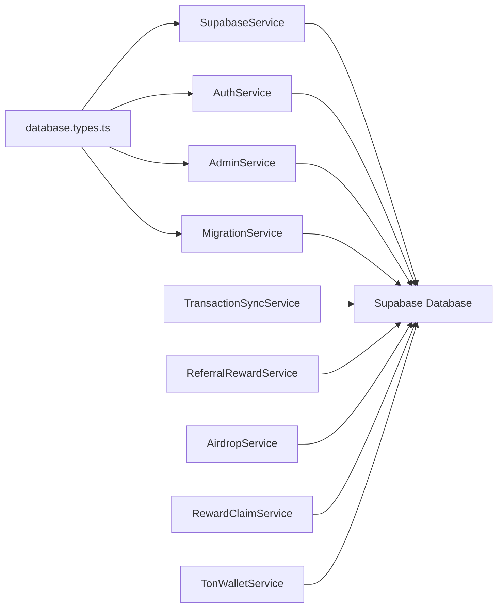

# Database and Backend Services

<cite>
**Referenced Files in This Document**
- [supabaseService.ts](file://services/supabaseService.ts)
- [authService.ts](file://services/authService.ts)
- [database.types.ts](file://types/database.types.ts)
- [supabase_schema.sql](file://supabase_schema.sql)
- [supabase_setup_simple.sql](file://supabase_setup_simple.sql)
- [adminService.ts](file://services/adminService.ts)
- [airdropService.ts](file://services/airdropService.ts)
- [rewardClaimService.ts](file://services/rewardClaimService.ts)
- [transactionSync.ts](file://services/transactionSync.ts)
- [migrationService.ts](file://services/migrationService.ts)
- [referralRewardService.ts](file://services/referralRewardService.ts)
- [tonWalletService.ts](file://services/tonWalletService.ts)
- [SupabaseConnectionTest.tsx](file://pages/SupabaseConnectionTest.tsx)
- [CREATE_AWARD_FUNCTION_NOW.sql](file://CREATE_AWARD_FUNCTION_NOW.sql)
- [supabase_rzc_migration.sql](file://supabase_rzc_migration.sql)
- [supabase_notifications_migration.sql](file://supabase_notifications_migration.sql)
</cite>

## Table of Contents
1. [Introduction](#introduction)
2. [Project Structure](#project-structure)
3. [Core Components](#core-components)
4. [Architecture Overview](#architecture-overview)
5. [Detailed Component Analysis](#detailed-component-analysis)
6. [Dependency Analysis](#dependency-analysis)
7. [Performance Considerations](#performance-considerations)
8. [Troubleshooting Guide](#troubleshooting-guide)
9. [Conclusion](#conclusion)

## Introduction
This document provides comprehensive documentation for the database and backend services architecture of the RhizaWebWallet application. It covers the Supabase integration, real-time database subscriptions, authentication system, Row Level Security (RLS) policies, database schema design, service layer architecture, business logic patterns, and data synchronization strategies. The focus is on enabling developers and operators to understand, maintain, and extend the backend services effectively.

## Project Structure
The backend services are organized around a service-layer pattern with dedicated modules for database operations, authentication, real-time features, and specialized business domains such as rewards, migrations, and airdrops. The database schema is defined via SQL scripts and enforced with Supabase RLS policies and triggers.



**Diagram sources**
- [supabaseService.ts:89-800](file://services/supabaseService.ts#L89-L800)
- [authService.ts:28-382](file://services/authService.ts#L28-L382)
- [transactionSync.ts:10-194](file://services/transactionSync.ts#L10-L194)
- [referralRewardService.ts:19-154](file://services/referralRewardService.ts#L19-L154)
- [airdropService.ts:31-760](file://services/airdropService.ts#L31-L760)
- [rewardClaimService.ts:15-267](file://services/rewardClaimService.ts#L15-L267)
- [adminService.ts:31-431](file://services/adminService.ts#L31-L431)
- [migrationService.ts:65-686](file://services/migrationService.ts#L65-L686)
- [tonWalletService.ts:174-846](file://services/tonWalletService.ts#L174-L846)
- [supabase_schema.sql:1-422](file://supabase_schema.sql#L1-L422)

**Section sources**
- [supabaseService.ts:1-800](file://services/supabaseService.ts#L1-L800)
- [authService.ts:1-382](file://services/authService.ts#L1-L382)
- [supabase_schema.sql:1-422](file://supabase_schema.sql#L1-L422)

## Core Components
This section outlines the primary backend services and their responsibilities:

- SupabaseService: Centralized database abstraction for user profiles, transactions, referrals, analytics, and RZC token operations. Provides CRUD operations, real-time subscriptions, and utility functions.
- AuthService: Authentication and session management using Supabase Auth, supporting email/password and wallet-based sign-in flows.
- TransactionSyncService: Blockchain-to-database synchronization for TON transactions, including deduplication and referral reward processing.
- ReferralRewardService: Calculates and records referral rewards based on transaction fees and referrer rank tiers.
- AirdropService: Task verification, reward distribution, and progress tracking for airdrop campaigns.
- RewardClaimService: Manages reward claim eligibility, cooldowns, and claim statistics.
- AdminService: Administrative operations for user management, activation, and RZC awarding.
- MigrationService: Handles pre-mine and STK token migration workflows with approvals and RZC crediting.
- TonWalletService: TON blockchain integration for balance retrieval, transaction sending, and multi-recipient transfers.

**Section sources**
- [supabaseService.ts:89-800](file://services/supabaseService.ts#L89-L800)
- [authService.ts:28-382](file://services/authService.ts#L28-L382)
- [transactionSync.ts:10-194](file://services/transactionSync.ts#L10-L194)
- [referralRewardService.ts:19-154](file://services/referralRewardService.ts#L19-L154)
- [airdropService.ts:31-760](file://services/airdropService.ts#L31-L760)
- [rewardClaimService.ts:15-267](file://services/rewardClaimService.ts#L15-L267)
- [adminService.ts:31-431](file://services/adminService.ts#L31-L431)
- [migrationService.ts:65-686](file://services/migrationService.ts#L65-L686)
- [tonWalletService.ts:174-846](file://services/tonWalletService.ts#L174-L846)

## Architecture Overview
The system integrates React frontend pages with Supabase for database and real-time features, and external TON blockchain APIs for wallet operations. Authentication leverages Supabase Auth, while database access is governed by RLS policies and server-side functions.



**Diagram sources**
- [authService.ts:108-189](file://services/authService.ts#L108-L189)
- [supabaseService.ts:173-242](file://services/supabaseService.ts#L173-L242)

**Section sources**
- [authService.ts:28-382](file://services/authService.ts#L28-L382)
- [supabaseService.ts:89-800](file://services/supabaseService.ts#L89-L800)

## Detailed Component Analysis

### SupabaseService: Database Abstraction and Real-Time
SupabaseService encapsulates database operations and real-time subscriptions. It supports:
- User profiles: create/update/read and admin queries
- Transactions: save, fetch, deduplicate by tx_hash, update status
- Referral system: create referral codes, fetch referral data, update stats
- Analytics: track events and fetch analytics
- Real-time subscriptions: transaction and profile channels with Postgres changes filters
- Utility: connection testing and statistics



**Diagram sources**
- [supabaseService.ts:89-800](file://services/supabaseService.ts#L89-L800)

**Section sources**
- [supabaseService.ts:89-800](file://services/supabaseService.ts#L89-L800)

### AuthService: Authentication and Authorization
AuthService manages authentication flows and admin checks:
- Email/password sign-up and sign-in
- Wallet-based sign-in with deterministic email/password generation
- Session management and user retrieval
- Admin role verification using wallet_user role and active flag
- Admin operations: user listing, role updates, deactivation, audit logging



**Diagram sources**
- [authService.ts:108-189](file://services/authService.ts#L108-L189)
- [supabaseService.ts:227-246](file://services/supabaseService.ts#L227-L246)

**Section sources**
- [authService.ts:28-382](file://services/authService.ts#L28-L382)
- [supabaseService.ts:227-246](file://services/supabaseService.ts#L227-L246)

### Database Schema Design and RLS
The database schema defines core tables and policies:

- wallet_users: user profiles linked to wallet addresses with roles and activation flags
- wallet_transactions: transaction history with deduplication via tx_hash
- wallet_referrals and wallet_referral_earnings: referral program with rank tiers and earnings
- wallet_analytics: event tracking
- wallet_admin_audit: admin action logs
- wallet_rzc_transactions: RZC token transactions
- wallet_notifications, wallet_user_activity, wallet_notification_preferences: notification system
- wallet_migrations, stk_migrations: migration workflows

RLS policies restrict access based on current wallet context and admin roles. Triggers update timestamps and referral statistics. Functions encapsulate atomic operations like awarding RZC tokens.

```mermaid
erDiagram
WALLET_USERS {
uuid id PK
uuid auth_user_id
text wallet_address UK
text email
text name
text avatar
text role
boolean is_active
text referrer_code
numeric rzc_balance
timestamptz last_login_at
timestamptz created_at
timestamptz updated_at
}
WALLET_TRANSACTIONS {
uuid id PK
uuid user_id FK
text wallet_address
text type
text amount
text asset
text to_address
text from_address
text tx_hash UK
text status
jsonb metadata
timestamptz created_at
}
WALLET_REFERRALS {
uuid id PK
uuid user_id UK FK
uuid referrer_id FK
text referral_code UK
numeric total_earned
text rank
integer level
timestamptz created_at
timestamptz updated_at
}
WALLET_REFERRAL_EARNINGS {
uuid id PK
uuid referrer_id FK
uuid referred_user_id FK
uuid transaction_id FK
numeric amount
numeric percentage
integer level
timestamptz created_at
}
WALLET_ANALYTICS {
uuid id PK
uuid user_id FK
text wallet_address
text event_name
jsonb properties
timestamptz created_at
}
WALLET_ADMIN_AUDIT {
uuid id PK
uuid admin_id FK
text action
uuid target_user_id FK
jsonb details
timestamptz created_at
}
WALLET_RZC_TRANSACTIONS {
uuid id PK
uuid user_id FK
text type
numeric amount
numeric balance_after
text description
jsonb metadata
timestamptz created_at
}
WALLET_NOTIFICATIONS {
uuid id PK
uuid user_id FK
text wallet_address
text type
text title
text message
jsonb data
boolean is_read
boolean is_archived
text priority
text action_url
text action_label
timestamptz created_at
timestamptz read_at
timestamptz expires_at
}
WALLET_USER_ACTIVITY {
uuid id PK
uuid user_id FK
text wallet_address
text activity_type
text description
jsonb metadata
text ip_address
text user_agent
text device_type
timestamptz created_at
}
WALLET_NOTIFICATION_PREFERENCES {
uuid id PK
uuid user_id UK FK
text wallet_address UK
boolean enable_transaction_notifications
boolean enable_referral_notifications
boolean enable_reward_notifications
boolean enable_system_notifications
boolean enable_security_notifications
boolean enable_push_notifications
boolean enable_email_notifications
timestamptz created_at
timestamptz updated_at
}
WALLET_MIGRATIONS {
uuid id PK
text wallet_address
text telegram_username
text mobile_number
numeric available_balance
numeric claimable_balance
numeric total_balance
text status
text admin_notes
timestamptz created_at
timestamptz updated_at
timestamptz reviewed_at
text reviewed_by
}
WALLET_STK_MIGRATIONS {
uuid id PK
text wallet_address
text telegram_username
text mobile_number
text stk_wallet_address
text nft_token_id
numeric stk_amount
numeric ton_staked
numeric starfi_points
numeric rzc_equivalent
text status
text admin_notes
timestamptz created_at
timestamptz updated_at
timestamptz reviewed_at
text reviewed_by
}
WALLET_USERS ||--o{ WALLET_TRANSACTIONS : "has"
WALLET_USERS ||--o{ WALLET_REFERRALS : "has"
WALLET_USERS ||--o{ WALLET_REFERRAL_EARNINGS : "referrer"
WALLET_USERS ||--o{ WALLET_REFERRAL_EARNINGS : "referred"
WALLET_USERS ||--o{ WALLET_RZC_TRANSACTIONS : "has"
WALLET_USERS ||--o{ WALLET_NOTIFICATIONS : "has"
WALLET_USERS ||--o{ WALLET_USER_ACTIVITY : "has"
WALLET_USERS ||--o{ WALLET_NOTIFICATION_PREFERENCES : "has"
WALLET_USERS ||--o{ WALLET_MIGRATIONS : "applies"
WALLET_USERS ||--o{ WALLET_STK_MIGRATIONS : "applies"
```

**Diagram sources**
- [supabase_schema.sql:11-136](file://supabase_schema.sql#L11-L136)
- [supabase_rzc_migration.sql:41-136](file://supabase_rzc_migration.sql#L41-L136)
- [supabase_notifications_migration.sql:13-160](file://supabase_notifications_migration.sql#L13-L160)

**Section sources**
- [supabase_schema.sql:1-422](file://supabase_schema.sql#L1-L422)
- [supabase_rzc_migration.sql:1-357](file://supabase_rzc_migration.sql#L1-L357)
- [supabase_notifications_migration.sql:1-506](file://supabase_notifications_migration.sql#L1-L506)

### Service Layer Architecture and Business Logic
The service layer implements domain-specific logic:

- TransactionSyncService: Deduplicates blockchain transactions, saves to database, and triggers referral reward processing.
- ReferralRewardService: Computes tiered commissions based on referrer rank and records earnings.
- AirdropService: Validates tasks, records completions, and distributes RZC via database functions.
- RewardClaimService: Enforces minimum claim thresholds and cooldown periods.
- AdminService: Administrative controls for user management and RZC awarding.
- MigrationService: Processes pre-mine and STK migrations with approvals and atomic RZC crediting.



**Diagram sources**
- [transactionSync.ts:18-156](file://services/transactionSync.ts#L18-L156)
- [referralRewardService.ts:24-112](file://services/referralRewardService.ts#L24-L112)

**Section sources**
- [transactionSync.ts:10-194](file://services/transactionSync.ts#L10-L194)
- [referralRewardService.ts:19-154](file://services/referralRewardService.ts#L19-L154)

### Authentication and Authorization Mechanisms
Authentication relies on Supabase Auth with wallet-based sign-in and admin role checks. Authorization is enforced via:
- Supabase Auth session management
- RLS policies on tables using current wallet context
- Admin-only operations gated by wallet_user role and active flag
- Audit logging for admin actions



**Diagram sources**
- [authService.ts:264-294](file://services/authService.ts#L264-L294)

**Section sources**
- [authService.ts:264-294](file://services/authService.ts#L264-L294)

### Real-Time Data Synchronization and Offline Patterns
Real-time synchronization is achieved through Supabase Postgres changes:
- Channels per wallet address for transactions and profile updates
- Filters applied to specific wallet_address
- Frontend subscribes/unsubscribes to keep UI synchronized
- Offline-first patterns supported by local caching and optimistic updates with eventual consistency



**Diagram sources**
- [supabaseService.ts:701-764](file://services/supabaseService.ts#L701-L764)

**Section sources**
- [supabaseService.ts:696-764](file://services/supabaseService.ts#L696-L764)

### Database Migration System and Schema Evolution
Schema evolution is managed via SQL scripts:
- Base schema creation and RLS setup
- RZC token system migration with atomic award function
- Notifications and activity tracking system
- Migration-safe additions using IF NOT EXISTS and ALTER TABLE IF EXISTS



**Diagram sources**
- [supabase_schema.sql:1-422](file://supabase_schema.sql#L1-L422)
- [supabase_rzc_migration.sql:1-357](file://supabase_rzc_migration.sql#L1-L357)
- [supabase_notifications_migration.sql:1-506](file://supabase_notifications_migration.sql#L1-L506)

**Section sources**
- [supabase_schema.sql:1-422](file://supabase_schema.sql#L1-L422)
- [supabase_rzc_migration.sql:1-357](file://supabase_rzc_migration.sql#L1-L357)
- [supabase_notifications_migration.sql:1-506](file://supabase_notifications_migration.sql#L1-L506)

### Data Integrity Measures
- Unique constraints on wallet_address and tx_hash
- Atomic operations via server-side functions (e.g., award_rzc_tokens)
- Triggers for timestamp updates and referral statistics
- RLS policies to enforce row-level access control
- Validation and sanitization in transaction flows

**Section sources**
- [supabase_schema.sql:11-136](file://supabase_schema.sql#L11-L136)
- [CREATE_AWARD_FUNCTION_NOW.sql:20-74](file://CREATE_AWARD_FUNCTION_NOW.sql#L20-L74)
- [supabase_rzc_migration.sql:87-136](file://supabase_rzc_migration.sql#L87-L136)

### Examples of Service Method Usage
- Authentication: [authService.ts:108-189](file://services/authService.ts#L108-L189)
- Database operations: [supabaseService.ts:133-171](file://services/supabaseService.ts#L133-L171)
- Transaction sync: [transactionSync.ts:18-156](file://services/transactionSync.ts#L18-L156)
- Referral rewards: [referralRewardService.ts:24-112](file://services/referralRewardService.ts#L24-L112)
- Airdrop verification: [airdropService.ts:301-385](file://services/airdropService.ts#L301-L385)
- Reward claims: [rewardClaimService.ts:19-75](file://services/rewardClaimService.ts#L19-L75)
- Admin operations: [adminService.ts:115-198](file://services/adminService.ts#L115-L198)
- Migrations: [migrationService.ts:69-128](file://services/migrationService.ts#L69-L128)
- TON wallet operations: [tonWalletService.ts:423-582](file://services/tonWalletService.ts#L423-L582)

**Section sources**
- [authService.ts:108-189](file://services/authService.ts#L108-L189)
- [supabaseService.ts:133-171](file://services/supabaseService.ts#L133-L171)
- [transactionSync.ts:18-156](file://services/transactionSync.ts#L18-L156)
- [referralRewardService.ts:24-112](file://services/referralRewardService.ts#L24-L112)
- [airdropService.ts:301-385](file://services/airdropService.ts#L301-L385)
- [rewardClaimService.ts:19-75](file://services/rewardClaimService.ts#L19-L75)
- [adminService.ts:115-198](file://services/adminService.ts#L115-L198)
- [migrationService.ts:69-128](file://services/migrationService.ts#L69-L128)
- [tonWalletService.ts:423-582](file://services/tonWalletService.ts#L423-L582)

## Dependency Analysis
The services depend on shared types and database definitions, with clear separation of concerns:



**Diagram sources**
- [database.types.ts:9-221](file://types/database.types.ts#L9-L221)
- [supabaseService.ts:89-800](file://services/supabaseService.ts#L89-L800)
- [authService.ts:28-382](file://services/authService.ts#L28-L382)
- [adminService.ts:31-431](file://services/adminService.ts#L31-L431)
- [migrationService.ts:65-686](file://services/migrationService.ts#L65-L686)
- [transactionSync.ts:10-194](file://services/transactionSync.ts#L10-L194)
- [referralRewardService.ts:19-154](file://services/referralRewardService.ts#L19-L154)
- [airdropService.ts:31-760](file://services/airdropService.ts#L31-L760)
- [rewardClaimService.ts:15-267](file://services/rewardClaimService.ts#L15-L267)
- [tonWalletService.ts:174-846](file://services/tonWalletService.ts#L174-L846)

**Section sources**
- [database.types.ts:9-221](file://types/database.types.ts#L9-L221)

## Performance Considerations
- Use indexes on frequently queried columns (wallet_address, tx_hash, user_id, created_at)
- Batch operations where possible (multi-transaction sends)
- Implement pagination for analytics and user lists
- Leverage Supabase RLS efficiently to avoid unnecessary scans
- Cache frequently accessed data (e.g., referral stats) and invalidate on change

## Troubleshooting Guide
Common issues and resolutions:
- Supabase not configured: Verify environment variables and client initialization
- Connection failures: Check Supabase URL and Anon Key; use connection test page
- RLS policy errors: Ensure current wallet context is set and user has appropriate role
- Transaction deduplication: Verify tx_hash uniqueness and subscription filters
- Function execution permissions: Confirm grants for server-side functions

**Section sources**
- [SupabaseConnectionTest.tsx:13-162](file://pages/SupabaseConnectionTest.tsx#L13-L162)
- [supabaseService.ts:773-800](file://services/supabaseService.ts#L773-L800)
- [supabase_schema.sql:252-336](file://supabase_schema.sql#L252-L336)

## Conclusion
The RhizaWebWallet backend combines Supabase for scalable database and real-time features with a robust service-layer architecture. Authentication is handled through Supabase Auth, while RLS and server-side functions enforce data integrity and access control. The system supports real-time synchronization, referral rewards, airdrop automation, and comprehensive administrative controls, providing a solid foundation for growth and maintenance.