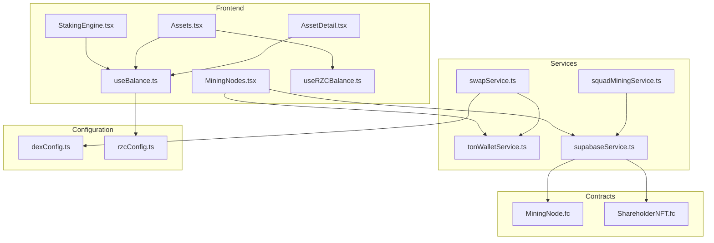
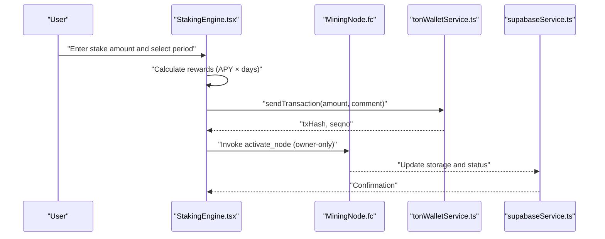
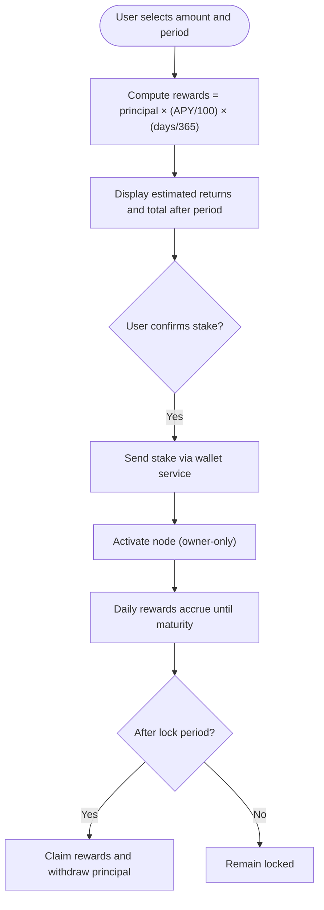
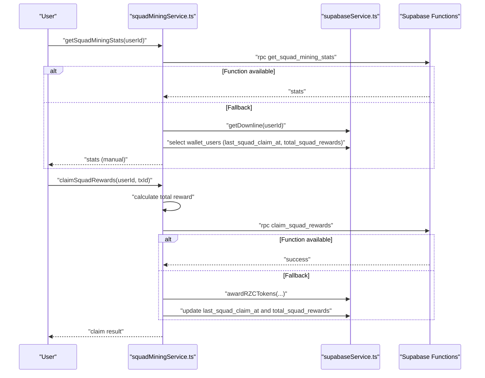
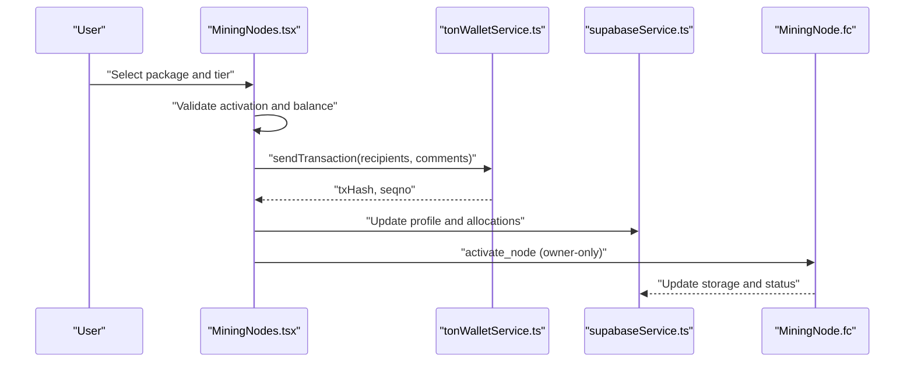
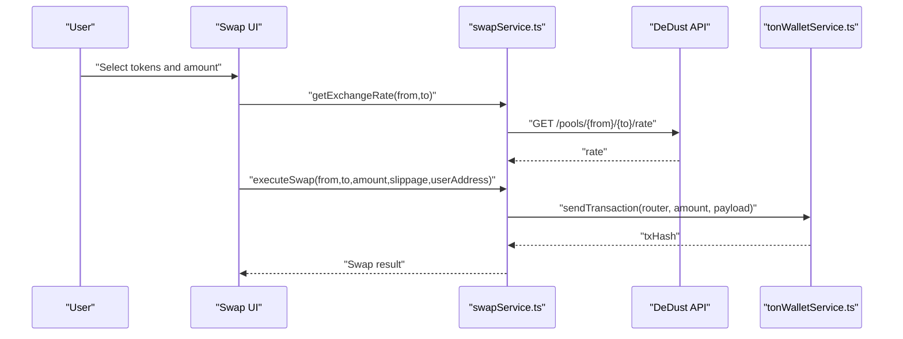
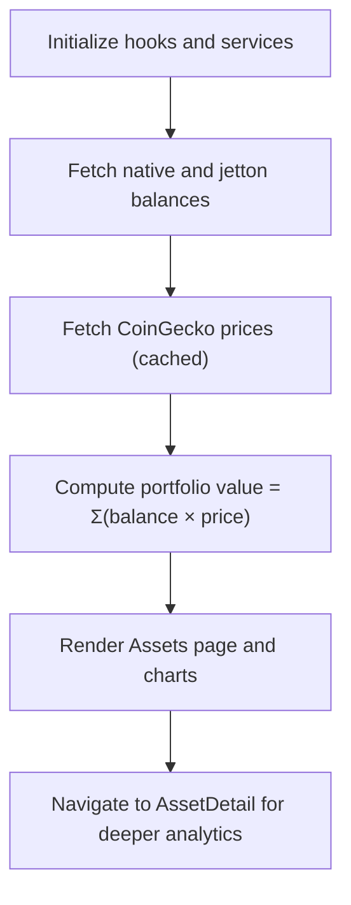
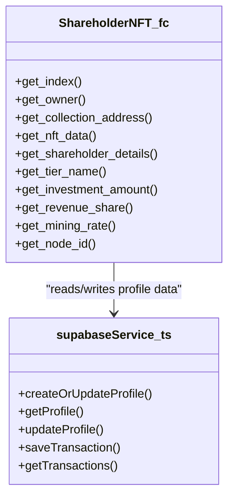
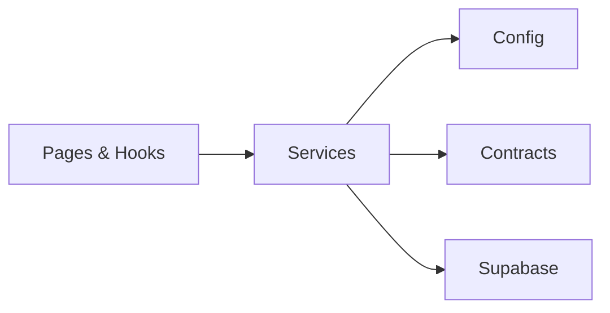

# Financial Services

<cite>
**Referenced Files in This Document**
- [StakingEngine.tsx](file://pages/StakingEngine.tsx)
- [squadMiningService.ts](file://services/squadMiningService.ts)
- [swapService.ts](file://services/swapService.ts)
- [MiningNode.fc](file://contracts/MiningNode.fc)
- [ShareholderNFT.fc](file://contracts/ShareholderNFT.fc)
- [useBalance.ts](file://hooks/useBalance.ts)
- [useRZCBalance.ts](file://hooks/useRZCBalance.ts)
- [Assets.tsx](file://pages/Assets.tsx)
- [AssetDetail.tsx](file://pages/AssetDetail.tsx)
- [dexConfig.ts](file://config/dexConfig.ts)
- [MiningNodes.tsx](file://pages/MiningNodes.tsx)
- [tonWalletService.ts](file://services/tonWalletService.ts)
- [supabaseService.ts](file://services/supabaseService.ts)
- [rzcConfig.ts](file://config/rzcConfig.ts)
</cite>

## Table of Contents
1. [Introduction](#introduction)
2. [Project Structure](#project-structure)
3. [Core Components](#core-components)
4. [Architecture Overview](#architecture-overview)
5. [Detailed Component Analysis](#detailed-component-analysis)
6. [Dependency Analysis](#dependency-analysis)
7. [Performance Considerations](#performance-considerations)
8. [Troubleshooting Guide](#troubleshooting-guide)
9. [Conclusion](#conclusion)
10. [Appendices](#appendices)

## Introduction
This document explains the financial services offered by the platform, focusing on:
- Staking engine architecture, configuration, yield calculations, and withdrawal processing
- Squad mining functionality, mining node management, and shareholder system integration
- Trading and exchange capabilities, including DEX integration, swap functionality, and price feed management
- Asset management features, portfolio tracking, balance monitoring, and performance analytics
- Liquidity management, market integration, and risk assessment

It provides practical examples of staking operations, trading workflows, and asset management scenarios, grounded in the repository’s frontend, backend services, and smart contracts.

## Project Structure
The financial services span three layers:
- Frontend pages and hooks for user-facing financial operations
- Services for blockchain interactions, DEX swaps, and database integrations
- Smart contracts for staking, mining nodes, and shareholder NFTs

**Diagram sources**
- [StakingEngine.tsx:1-350](file://pages/StakingEngine.tsx#L1-L350)
- [MiningNodes.tsx:1-738](file://pages/MiningNodes.tsx#L1-L738)
- [Assets.tsx:1-989](file://pages/Assets.tsx#L1-L989)
- [AssetDetail.tsx:1-498](file://pages/AssetDetail.tsx#L1-L498)
- [useBalance.ts:1-158](file://hooks/useBalance.ts#L1-L158)
- [useRZCBalance.ts:1-86](file://hooks/useRZCBalance.ts#L1-L86)
- [swapService.ts:1-444](file://services/swapService.ts#L1-L444)
- [tonWalletService.ts:1-846](file://services/tonWalletService.ts#L1-L846)
- [supabaseService.ts:1-1916](file://services/supabaseService.ts#L1-L1916)
- [squadMiningService.ts:1-339](file://services/squadMiningService.ts#L1-L339)
- [dexConfig.ts:1-193](file://config/dexConfig.ts#L1-L193)
- [rzcConfig.ts:1-97](file://config/rzcConfig.ts#L1-L97)
- [MiningNode.fc:1-259](file://contracts/MiningNode.fc#L1-L259)
- [ShareholderNFT.fc:1-229](file://contracts/ShareholderNFT.fc#L1-L229)

**Section sources**
- [StakingEngine.tsx:1-350](file://pages/StakingEngine.tsx#L1-L350)
- [MiningNodes.tsx:1-738](file://pages/MiningNodes.tsx#L1-L738)
- [Assets.tsx:1-989](file://pages/Assets.tsx#L1-L989)
- [AssetDetail.tsx:1-498](file://pages/AssetDetail.tsx#L1-L498)
- [useBalance.ts:1-158](file://hooks/useBalance.ts#L1-L158)
- [useRZCBalance.ts:1-86](file://hooks/useRZCBalance.ts#L1-L86)
- [swapService.ts:1-444](file://services/swapService.ts#L1-L444)
- [tonWalletService.ts:1-846](file://services/tonWalletService.ts#L1-L846)
- [supabaseService.ts:1-1916](file://services/supabaseService.ts#L1-L1916)
- [squadMiningService.ts:1-339](file://services/squadMiningService.ts#L1-L339)
- [dexConfig.ts:1-193](file://config/dexConfig.ts#L1-L193)
- [rzcConfig.ts:1-97](file://config/rzcConfig.ts#L1-L97)
- [MiningNode.fc:1-259](file://contracts/MiningNode.fc#L1-L259)
- [ShareholderNFT.fc:1-229](file://contracts/ShareholderNFT.fc#L1-L229)

## Core Components
- Staking Engine: Interactive calculator and enrollment flow for passive yield with configurable tiers and APY.
- Squad Mining: Community-driven reward distribution based on team size and tiered member contributions.
- Mining Nodes: Node purchase and activation flow integrated with wallet balances and ecosystem rewards.
- DEX Swap Service: Real-time swap execution via DeDust with token metadata and gas estimation.
- Asset Management: Portfolio aggregation, balance monitoring, and performance analytics across native, community, and multi-chain assets.
- Shareholder NFT: Ownership and revenue share tracking via NFT certificates with transfer and metadata support.
- Smart Contracts: On-chain staking, node activation, rewards, and shareholder governance.

**Section sources**
- [StakingEngine.tsx:1-350](file://pages/StakingEngine.tsx#L1-L350)
- [squadMiningService.ts:1-339](file://services/squadMiningService.ts#L1-L339)
- [MiningNodes.tsx:1-738](file://pages/MiningNodes.tsx#L1-L738)
- [swapService.ts:1-444](file://services/swapService.ts#L1-L444)
- [Assets.tsx:1-989](file://pages/Assets.tsx#L1-L989)
- [AssetDetail.tsx:1-498](file://pages/AssetDetail.tsx#L1-L498)
- [ShareholderNFT.fc:1-229](file://contracts/ShareholderNFT.fc#L1-L229)
- [MiningNode.fc:1-259](file://contracts/MiningNode.fc#L1-L259)

## Architecture Overview
The financial architecture integrates user interfaces with blockchain services and smart contracts. Key flows:
- Staking: UI calculates yield, user confirms stake, smart contract locks tokens and accrues rewards.
- Squad Mining: Service computes eligible rewards from downline members and claims via database function or manual fallback.
- Mining Nodes: Purchase flow validates wallet balance, invokes wallet service to send payments, and updates Supabase profiles.
- DEX Swaps: Service queries DeDust for rates, builds swap payloads, and executes via wallet service.
- Asset Management: Hooks fetch balances and prices, pages render portfolio and charts, and analytics are persisted in Supabase.

**Diagram sources**
- [StakingEngine.tsx:1-350](file://pages/StakingEngine.tsx#L1-L350)
- [MiningNode.fc:92-120](file://contracts/MiningNode.fc#L92-L120)
- [tonWalletService.ts:423-582](file://services/tonWalletService.ts#L423-L582)
- [supabaseService.ts:1-1916](file://services/supabaseService.ts#L1-L1916)

**Section sources**
- [StakingEngine.tsx:1-350](file://pages/StakingEngine.tsx#L1-L350)
- [MiningNode.fc:1-259](file://contracts/MiningNode.fc#L1-L259)
- [tonWalletService.ts:1-846](file://services/tonWalletService.ts#L1-L846)
- [supabaseService.ts:1-1916](file://services/supabaseService.ts#L1-L1916)

## Detailed Component Analysis

### Staking Engine
- Configuration: Three tiers (30/90/180 days) with fixed APYs; calculator computes rewards and totals.
- Yield Calculation: Annual Percentage Yield applied over the selected lock period with daily compounding semantics.
- Withdrawal Processing: Lock period enforced; withdrawals permitted after maturity; UI warns on risks and APY changes.

**Diagram sources**
- [StakingEngine.tsx:9-19](file://pages/StakingEngine.tsx#L9-L19)
- [MiningNode.fc:86-89](file://contracts/MiningNode.fc#L86-L89)
- [MiningNode.fc:122-159](file://contracts/MiningNode.fc#L122-L159)

**Section sources**
- [StakingEngine.tsx:1-350](file://pages/StakingEngine.tsx#L1-L350)
- [MiningNode.fc:1-259](file://contracts/MiningNode.fc#L1-L259)

### Squad Mining
- Statistics: Squad size, potential reward, total earned, last claim, and eligibility derived from database function or manual calculation.
- Reward Model: Base reward per member plus premium bonus for elite members; claim interval enforced.
- Claims: Attempts database function first, falls back to manual credit and profile updates.

**Diagram sources**
- [squadMiningService.ts:35-65](file://services/squadMiningService.ts#L35-L65)
- [squadMiningService.ts:209-334](file://services/squadMiningService.ts#L209-L334)
- [supabaseService.ts:1-1916](file://services/supabaseService.ts#L1-L1916)

**Section sources**
- [squadMiningService.ts:1-339](file://services/squadMiningService.ts#L1-L339)
- [supabaseService.ts:1-1916](file://services/supabaseService.ts#L1-L1916)

### Mining Nodes
- Purchase Flow: Validates wallet activation, checks balance, opens purchase modal, stores local purchases, and triggers wallet service to send payments.
- Node Lifecycle: Activation requires payment; rewards accrue based on mining rate; status and expiration handled on-chain.

**Diagram sources**
- [MiningNodes.tsx:281-293](file://pages/MiningNodes.tsx#L281-L293)
- [tonWalletService.ts:423-582](file://services/tonWalletService.ts#L423-L582)
- [supabaseService.ts:1-1916](file://services/supabaseService.ts#L1-L1916)
- [MiningNode.fc:92-120](file://contracts/MiningNode.fc#L92-L120)

**Section sources**
- [MiningNodes.tsx:1-738](file://pages/MiningNodes.tsx#L1-L738)
- [MiningNode.fc:1-259](file://contracts/MiningNode.fc#L1-L259)
- [tonWalletService.ts:1-846](file://services/tonWalletService.ts#L1-L846)
- [supabaseService.ts:1-1916](file://services/supabaseService.ts#L1-L1916)

### DEX Swap Service and Price Feed
- DEX Integration: DeDust router and factory addresses configured; supports TON, USDT, USDC, jUSDT, NOT, SCALE.
- Swap Execution: Builds swap payloads, estimates gas, and sends transactions via wallet service; supports TON↔Jetton and Jetton↔Jetton swaps.
- Price Feeds: CoinGecko integration for native assets; fallbacks and caching for stability; mock charts for community tokens.

**Diagram sources**
- [swapService.ts:70-107](file://services/swapService.ts#L70-L107)
- [swapService.ts:147-234](file://services/swapService.ts#L147-L234)
- [dexConfig.ts:21-55](file://config/dexConfig.ts#L21-L55)
- [tonWalletService.ts:423-582](file://services/tonWalletService.ts#L423-L582)

**Section sources**
- [swapService.ts:1-444](file://services/swapService.ts#L1-L444)
- [dexConfig.ts:1-193](file://config/dexConfig.ts#L1-L193)
- [tonWalletService.ts:1-846](file://services/tonWalletService.ts#L1-L846)

### Asset Management and Portfolio Tracking
- Portfolio Aggregation: Native TON, community RZC, multi-chain assets (EVM/BTC), and jettons combined with registry metadata and prices.
- Balance Monitoring: Real-time balances via wallet service; price feeds via CoinGecko with caching; RZC price from centralized config.
- Performance Analytics: Charts powered by historical price data; transaction history linked to asset detail views.

**Diagram sources**
- [Assets.tsx:151-241](file://pages/Assets.tsx#L151-L241)
- [Assets.tsx:340-358](file://pages/Assets.tsx#L340-L358)
- [AssetDetail.tsx:32-41](file://pages/AssetDetail.tsx#L32-L41)
- [useBalance.ts:37-56](file://hooks/useBalance.ts#L37-L56)
- [useRZCBalance.ts:25-59](file://hooks/useRZCBalance.ts#L25-L59)
- [rzcConfig.ts:17-35](file://config/rzcConfig.ts#L17-L35)

**Section sources**
- [Assets.tsx:1-989](file://pages/Assets.tsx#L1-L989)
- [AssetDetail.tsx:1-498](file://pages/AssetDetail.tsx#L1-L498)
- [useBalance.ts:1-158](file://hooks/useBalance.ts#L1-L158)
- [useRZCBalance.ts:1-86](file://hooks/useRZCBalance.ts#L1-L86)
- [rzcConfig.ts:1-97](file://config/rzcConfig.ts#L1-L97)

### Shareholder System Integration
- Shareholder NFT: Tracks ownership, tier, investment amount, mining rate, revenue share, and node ID; supports transfers and metadata retrieval.
- Integration: Supabase service coordinates with NFT contract for ownership updates and metadata exposure.

**Diagram sources**
- [ShareholderNFT.fc:157-229](file://contracts/ShareholderNFT.fc#L157-L229)
- [supabaseService.ts:129-280](file://services/supabaseService.ts#L129-L280)

**Section sources**
- [ShareholderNFT.fc:1-229](file://contracts/ShareholderNFT.fc#L1-L229)
- [supabaseService.ts:1-1916](file://services/supabaseService.ts#L1-L1916)

## Dependency Analysis
- Frontend depends on services for blockchain operations and data persistence.
- Services depend on configuration for DEX addresses and token metadata.
- Smart contracts enforce on-chain state transitions and payouts.
- Supabase centralizes user profiles, transactions, and analytics.

**Diagram sources**
- [swapService.ts:1-444](file://services/swapService.ts#L1-L444)
- [tonWalletService.ts:1-846](file://services/tonWalletService.ts#L1-L846)
- [supabaseService.ts:1-1916](file://services/supabaseService.ts#L1-L1916)
- [dexConfig.ts:1-193](file://config/dexConfig.ts#L1-L193)
- [MiningNode.fc:1-259](file://contracts/MiningNode.fc#L1-L259)
- [ShareholderNFT.fc:1-229](file://contracts/ShareholderNFT.fc#L1-L229)

**Section sources**
- [swapService.ts:1-444](file://services/swapService.ts#L1-L444)
- [tonWalletService.ts:1-846](file://services/tonWalletService.ts#L1-L846)
- [supabaseService.ts:1-1916](file://services/supabaseService.ts#L1-L1916)
- [dexConfig.ts:1-193](file://config/dexConfig.ts#L1-L193)
- [MiningNode.fc:1-259](file://contracts/MiningNode.fc#L1-L259)
- [ShareholderNFT.fc:1-229](file://contracts/ShareholderNFT.fc#L1-L229)

## Performance Considerations
- Caching: Price cache with TTL reduces API calls; consider increasing cache intervals for stable assets.
- Batch Operations: Multi-send transactions consolidate platform and referral commissions to reduce gas overhead.
- Network Selection: Default mainnet; switch to testnet for development to avoid real gas costs.
- Gas Estimation: Use service-provided estimates; monitor actual fees and adjust UI messaging accordingly.

[No sources needed since this section provides general guidance]

## Troubleshooting Guide
- Staking Failures: Verify wallet initialization, sufficient balance, and correct network selection before sending transactions.
- Swap Errors: Ensure DEX API availability, correct token addresses, and adequate gas; check slippage and timeouts.
- Squad Mining Claims: Confirm database function availability; fallback to manual credit path; validate claim intervals.
- Asset Balances: Refresh balances and confirm registry metadata; verify token decimals and addresses.
- Session Expiry: Restore session before performing sensitive operations; ensure encryption migration is complete.

**Section sources**
- [tonWalletService.ts:1-846](file://services/tonWalletService.ts#L1-L846)
- [swapService.ts:1-444](file://services/swapService.ts#L1-L444)
- [squadMiningService.ts:1-339](file://services/squadMiningService.ts#L1-L339)
- [Assets.tsx:1-989](file://pages/Assets.tsx#L1-L989)

## Conclusion
The financial services layer combines intuitive UIs, robust services, and on-chain contracts to deliver a seamless experience for staking, squad mining, node management, DEX swaps, and asset management. Centralized configuration and caching improve reliability, while Supabase enables scalable analytics and user data management. The architecture supports extensibility for additional DEXes, tokens, and yield mechanisms.

[No sources needed since this section summarizes without analyzing specific files]

## Appendices

### Examples

- Staking Operations
  - Select stake amount and period; review estimated returns; confirm stake; monitor accruals; claim after lock period.
  - Reference: [StakingEngine.tsx:1-350](file://pages/StakingEngine.tsx#L1-L350), [MiningNode.fc:86-159](file://contracts/MiningNode.fc#L86-L159)

- Trading Workflows
  - Choose tokens and amount; review exchange rate and slippage; execute swap; monitor transaction status.
  - Reference: [swapService.ts:70-141](file://services/swapService.ts#L70-L141), [dexConfig.ts:21-55](file://config/dexConfig.ts#L21-L55)

- Asset Management Scenarios
  - View portfolio value; inspect asset details and charts; manage transfers; track transaction history.
  - Reference: [Assets.tsx:340-358](file://pages/Assets.tsx#L340-L358), [AssetDetail.tsx:32-41](file://pages/AssetDetail.tsx#L32-L41)

[No sources needed since this section provides general guidance]