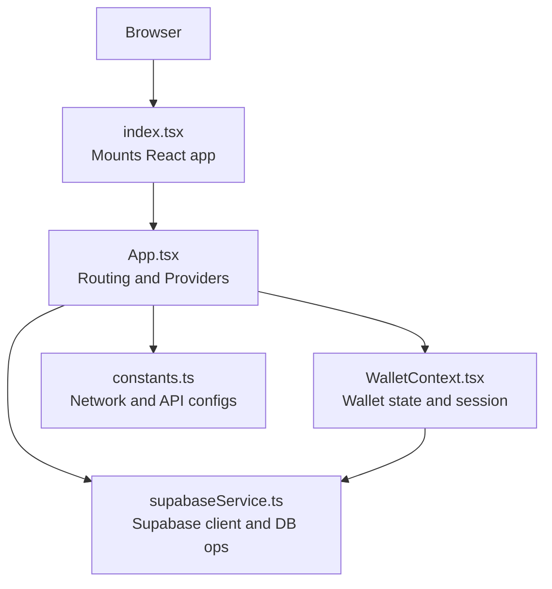

# Getting Started

<cite>
**Referenced Files in This Document**
- [package.json](file://package.json)
- [vite.config.ts](file://vite.config.ts)
- [tsconfig.json](file://tsconfig.json)
- [index.tsx](file://index.tsx)
- [App.tsx](file://App.tsx)
- [constants.ts](file://constants.ts)
- [net-mock.js](file://net-mock.js)
- [tls-mock.js](file://tls-mock.js)
- [supabaseService.ts](file://services/supabaseService.ts)
- [WalletContext.tsx](file://context/WalletContext.tsx)
- [supabase_setup_simple.sql](file://supabase_setup_simple.sql)
- [supabase_schema.sql](file://supabase_schema.sql)
</cite>

## Table of Contents
1. [Introduction](#introduction)
2. [Prerequisites](#prerequisites)
3. [Installation](#installation)
4. [Environment Variables](#environment-variables)
5. [Database Setup](#database-setup)
6. [Build and Run](#build-and-run)
7. [Initial Project Verification](#initial-project-verification)
8. [Architecture Overview](#architecture-overview)
9. [Troubleshooting](#troubleshooting)
10. [Conclusion](#conclusion)

## Introduction
This guide helps you install, configure, and run RhizaWebWallet locally. It covers prerequisites, environment setup, building the frontend, connecting to Supabase, and verifying the app works end-to-end. The project is a React-based web wallet integrated with TON blockchain services and Supabase for user and transaction data.

## Prerequisites
- Operating system: Windows, macOS, or Linux
- Node.js: Version 18.x recommended for compatibility with crypto libraries and polyfills used by the project
- Package manager: npm or yarn
- Git: To clone the repository
- Text editor or IDE: Recommended for viewing and editing configuration files

Why Node.js 18.x:
- The project defines a mock process version for legacy crypto libraries and uses polyfills for Node built-ins in the browser.
- Some dependencies rely on modern JavaScript features; Node 18 ensures compatibility during development and builds.

**Section sources**
- [index.tsx:1-13](file://index.tsx#L1-L13)
- [vite.config.ts:28-31](file://vite.config.ts#L28-L31)

## Installation
1. Clone the repository
   - Use your terminal or GUI to clone the repository to your machine.
2. Install dependencies
   - Using npm: run npm install
   - Using yarn: run yarn install
3. Confirm TypeScript configuration
   - The project uses a strict TS configuration optimized for React and modern JS features.

Notes:
- The project uses Vite for dev/build. Scripts are defined in package.json for dev, build, preview, and deploy.
- The TS compiler targets ES2022 and uses bundler module resolution.

**Section sources**
- [package.json:7-12](file://package.json#L7-L12)
- [tsconfig.json:1-29](file://tsconfig.json#L1-L29)

## Environment Variables
RhizaWebWallet reads several environment variables at runtime. Define them in a .env file at the project root.

Required variables:
- VITE_SUPABASE_URL: Supabase project URL
- VITE_SUPABASE_ANON_KEY: Supabase project anonymous API key
- VITE_STARFI_MINING_CONTRACT_MAINNET: Mining contract address for mainnet
- VITE_STARFI_MINING_CONTRACT_TESTNET: Mining contract address for testnet
- VITE_TONAPI_KEY_MAINNET: TON API key for mainnet
- VITE_TONAPI_KEY_TESTNET: TON API key for testnet
- GEMINI_API_KEY: Gemini AI API key (used via Vite define)

Optional variables:
- NODE_ENV: Controls base path for production builds

How they are used:
- Supabase client initialization checks for VITE_SUPABASE_URL and VITE_SUPABASE_ANON_KEY
- Network configuration reads VITE_STARFI_MINING_CONTRACT_* and *_KEY_* variables
- Vite’s define injects API keys into the app bundle for runtime access

**Section sources**
- [supabaseService.ts:4-5](file://services/supabaseService.ts#L4-L5)
- [constants.ts:17, 35, 82-89:17-89](file://constants.ts#L17-L89)
- [vite.config.ts:28-29](file://vite.config.ts#L28-L29)

## Database Setup
RhizaWebWallet uses Supabase for user profiles, transactions, referrals, analytics, and related tables. You can set up the schema using either the simple setup script or the full schema.

Option A: Simple setup (recommended for first-time setup)
- Open Supabase SQL Editor
- Run the simple setup script to create tables, indexes, functions, triggers, and policies

Option B: Full schema
- Apply the full schema for advanced features, views, and grants

After applying the schema:
- Verify tables and policies are created
- Optionally seed initial data (e.g., admin user) as shown in comments inside the schema file

**Section sources**
- [supabase_setup_simple.sql:1-314](file://supabase_setup_simple.sql#L1-L314)
- [supabase_schema.sql:1-422](file://supabase_schema.sql#L1-L422)

## Build and Run
Local development server:
- Start: npm run dev or yarn dev
- The dev server runs on port 3000 by default and binds to 0.0.0.0

Build for production:
- npm run build or yarn build
- Preview the build locally: npm run preview or yarn preview

Base path for GitHub Pages:
- The Vite config sets a base path for production deployments

Node polyfills and mocks:
- The project aliases Node built-ins and provides net/tls mocks for browser compatibility
- Sodium polyfill is explicitly included for modern crypto features

**Section sources**
- [package.json:7-12](file://package.json#L7-L12)
- [vite.config.ts:9-13](file://vite.config.ts#L9-L13)
- [vite.config.ts:14-26](file://vite.config.ts#L14-L26)
- [vite.config.ts:32-44](file://vite.config.ts#L32-L44)
- [net-mock.js:1-54](file://net-mock.js#L1-L54)
- [tls-mock.js:1-4](file://tls-mock.js#L1-L4)

## Initial Project Verification
After starting the dev server and setting up Supabase:

1. Visit http://localhost:3000
2. Expect to see the landing page and navigation routes
3. Open the browser console and confirm:
   - Supabase client initializes (if environment variables are set)
   - No errors related to missing environment variables
4. Try logging in with a wallet (if you have a mnemonic):
   - The WalletContext handles login, profile loading, and transaction sync
   - After login, the dashboard and wallet routes should render

Common checks:
- Network switching: the app supports mainnet/testnet and persists selection
- Theme toggling: theme preference is persisted in localStorage
- Auto-sync: transactions are synced periodically after login

**Section sources**
- [App.tsx:240-298](file://App.tsx#L240-L298)
- [WalletContext.tsx:60-403](file://context/WalletContext.tsx#L60-L403)
- [supabaseService.ts:101-115](file://services/supabaseService.ts#L101-L115)

## Architecture Overview
High-level runtime flow:
- The React app mounts in index.tsx and renders App.tsx
- App.tsx defines routes and providers (Wallet, Toast, Airdrop, etc.)
- WalletContext manages wallet state, network, and session
- SupabaseService connects to Supabase for user profiles, transactions, and analytics
- constants.ts centralizes network configuration and API keys

**Diagram sources**
- [index.tsx:15-30](file://index.tsx#L15-L30)
- [App.tsx:303-325](file://App.tsx#L303-L325)
- [WalletContext.tsx:60-403](file://context/WalletContext.tsx#L60-L403)
- [supabaseService.ts:89-119](file://services/supabaseService.ts#L89-L119)
- [constants.ts:12-90](file://constants.ts#L12-L90)

## Troubleshooting
Common setup issues and fixes:

- Missing environment variables
  - Symptom: Supabase client fails to initialize or shows warnings
  - Fix: Add VITE_SUPABASE_URL, VITE_SUPABASE_ANON_KEY, and network keys to .env

- Network mismatch or incorrect endpoints
  - Symptom: TON RPC calls fail or explorer links show wrong chain
  - Fix: Ensure VITE_STARFI_MINING_CONTRACT_* and *_KEY_* variables match selected network

- Crypto library errors in browser
  - Symptom: Errors about Buffer/process not defined
  - Fix: The app polyfills Buffer and process globally; ensure Node 18.x is used

- net/tls errors in browser
  - Symptom: Errors about TCP sockets or TLS
  - Fix: net/tls are mocked; ensure the mocks are resolved by Vite aliases

- Supabase policy or RLS errors
  - Symptom: Select/insert/update blocked unexpectedly
  - Fix: Verify schema was applied and policies are enabled

- Wallet login does not persist
  - Symptom: Session lost after refresh
  - Fix: Ensure stored session exists and tonWalletService can restore it

- Build path issues for static hosting
  - Symptom: Assets not found after build
  - Fix: Production base path is set in Vite config; adjust if hosting under a subpath

**Section sources**
- [index.tsx:4-13](file://index.tsx#L4-L13)
- [vite.config.ts:9-13](file://vite.config.ts#L9-L13)
- [vite.config.ts:32-44](file://vite.config.ts#L32-L44)
- [net-mock.js:1-54](file://net-mock.js#L1-L54)
- [tls-mock.js:1-4](file://tls-mock.js#L1-L4)
- [supabaseService.ts:101-115](file://services/supabaseService.ts#L101-L115)
- [WalletContext.tsx:356-378](file://context/WalletContext.tsx#L356-L378)

## Conclusion
You now have the prerequisites, environment variables, and database schema in place to run RhizaWebWallet locally. Start the dev server, verify Supabase connectivity, and explore the wallet features. For production, build the app and deploy using the provided scripts.