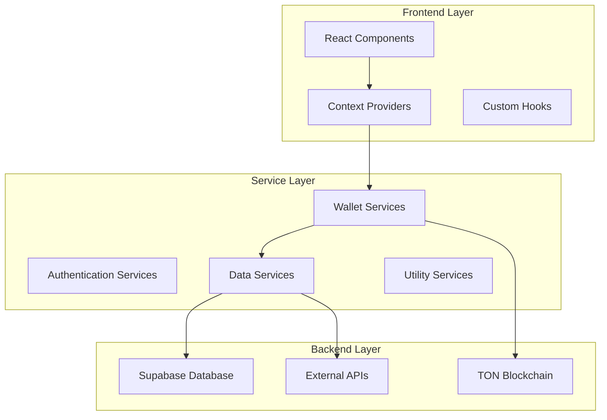
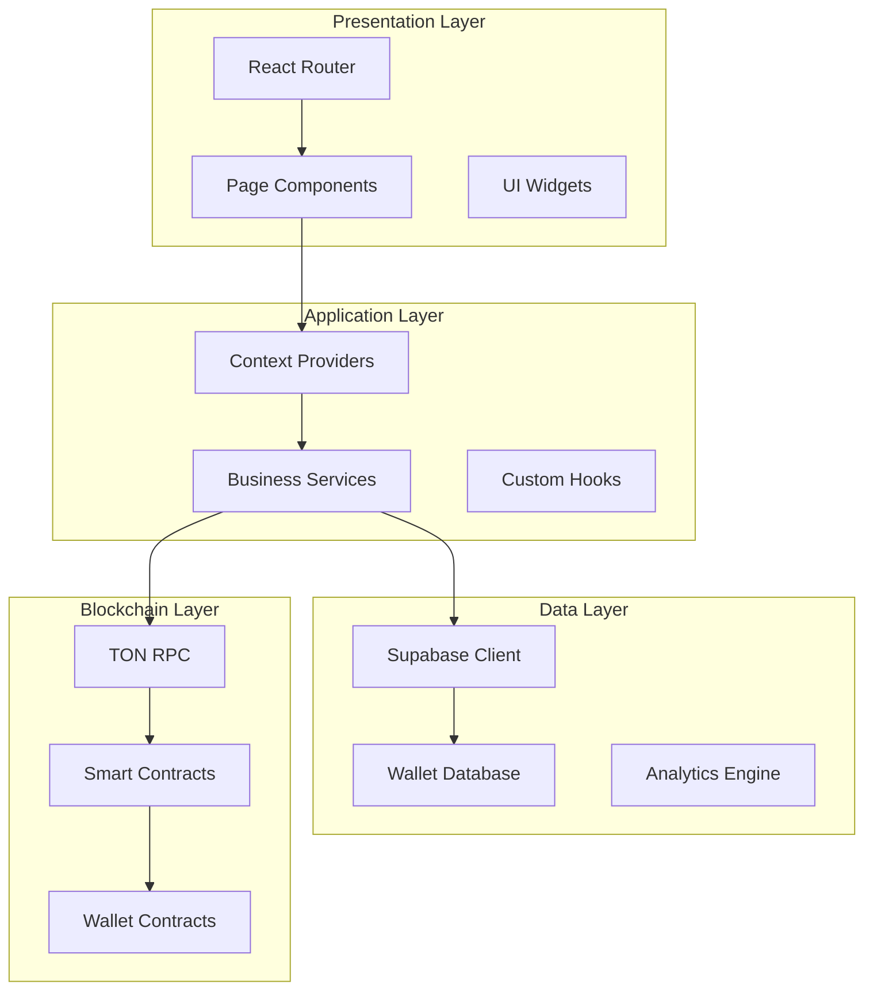
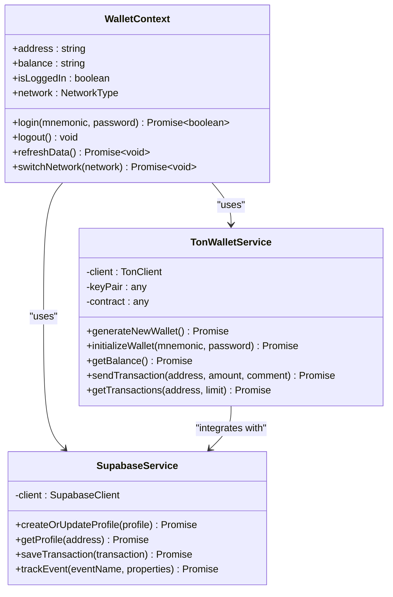
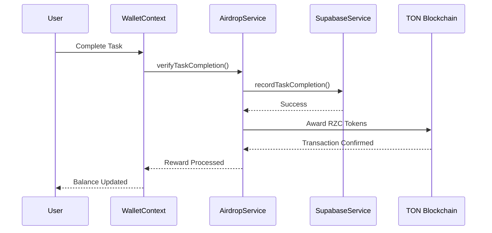
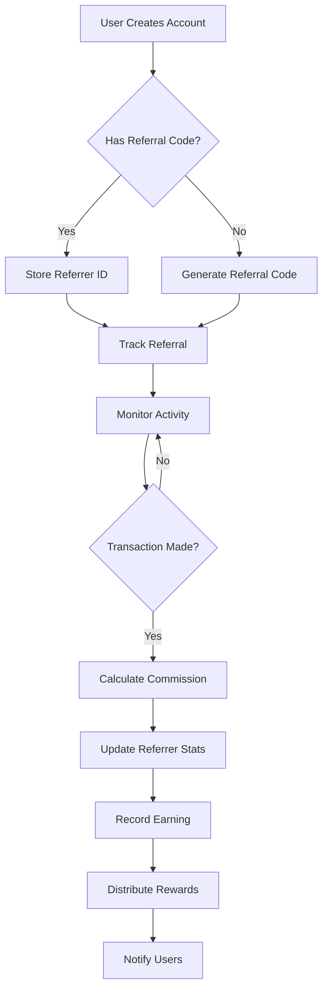
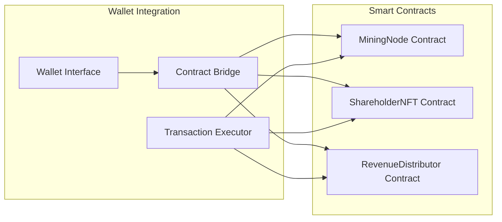

# Project Overview

<cite>
**Referenced Files in This Document**
- [App.tsx](file://App.tsx)
- [package.json](file://package.json)
- [constants.ts](file://constants.ts)
- [WalletContext.tsx](file://context/WalletContext.tsx)
- [tonWalletService.ts](file://services/tonWalletService.ts)
- [supabaseService.ts](file://services/supabaseService.ts)
- [authService.ts](file://services/authService.ts)
- [airdropService.ts](file://services/airdropService.ts)
- [referralRewardService.ts](file://services/referralRewardService.ts)
- [AdminDashboard.tsx](file://pages/AdminDashboard.tsx)
- [ReferralPortal.tsx](file://pages/ReferralPortal.tsx)
- [Dashboard.tsx](file://pages/Dashboard.tsx)
- [Landing.tsx](file://pages/Landing.tsx)
- [SMART_CONTRACT_GUIDE.md](file://contracts/SMART_CONTRACT_GUIDE.md)
</cite>

## Table of Contents
1. [Introduction](#introduction)
2. [Project Structure](#project-structure)
3. [Core Components](#core-components)
4. [Architecture Overview](#architecture-overview)
5. [Detailed Component Analysis](#detailed-component-analysis)
6. [Dependency Analysis](#dependency-analysis)
7. [Performance Considerations](#performance-considerations)
8. [Troubleshooting Guide](#troubleshooting-guide)
9. [Conclusion](#conclusion)

## Introduction

RhizaWebWallet is a comprehensive multi-chain cryptocurrency wallet built specifically for the TON (The Open Network) ecosystem. The project combines a modern web wallet interface with advanced tokenomics, community-driven features, and enterprise-grade infrastructure. As a multi-chain solution, it supports TON alongside other major blockchain networks, providing users with seamless cross-chain interoperability while maintaining focus on TON's superior performance characteristics.

The wallet serves as both a personal finance tool and a community platform, featuring sophisticated token economics with the native $RZC token, an integrated referral system that rewards user acquisition, and comprehensive administrative capabilities for ecosystem management. Built with React and TypeScript, the application leverages cutting-edge web technologies including Vite for bundling, TailwindCSS for styling, and Supabase for backend services.

## Project Structure

The project follows a modular React architecture with clear separation of concerns across multiple layers:



**Diagram sources**
- [App.tsx:303-325](file://App.tsx#L303-L325)
- [WalletContext.tsx:60-402](file://context/WalletContext.tsx#L60-L402)

The application is organized into several key directories:

- **components/**: Reusable UI components and widgets
- **pages/**: Route-based page components with distinct functionality
- **services/**: Business logic services for wallet operations
- **context/**: React context providers for state management
- **hooks/**: Custom React hooks for data fetching
- **types/**: TypeScript type definitions
- **utility/**: Cryptographic and utility functions

**Section sources**
- [App.tsx:1-328](file://App.tsx#L1-L328)
- [package.json:1-52](file://package.json#L1-L52)

## Core Components

### Multi-Chain Wallet Infrastructure

The wallet provides comprehensive multi-chain support through the TON Wallet Development Kit (WDK), enabling seamless operations across multiple blockchain networks. The core wallet service manages:

- **TON Blockchain Integration**: Native TON wallet functionality with full RPC connectivity
- **Cross-Chain Operations**: Support for Bitcoin, Ethereum, and other major networks
- **Wallet Generation**: BIP39 mnemonic phrase generation and seed derivation
- **Transaction Management**: Real-time transaction monitoring and confirmation tracking
- **Balance Management**: Multi-token balance tracking across supported networks

### Tokenomics and $RZC Integration

The wallet operates on a sophisticated token economy centered around the $RZC token:

- **Dual Token System**: $RZC serves as both utility and governance token
- **Staking Rewards**: Passive income generation through token staking
- **Transaction Fees**: Protocol fee collection with revenue distribution
- **Community Treasury**: Token allocation for ecosystem development and marketing
- **Inflation Controls**: Dynamic supply mechanisms to maintain economic stability

### Referral System Architecture

The referral system implements a tiered commission structure with automated reward distribution:

- **Commission Tiers**: Bronze (5%), Silver (7.5%), Gold (10%), Platinum (15%)
- **Automated Processing**: Real-time reward calculation on transaction fees
- **Performance Tracking**: Comprehensive analytics for user acquisition metrics
- **Leaderboard System**: Competitive ranking among referrers
- **Marketing Tools**: Integrated promotional materials and tracking

### Administrative Dashboard

The admin panel provides comprehensive ecosystem management capabilities:

- **User Management**: Complete user lifecycle management
- **Transaction Monitoring**: Real-time transaction oversight
- **Content Moderation**: Airdrop and promotional content management
- **Analytics Dashboard**: Comprehensive performance metrics
- **System Configuration**: Runtime system parameter management

**Section sources**
- [constants.ts:12-90](file://constants.ts#L12-L90)
- [tonWalletService.ts:174-846](file://services/tonWalletService.ts#L174-L846)
- [referralRewardService.ts:19-154](file://services/referralRewardService.ts#L19-L154)

## Architecture Overview

RhizaWebWallet employs a modern, layered architecture designed for scalability, security, and maintainability:



**Diagram sources**
- [App.tsx:303-325](file://App.tsx#L303-L325)
- [WalletContext.tsx:60-402](file://context/WalletContext.tsx#L60-L402)
- [supabaseService.ts:89-1916](file://services/supabaseService.ts#L89-L1916)

The architecture implements several key design patterns:

- **Context Provider Pattern**: Centralized state management across the application
- **Service Layer Pattern**: Clean separation of business logic from presentation
- **Repository Pattern**: Database abstraction for wallet and user data
- **Observer Pattern**: Real-time updates through Supabase subscriptions
- **Factory Pattern**: Dynamic service instantiation based on network selection

**Section sources**
- [App.tsx:91-301](file://App.tsx#L91-L301)
- [WalletContext.tsx:60-410](file://context/WalletContext.tsx#L60-L410)

## Detailed Component Analysis

### Wallet Management System

The wallet management system forms the core of the application, providing comprehensive cryptocurrency wallet functionality:



**Diagram sources**
- [WalletContext.tsx:35-410](file://context/WalletContext.tsx#L35-L410)
- [tonWalletService.ts:174-846](file://services/tonWalletService.ts#L174-L846)
- [supabaseService.ts:89-1916](file://services/supabaseService.ts#L89-L1916)

The wallet system implements advanced security features including:

- **Session Management**: Secure session handling with automatic timeout
- **Encryption**: Hardware-backed encryption for mnemonic phrases
- **Multi-Factor Authentication**: Optional password protection for sessions
- **Transaction Validation**: Comprehensive input validation and sanitization
- **Error Handling**: Robust error handling with user-friendly messaging

### Token Economy and Airdrop System

The token economy integrates seamlessly with the wallet infrastructure:



**Diagram sources**
- [airdropService.ts:301-513](file://services/airdropService.ts#L301-L513)
- [supabaseService.ts:447-513](file://services/supabaseService.ts#L447-L513)

The airdrop system features:

- **Task-Based Rewards**: Comprehensive task completion tracking
- **Social Media Integration**: Real-time verification of social media activities
- **Manual Review System**: Quality assurance for complex tasks
- **Leaderboard Management**: Competitive ranking and rewards distribution
- **Analytics Dashboard**: Performance tracking and optimization insights

### Referral System Implementation

The referral system provides sophisticated user acquisition capabilities:



**Diagram sources**
- [referralRewardService.ts:24-112](file://services/referralRewardService.ts#L24-L112)
- [supabaseService.ts:432-614](file://services/supabaseService.ts#L432-L614)

**Section sources**
- [Dashboard.tsx:62-800](file://pages/Dashboard.tsx#L62-L800)
- [Landing.tsx:86-1373](file://pages/Landing.tsx#L86-L1373)
- [AdminDashboard.tsx:65-800](file://pages/AdminDashboard.tsx#L65-L800)

### Smart Contract Integration

The wallet integrates with on-chain smart contracts for advanced functionality:



**Diagram sources**
- [SMART_CONTRACT_GUIDE.md:10-113](file://contracts/SMART_CONTRACT_GUIDE.md#L10-L113)

The smart contract system enables:

- **Mining Operations**: Automated reward calculation and distribution
- **NFT Certificates**: Digital ownership verification and trading
- **Revenue Sharing**: Transparent profit distribution mechanisms
- **Governance Participation**: On-chain decision making capabilities

**Section sources**
- [SMART_CONTRACT_GUIDE.md:1-475](file://contracts/SMART_CONTRACT_GUIDE.md#L1-L475)

## Dependency Analysis

The project maintains a clean dependency structure with strategic third-party integrations:

```mermaid
graph TB
subgraph "Core Dependencies"
React[react ^19.2.4]
Router[react-router-dom ^7.13.0]
Typescript[typescript ~5.8.2]
Vite[vite ^6.2.0]
end
subgraph "Blockchain Integration"
TON[@ton/ton ^13.5.0]
Crypto[@ton/crypto ^3.2.0]
WDK[@tetherto/wdk ^1.0.0-beta.7]
Ethers[ethers ^6.16.0]
end
subgraph "Backend Services"
Supabase[@supabase/supabase-js ^2.97.0]
Gemini[@google/genai ^1.41.0]
end
subgraph "UI & Utilities"
Lucide[lucide-react ^0.574.0]
Recharts[recharts ^3.7.0]
i18next[i18next ^25.8.13]
Sodium[sodium-javascript ^0.8.0]
end
React --> Router
React --> Lucide
React --> Recharts
TON --> Crypto
WDK --> TON
Supabase --> React
Gemini --> React
```

**Diagram sources**
- [package.json:14-39](file://package.json#L14-L39)

The dependency strategy emphasizes:

- **Modern JavaScript**: Latest React and TypeScript versions for optimal developer experience
- **Blockchain Excellence**: Official TON SDK and WDK for reliable blockchain integration
- **Backend-as-a-Service**: Supabase for rapid backend development and scaling
- **Internationalization**: Comprehensive i18n support for global user base
- **Performance**: Lightweight libraries optimized for web wallet performance

**Section sources**
- [package.json:1-52](file://package.json#L1-L52)

## Performance Considerations

The application is designed with performance optimization as a core principle:

### Network Optimization
- **Lazy Loading**: Dynamic imports for route components to minimize initial bundle size
- **Code Splitting**: Strategic splitting of vendor and application code
- **Caching Strategies**: Intelligent caching of blockchain data and user preferences
- **Connection Pooling**: Efficient management of TON RPC connections

### Memory Management
- **Context Optimization**: Minimal re-renders through proper context usage
- **Cleanup Functions**: Proper cleanup of subscriptions and intervals
- **Resource Cleanup**: Automatic cleanup of blockchain connections and database subscriptions

### User Experience
- **Progressive Loading**: Skeleton screens and loading states for better perceived performance
- **Offline Capabilities**: Local caching for basic functionality during network issues
- **Responsive Design**: Mobile-first approach with adaptive layouts

## Troubleshooting Guide

### Common Issues and Solutions

**Wallet Connection Problems**
- Verify TON RPC endpoint availability and API key configuration
- Check network selection (mainnet vs testnet) alignment
- Ensure proper wallet initialization sequence

**Transaction Failures**
- Validate sufficient TON balance for gas fees
- Check transaction amount against minimum limits
- Verify recipient address format and validity

**Authentication Issues**
- Confirm Supabase configuration and environment variables
- Check wallet address format and blockchain compatibility
- Verify session timeout and automatic re-authentication

**Database Connectivity**
- Monitor Supabase service availability and quotas
- Check real-time subscription permissions
- Verify database schema consistency

**Section sources**
- [tonWalletService.ts:265-333](file://services/tonWalletService.ts#L265-L333)
- [supabaseService.ts:770-800](file://services/supabaseService.ts#L770-L800)

## Conclusion

RhizaWebWallet represents a comprehensive solution for the TON ecosystem, combining advanced multi-chain wallet functionality with sophisticated tokenomics and community-building features. The project demonstrates exceptional technical architecture with clear separation of concerns, robust security measures, and scalable design patterns.

The integration of TON blockchain technology with modern web development practices creates a powerful platform that serves both individual users seeking convenient cryptocurrency management and ecosystem participants requiring advanced tools for community building and token economy participation. The modular architecture ensures maintainability and extensibility, while the comprehensive feature set positions the platform as a significant player in the evolving TON ecosystem.

Through its innovative referral system, token economy, and administrative capabilities, RhizaWebWallet establishes itself as more than just a wallet—it represents a complete ecosystem for TON-based financial services and community engagement.