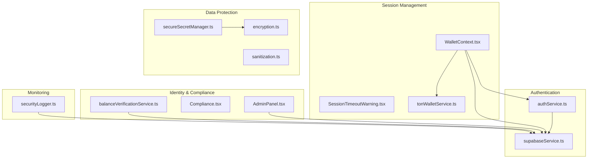
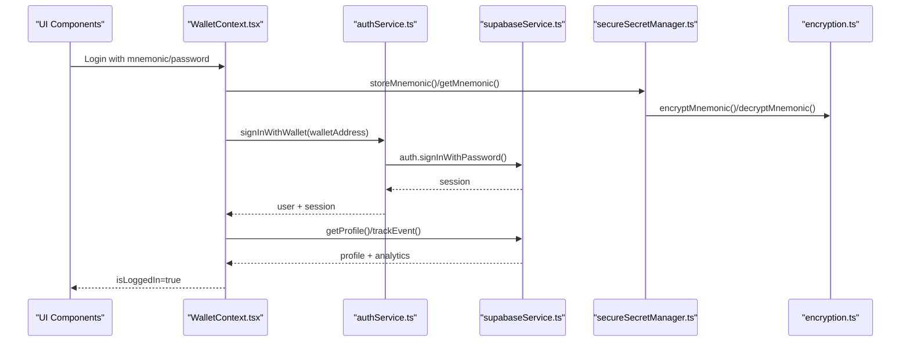
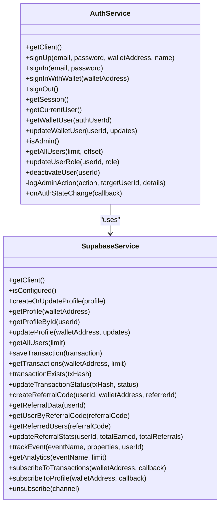
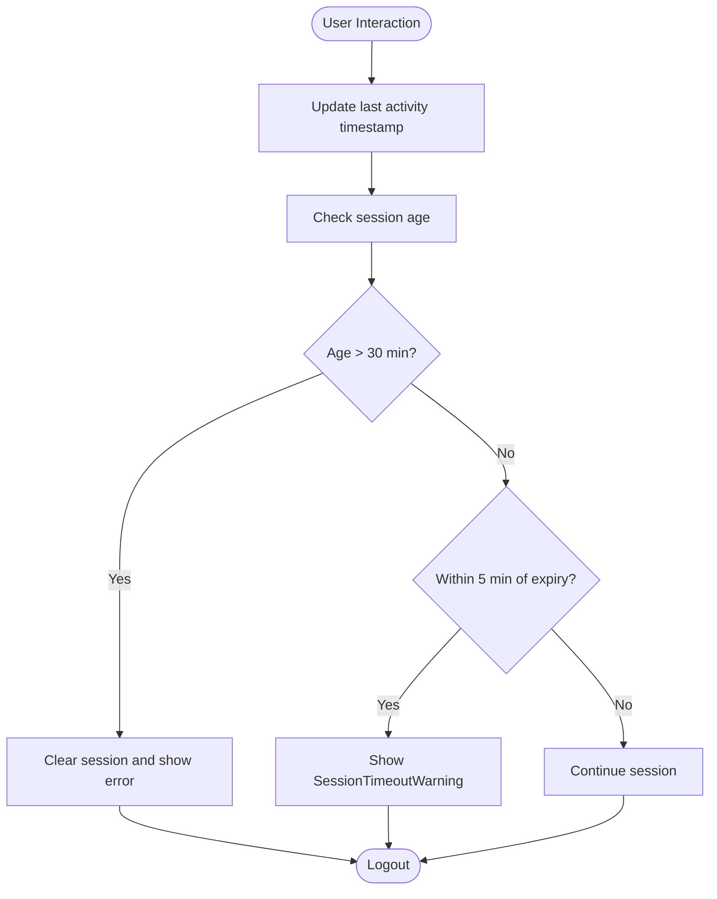
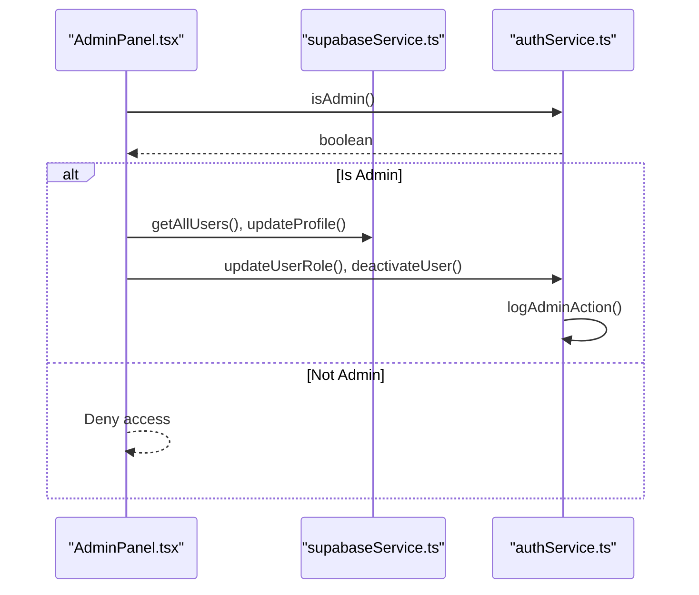
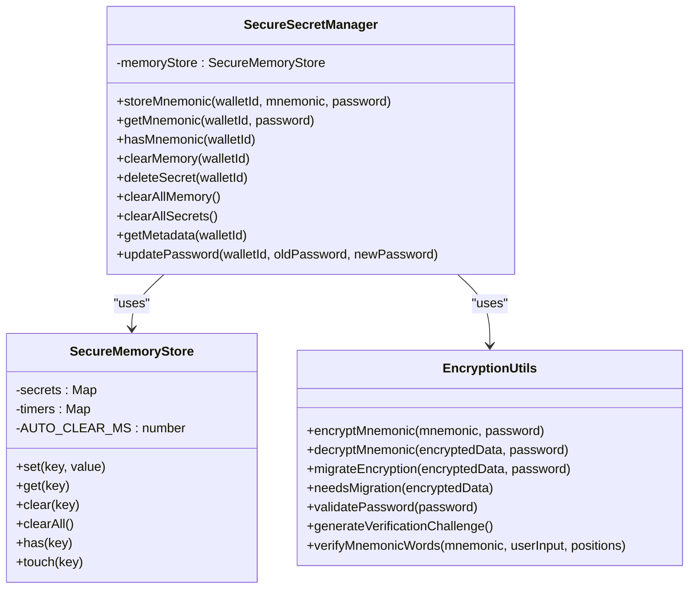
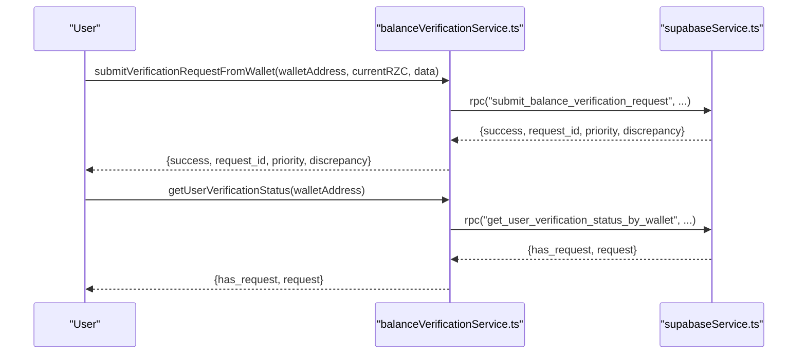
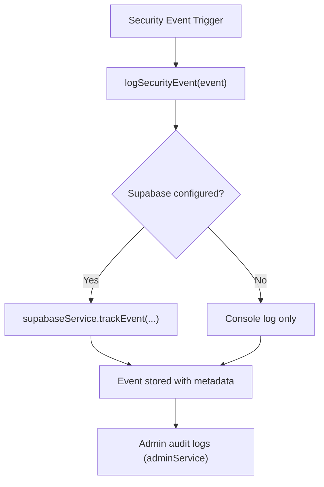
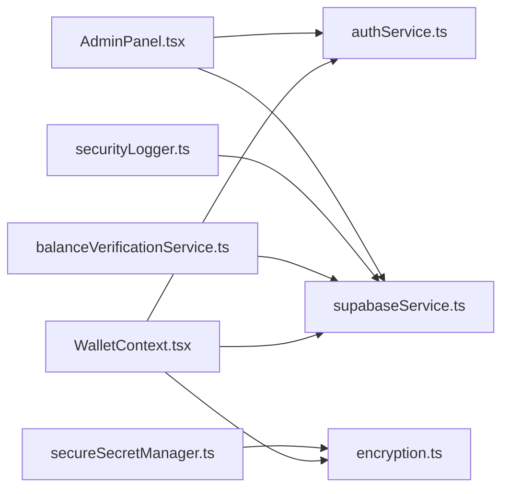

# Security and Compliance

<cite>
**Referenced Files in This Document**
- [authService.ts](file://services/authService.ts)
- [supabaseService.ts](file://services/supabaseService.ts)
- [secureSecretManager.ts](file://services/secureSecretManager.ts)
- [encryption.ts](file://utils/encryption.ts)
- [securityLogger.ts](file://utils/securityLogger.ts)
- [sanitization.ts](file://utils/sanitization.ts)
- [WalletContext.tsx](file://context/WalletContext.tsx)
- [SessionTimeoutWarning.tsx](file://components/SessionTimeoutWarning.tsx)
- [WalletLockOverlay.tsx](file://components/WalletLockOverlay.tsx)
- [balanceVerificationService.ts](file://services/balanceVerificationService.ts)
- [Compliance.tsx](file://pages/Compliance.tsx)
- [AdminPanel.tsx](file://pages/AdminPanel.tsx)
- [tonWalletService.ts](file://services/tonWalletService.ts)
</cite>

## Table of Contents
1. [Introduction](#introduction)
2. [Project Structure](#project-structure)
3. [Core Components](#core-components)
4. [Architecture Overview](#architecture-overview)
5. [Detailed Component Analysis](#detailed-component-analysis)
6. [Dependency Analysis](#dependency-analysis)
7. [Performance Considerations](#performance-considerations)
8. [Troubleshooting Guide](#troubleshooting-guide)
9. [Conclusion](#conclusion)
10. [Appendices](#appendices)

## Introduction
This document describes the security and compliance framework of the Rhiza Web Wallet. It covers authentication and session management, authorization and role-based access control, data protection and encryption, identity verification workflows, compliance features, audit and logging, security monitoring, and incident response procedures. The goal is to provide a clear, actionable understanding of how the system protects user assets and data, maintains regulatory alignment, and supports operational security.

## Project Structure
Security and compliance features are implemented across services, utilities, contexts, and UI components:
- Authentication and authorization: Supabase-backed auth, admin audit logs, and role checks
- Session lifecycle: Wallet context, session timers, and timeout warnings
- Data protection: Secure secret manager, encryption utilities, and input sanitization
- Identity verification: Balance verification service and UI flows
- Compliance: Regulatory statements and admin controls
- Monitoring and auditing: Security logger and analytics

**Diagram sources**
- [authService.ts:28-382](file://services/authService.ts#L28-L382)
- [supabaseService.ts:89-800](file://services/supabaseService.ts#L89-L800)
- [WalletContext.tsx:60-410](file://context/WalletContext.tsx#L60-L410)
- [SessionTimeoutWarning.tsx:1-47](file://components/SessionTimeoutWarning.tsx#L1-L47)
- [tonWalletService.ts:45-149](file://services/tonWalletService.ts#L45-L149)
- [secureSecretManager.ts:120-339](file://services/secureSecretManager.ts#L120-L339)
- [encryption.ts:11-255](file://utils/encryption.ts#L11-L255)
- [sanitization.ts:1-109](file://utils/sanitization.ts#L1-L109)
- [balanceVerificationService.ts:47-756](file://services/balanceVerificationService.ts#L47-L756)
- [Compliance.tsx:1-167](file://pages/Compliance.tsx#L1-L167)
- [AdminPanel.tsx:30-800](file://pages/AdminPanel.tsx#L30-L800)
- [securityLogger.ts:1-306](file://utils/securityLogger.ts#L1-L306)

**Section sources**
- [authService.ts:28-382](file://services/authService.ts#L28-L382)
- [supabaseService.ts:89-800](file://services/supabaseService.ts#L89-L800)
- [WalletContext.tsx:60-410](file://context/WalletContext.tsx#L60-L410)
- [secureSecretManager.ts:120-339](file://services/secureSecretManager.ts#L120-L339)
- [encryption.ts:11-255](file://utils/encryption.ts#L11-L255)
- [sanitization.ts:1-109](file://utils/sanitization.ts#L1-L109)
- [balanceVerificationService.ts:47-756](file://services/balanceVerificationService.ts#L47-L756)
- [Compliance.tsx:1-167](file://pages/Compliance.tsx#L1-L167)
- [AdminPanel.tsx:30-800](file://pages/AdminPanel.tsx#L30-L800)
- [securityLogger.ts:1-306](file://utils/securityLogger.ts#L1-L306)

## Core Components
- Authentication and session management: Supabase-based auth with wallet-specific sign-in, session persistence, and automatic timeouts
- Authorization and RBAC: Role-based checks (user/admin) and admin audit logging
- Data protection: Secure secret manager with encrypted storage, in-memory clearing, and PBKDF2-based encryption
- Identity verification: Balance verification workflows with admin controls and audit trails
- Compliance: Regulatory statements and admin tools for user management
- Monitoring and auditing: Security event logging with metadata and analytics

**Section sources**
- [authService.ts:28-382](file://services/authService.ts#L28-L382)
- [supabaseService.ts:89-800](file://services/supabaseService.ts#L89-L800)
- [secureSecretManager.ts:120-339](file://services/secureSecretManager.ts#L120-L339)
- [encryption.ts:11-255](file://utils/encryption.ts#L11-L255)
- [balanceVerificationService.ts:47-756](file://services/balanceVerificationService.ts#L47-L756)
- [Compliance.tsx:1-167](file://pages/Compliance.tsx#L1-L167)
- [securityLogger.ts:1-306](file://utils/securityLogger.ts#L1-L306)

## Architecture Overview
The security architecture integrates wallet authentication, session lifecycle, secure storage, and admin oversight with audit and compliance.

**Diagram sources**
- [WalletContext.tsx:172-316](file://context/WalletContext.tsx#L172-L316)
- [authService.ts:108-189](file://services/authService.ts#L108-L189)
- [supabaseService.ts:133-171](file://services/supabaseService.ts#L133-L171)
- [secureSecretManager.ts:141-223](file://services/secureSecretManager.ts#L141-L223)
- [encryption.ts:54-148](file://utils/encryption.ts#L54-L148)

## Detailed Component Analysis

### Authentication System
- Supabase-based authentication with email/password and wallet-specific sign-in
- Deterministic wallet email/password generation and optional confirmation bypass
- Session retrieval and user context management
- Admin role checks and audit logging for admin actions

**Diagram sources**
- [authService.ts:28-382](file://services/authService.ts#L28-L382)
- [supabaseService.ts:89-800](file://services/supabaseService.ts#L89-L800)

**Section sources**
- [authService.ts:28-382](file://services/authService.ts#L28-L382)
- [supabaseService.ts:89-800](file://services/supabaseService.ts#L89-L800)

### Session Management and Timeout
- Session age tracking and automatic expiry after 30 minutes of inactivity
- Activity updates on user interactions
- Warning UI when session is expiring soon
- Multi-tab synchronization via BroadcastChannel

**Diagram sources**
- [tonWalletService.ts:45-149](file://services/tonWalletService.ts#L45-L149)
- [SessionTimeoutWarning.tsx:1-47](file://components/SessionTimeoutWarning.tsx#L1-L47)
- [WalletContext.tsx:107-127](file://context/WalletContext.tsx#L107-L127)

**Section sources**
- [tonWalletService.ts:45-149](file://services/tonWalletService.ts#L45-L149)
- [SessionTimeoutWarning.tsx:1-47](file://components/SessionTimeoutWarning.tsx#L1-L47)
- [WalletContext.tsx:107-127](file://context/WalletContext.tsx#L107-L127)

### Authorization Controls and RBAC
- Role-based access control with user/admin roles
- Admin-only endpoints and UI protections
- Audit logging for admin actions (role changes, deactivation)
- Admin panel with user management and RZC awards

**Diagram sources**
- [AdminPanel.tsx:30-800](file://pages/AdminPanel.tsx#L30-L800)
- [authService.ts:264-294](file://services/authService.ts#L264-L294)
- [supabaseService.ts:284-308](file://services/supabaseService.ts#L284-L308)

**Section sources**
- [AdminPanel.tsx:30-800](file://pages/AdminPanel.tsx#L30-L800)
- [authService.ts:264-294](file://services/authService.ts#L264-L294)
- [supabaseService.ts:284-308](file://services/supabaseService.ts#L284-L308)

### Data Protection and Encryption
- Secure secret manager with encrypted persistent storage and in-memory caching
- PBKDF2-based AES-256-GCM encryption with configurable iteration counts and migration
- Automatic memory clearing and secure overwrite
- Input sanitization to prevent XSS and injection

**Diagram sources**
- [secureSecretManager.ts:120-339](file://services/secureSecretManager.ts#L120-L339)
- [encryption.ts:11-255](file://utils/encryption.ts#L11-L255)

**Section sources**
- [secureSecretManager.ts:120-339](file://services/secureSecretManager.ts#L120-L339)
- [encryption.ts:11-255](file://utils/encryption.ts#L11-L255)

### Identity Verification and Compliance
- Balance verification workflows with RPC-based submission and admin review
- Wallet-based verification RPCs for non-authenticated flows
- Verification status tracking and admin dashboards
- Compliance page with regulatory statements and contact information

**Diagram sources**
- [balanceVerificationService.ts:133-352](file://services/balanceVerificationService.ts#L133-L352)
- [Compliance.tsx:1-167](file://pages/Compliance.tsx#L1-167)

**Section sources**
- [balanceVerificationService.ts:133-352](file://services/balanceVerificationService.ts#L133-L352)
- [Compliance.tsx:1-167](file://pages/Compliance.tsx#L1-167)

### Security Monitoring and Audit Trails
- Security event logging with metadata and severity classification
- Analytics event tracking and real-time subscriptions
- Admin audit logs for privileged actions
- Wallet lock overlay for restricted feature gating

**Diagram sources**
- [securityLogger.ts:32-81](file://utils/securityLogger.ts#L32-L81)
- [supabaseService.ts:623-655](file://services/supabaseService.ts#L623-L655)
- [authService.ts:354-373](file://services/authService.ts#L354-L373)
- [WalletLockOverlay.tsx:1-211](file://components/WalletLockOverlay.tsx#L1-L211)

**Section sources**
- [securityLogger.ts:32-81](file://utils/securityLogger.ts#L32-L81)
- [supabaseService.ts:623-655](file://services/supabaseService.ts#L623-L655)
- [authService.ts:354-373](file://services/authService.ts#L354-L373)
- [WalletLockOverlay.tsx:1-211](file://components/WalletLockOverlay.tsx#L1-L211)

## Dependency Analysis
- WalletContext orchestrates authentication, session, and profile management
- AuthService depends on Supabase for auth and wallet user records
- SecureSecretManager depends on Encryption utilities for cryptographic operations
- BalanceVerificationService depends on Supabase RPCs and storage
- SecurityLogger depends on Supabase analytics for event tracking

**Diagram sources**
- [WalletContext.tsx:60-410](file://context/WalletContext.tsx#L60-L410)
- [authService.ts:28-382](file://services/authService.ts#L28-L382)
- [supabaseService.ts:89-800](file://services/supabaseService.ts#L89-L800)
- [secureSecretManager.ts:120-339](file://services/secureSecretManager.ts#L120-L339)
- [encryption.ts:11-255](file://utils/encryption.ts#L11-L255)
- [balanceVerificationService.ts:47-756](file://services/balanceVerificationService.ts#L47-L756)
- [securityLogger.ts:1-306](file://utils/securityLogger.ts#L1-L306)
- [AdminPanel.tsx:30-800](file://pages/AdminPanel.tsx#L30-L800)

**Section sources**
- [WalletContext.tsx:60-410](file://context/WalletContext.tsx#L60-L410)
- [authService.ts:28-382](file://services/authService.ts#L28-L382)
- [supabaseService.ts:89-800](file://services/supabaseService.ts#L89-L800)
- [secureSecretManager.ts:120-339](file://services/secureSecretManager.ts#L120-L339)
- [encryption.ts:11-255](file://utils/encryption.ts#L11-L255)
- [balanceVerificationService.ts:47-756](file://services/balanceVerificationService.ts#L47-L756)
- [securityLogger.ts:1-306](file://utils/securityLogger.ts#L1-L306)
- [AdminPanel.tsx:30-800](file://pages/AdminPanel.tsx#L30-L800)

## Performance Considerations
- Session timeout reduces long-lived sessions, improving security with minimal UX impact
- In-memory caching in SecureSecretManager reduces repeated decryption costs
- PBKDF2 iteration counts are tuned for security vs. performance trade-offs
- Analytics and event logging are designed to avoid blocking operations

[No sources needed since this section provides general guidance]

## Troubleshooting Guide
Common issues and resolutions:
- Session expired after 30 minutes: The system automatically clears the session and requires re-authentication
- Mnemonic decryption failures: Verify password and check for migration status; use updatePassword to re-encrypt with new password
- Verification request submission failures: Use manual submission instructions returned by the service when RPC fails
- Admin access denied: Confirm wallet role is admin or super_admin and that adminService.isAdmin resolves to true

**Section sources**
- [tonWalletService.ts:45-55](file://services/tonWalletService.ts#L45-L55)
- [secureSecretManager.ts:296-334](file://services/secureSecretManager.ts#L296-L334)
- [balanceVerificationService.ts:200-245](file://services/balanceVerificationService.ts#L200-L245)
- [AdminPanel.tsx:97-107](file://pages/AdminPanel.tsx#L97-L107)

## Conclusion
The Rhiza Web Wallet implements a robust security and compliance framework combining Supabase authentication, secure secret management, session lifecycle controls, identity verification, and comprehensive audit logging. These measures collectively protect user data and assets, support regulatory alignment, and enable effective monitoring and incident response.

[No sources needed since this section summarizes without analyzing specific files]

## Appendices

### Compliance Statements
- Non-custodial operation with no personal data collection
- GDPR and CCPA compliant practices through minimal data handling
- Open-source transparency and self-regulation
- Anti-money laundering awareness and user responsibility

**Section sources**
- [Compliance.tsx:31-134](file://pages/Compliance.tsx#L31-L134)

### Security Best Practices
- Enforce session timeouts and activity tracking
- Use secure secret storage with encrypted persistence and in-memory clearing
- Validate and sanitize all user inputs
- Implement RBAC and maintain admin audit logs
- Monitor security events and maintain audit trails

**Section sources**
- [tonWalletService.ts:45-149](file://services/tonWalletService.ts#L45-L149)
- [secureSecretManager.ts:120-339](file://services/secureSecretManager.ts#L120-L339)
- [sanitization.ts:1-109](file://utils/sanitization.ts#L1-L109)
- [authService.ts:354-373](file://services/authService.ts#L354-L373)
- [securityLogger.ts:32-81](file://utils/securityLogger.ts#L32-L81)