# Token Economy and RZC System

<cite>
**Referenced Files in This Document**
- [config/rzcConfig.ts](file://config/rzcConfig.ts)
- [services/rzcRewardService.ts](file://services/rzcRewardService.ts)
- [services/referralRewardService.ts](file://services/referralRewardService.ts)
- [services/rzcTransferService.ts](file://services/rzcTransferService.ts)
- [services/rewardClaimService.ts](file://services/rewardClaimService.ts)
- [hooks/useRZCBalance.ts](file://hooks/useRZCBalance.ts)
- [hooks/useTransactions.ts](file://hooks/useTransactions.ts)
- [utils/referralUtils.ts](file://utils/referralUtils.ts)
- [utils/priceConfig.ts](file://utils/priceConfig.ts)
- [components/TokenomicsCalculator.tsx](file://components/TokenomicsCalculator.tsx)
- [components/TokenomicsChart.tsx](file://components/TokenomicsChart.tsx)
- [pages/StakingEngine.tsx](file://pages/StakingEngine.tsx)
- [pages/Marketplace.tsx](file://pages/Marketplace.tsx)
- [pages/RzcUtility.tsx](file://pages/RzcUtility.tsx)
- [pages/Swap.tsx](file://pages/Swap.tsx)
</cite>

## Table of Contents
1. [Introduction](#introduction)
2. [Project Structure](#project-structure)
3. [Core Components](#core-components)
4. [Architecture Overview](#architecture-overview)
5. [Detailed Component Analysis](#detailed-component-analysis)
6. [Dependency Analysis](#dependency-analysis)
7. [Performance Considerations](#performance-considerations)
8. [Troubleshooting Guide](#troubleshooting-guide)
9. [Conclusion](#conclusion)
10. [Appendices](#appendices)

## Introduction
This document explains the token economy and RZC token system implemented in the RhizaWebWallet. It covers token configuration, supply mechanics, reward distribution, staking, marketplace integration, token transfers, transaction tracking, price management, and tokenomics modeling. The goal is to provide both technical depth and practical guidance for developers and operators to understand, maintain, and extend the economic model.

## Project Structure
The token economy spans configuration, services, hooks, utilities, and UI components:
- Configuration defines token metadata, pricing, and conversions.
- Services encapsulate reward distribution, transfers, and claim workflows.
- Hooks integrate balances and transaction histories into the UI.
- Utilities support referral logic and price overrides.
- UI pages/components present staking, marketplace, tokenomics calculators, and utility hubs.

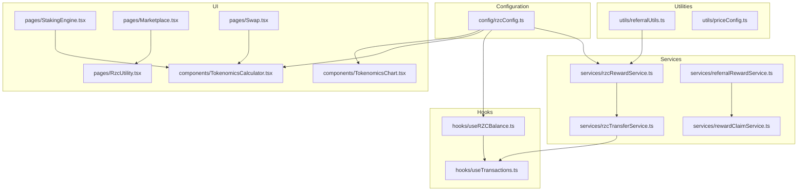

**Diagram sources**
- [config/rzcConfig.ts:1-97](file://config/rzcConfig.ts#L1-L97)
- [services/rzcRewardService.ts:1-281](file://services/rzcRewardService.ts#L1-L281)
- [services/referralRewardService.ts:1-154](file://services/referralRewardService.ts#L1-L154)
- [services/rzcTransferService.ts:1-298](file://services/rzcTransferService.ts#L1-L298)
- [services/rewardClaimService.ts:1-267](file://services/rewardClaimService.ts#L1-L267)
- [hooks/useRZCBalance.ts:1-86](file://hooks/useRZCBalance.ts#L1-L86)
- [hooks/useTransactions.ts:1-268](file://hooks/useTransactions.ts#L1-L268)
- [utils/referralUtils.ts:1-209](file://utils/referralUtils.ts#L1-L209)
- [utils/priceConfig.ts:1-41](file://utils/priceConfig.ts#L1-L41)
- [components/TokenomicsCalculator.tsx:1-193](file://components/TokenomicsCalculator.tsx#L1-L193)
- [components/TokenomicsChart.tsx:1-104](file://components/TokenomicsChart.tsx#L1-L104)
- [pages/StakingEngine.tsx:1-350](file://pages/StakingEngine.tsx#L1-L350)
- [pages/Marketplace.tsx:1-318](file://pages/Marketplace.tsx#L1-L318)
- [pages/RzcUtility.tsx:1-362](file://pages/RzcUtility.tsx#L1-L362)
- [pages/Swap.tsx:1-344](file://pages/Swap.tsx#L1-L344)

**Section sources**
- [config/rzcConfig.ts:1-97](file://config/rzcConfig.ts#L1-L97)
- [services/rzcRewardService.ts:1-281](file://services/rzcRewardService.ts#L1-L281)
- [services/referralRewardService.ts:1-154](file://services/referralRewardService.ts#L1-L154)
- [services/rzcTransferService.ts:1-298](file://services/rzcTransferService.ts#L1-L298)
- [services/rewardClaimService.ts:1-267](file://services/rewardClaimService.ts#L1-L267)
- [hooks/useRZCBalance.ts:1-86](file://hooks/useRZCBalance.ts#L1-L86)
- [hooks/useTransactions.ts:1-268](file://hooks/useTransactions.ts#L1-L268)
- [utils/referralUtils.ts:1-209](file://utils/referralUtils.ts#L1-L209)
- [utils/priceConfig.ts:1-41](file://utils/priceConfig.ts#L1-L41)
- [components/TokenomicsCalculator.tsx:1-193](file://components/TokenomicsCalculator.tsx#L1-L193)
- [components/TokenomicsChart.tsx:1-104](file://components/TokenomicsChart.tsx#L1-L104)
- [pages/StakingEngine.tsx:1-350](file://pages/StakingEngine.tsx#L1-L350)
- [pages/Marketplace.tsx:1-318](file://pages/Marketplace.tsx#L1-L318)
- [pages/RzcUtility.tsx:1-362](file://pages/RzcUtility.tsx#L1-L362)
- [pages/Swap.tsx:1-344](file://pages/Swap.tsx#L1-L344)

## Core Components
- Token configuration and conversions define price, symbol, decimals, and formatting helpers.
- Reward services distribute signup, activation, referral, transaction, and daily login bonuses.
- Referral reward service computes and records referral earnings based on rank tiers.
- Transfer service manages RZC transfers, history, and balance queries.
- Claim service governs eligibility, requests, and statistics for reward payouts.
- Hooks provide real-time balance and transaction tracking.
- Utilities handle referral validation, links, and price override persistence.
- UI components expose staking, marketplace, tokenomics calculator, and utility navigation.

**Section sources**
- [config/rzcConfig.ts:17-96](file://config/rzcConfig.ts#L17-L96)
- [services/rzcRewardService.ts:8-27](file://services/rzcRewardService.ts#L8-L27)
- [services/referralRewardService.ts:8-17](file://services/referralRewardService.ts#L8-L17)
- [services/rzcTransferService.ts:33-294](file://services/rzcTransferService.ts#L33-L294)
- [services/rewardClaimService.ts:9-13](file://services/rewardClaimService.ts#L9-L13)
- [hooks/useRZCBalance.ts:6-85](file://hooks/useRZCBalance.ts#L6-L85)
- [hooks/useTransactions.ts:6-267](file://hooks/useTransactions.ts#L6-L267)
- [utils/referralUtils.ts:7-99](file://utils/referralUtils.ts#L7-L99)
- [utils/priceConfig.ts:10-40](file://utils/priceConfig.ts#L10-L40)
- [components/TokenomicsCalculator.tsx:4-33](file://components/TokenomicsCalculator.tsx#L4-L33)
- [components/TokenomicsChart.tsx:4-98](file://components/TokenomicsChart.tsx#L4-L98)
- [pages/StakingEngine.tsx:5-21](file://pages/StakingEngine.tsx#L5-L21)
- [pages/Marketplace.tsx:5-85](file://pages/Marketplace.tsx#L5-L85)
- [pages/RzcUtility.tsx:38-167](file://pages/RzcUtility.tsx#L38-L167)

## Architecture Overview
The token economy integrates frontend hooks, backend services, and database functions. Pricing and conversions are centralized in configuration. Rewards and transfers are handled by dedicated services, with hooks orchestrating UI updates. Referral logic coordinates with reward services and notifications. Price overrides provide resilience against live market failures.

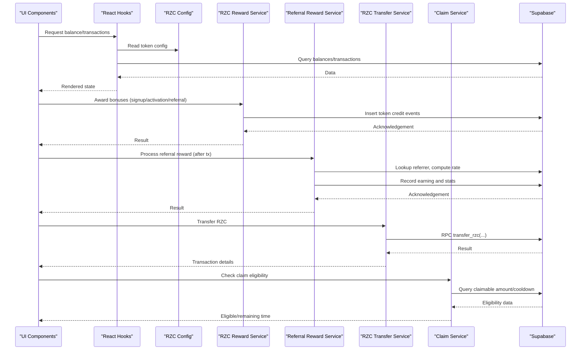

**Diagram sources**
- [config/rzcConfig.ts:17-96](file://config/rzcConfig.ts#L17-L96)
- [services/rzcRewardService.ts:27-174](file://services/rzcRewardService.ts#L27-L174)
- [services/referralRewardService.ts:24-112](file://services/referralRewardService.ts#L24-L112)
- [services/rzcTransferService.ts:37-130](file://services/rzcTransferService.ts#L37-L130)
- [services/rewardClaimService.ts:19-75](file://services/rewardClaimService.ts#L19-L75)
- [hooks/useRZCBalance.ts:25-76](file://hooks/useRZCBalance.ts#L25-L76)
- [hooks/useTransactions.ts:27-240](file://hooks/useTransactions.ts#L27-L240)

## Detailed Component Analysis

### Token Configuration and Pricing
- Centralized token metadata: symbol, name, decimals, min/max amounts.
- Conversion helpers: USD↔RZC, formatting, and commission calculations.
- Price source: configurable USD price with helper to fetch current value.

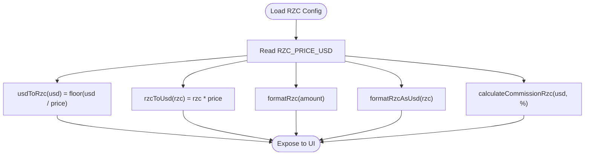

**Diagram sources**
- [config/rzcConfig.ts:17-96](file://config/rzcConfig.ts#L17-L96)

**Section sources**
- [config/rzcConfig.ts:17-96](file://config/rzcConfig.ts#L17-L96)

### Reward Distribution System
- Bonuses: signup, activation, referral (base and milestone tiers), transaction, daily login.
- Milestones: 10, 50, 100 referrals unlock increasing bonuses.
- Daily login checks for duplicate claims within a day.
- Formatting and next milestone computation.

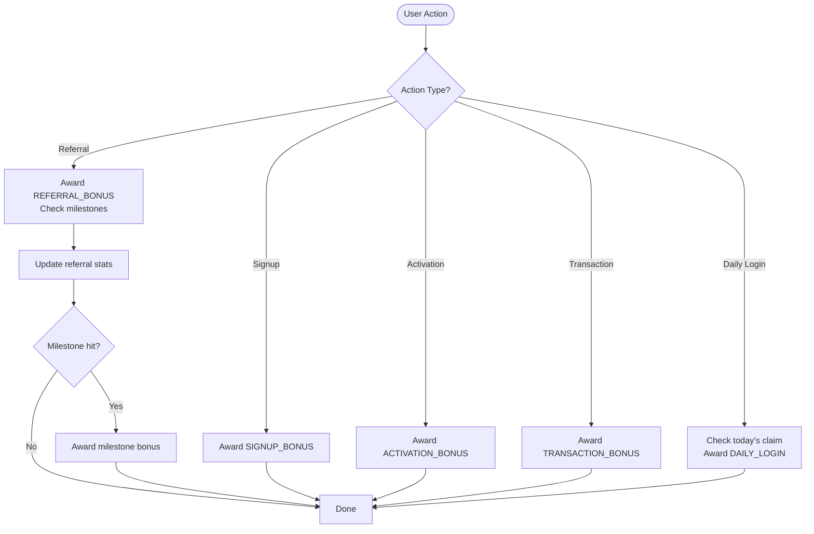

**Diagram sources**
- [services/rzcRewardService.ts:27-174](file://services/rzcRewardService.ts#L27-L174)

**Section sources**
- [services/rzcRewardService.ts:8-27](file://services/rzcRewardService.ts#L8-L27)
- [services/rzcRewardService.ts:27-174](file://services/rzcRewardService.ts#L27-L174)
- [services/rzcRewardService.ts:251-270](file://services/rzcRewardService.ts#L251-L270)

### Referral Reward Calculation and Distribution
- Rank-based commission tiers: Core Node (5%), Silver (7.5%), Gold (10%), Elite Partner (15%).
- Minimum transaction fee threshold prevents spam.
- Post-confirmation processing records earnings and updates totals.

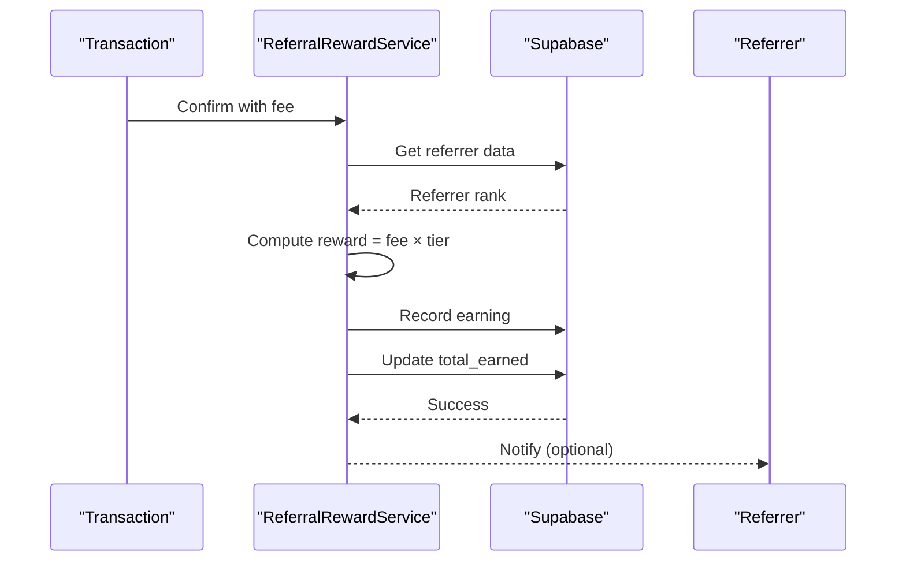

**Diagram sources**
- [services/referralRewardService.ts:24-112](file://services/referralRewardService.ts#L24-L112)

**Section sources**
- [services/referralRewardService.ts:8-17](file://services/referralRewardService.ts#L8-L17)
- [services/referralRewardService.ts:19-112](file://services/referralRewardService.ts#L19-L112)
- [utils/referralUtils.ts:104-209](file://utils/referralUtils.ts#L104-L209)

### Token Transfer System
- Accepts transfers via @username, username, or wallet address.
- Validates recipients, executes RPC transfer, and returns balances.
- Provides transfer history and recent transfers with time-ago formatting.

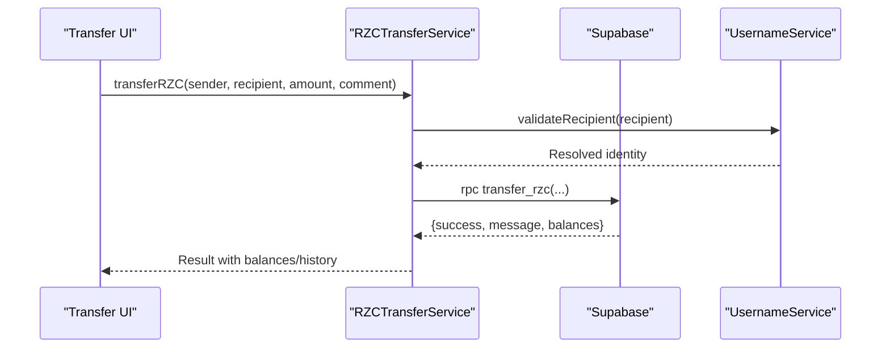

**Diagram sources**
- [services/rzcTransferService.ts:37-130](file://services/rzcTransferService.ts#L37-L130)
- [services/rzcTransferService.ts:222-254](file://services/rzcTransferService.ts#L222-L254)

**Section sources**
- [services/rzcTransferService.ts:33-130](file://services/rzcTransferService.ts#L33-L130)
- [services/rzcTransferService.ts:135-217](file://services/rzcTransferService.ts#L135-L217)
- [services/rzcTransferService.ts:222-254](file://services/rzcTransferService.ts#L222-L254)
- [hooks/useTransactions.ts:156-197](file://hooks/useTransactions.ts#L156-L197)

### Balance Management and Transaction Tracking
- Real-time balance hook reads from Supabase and computes USD value.
- Unified transaction stream merges TON, RZC, and multi-chain activity.
- Supports refresh cycles and error handling.

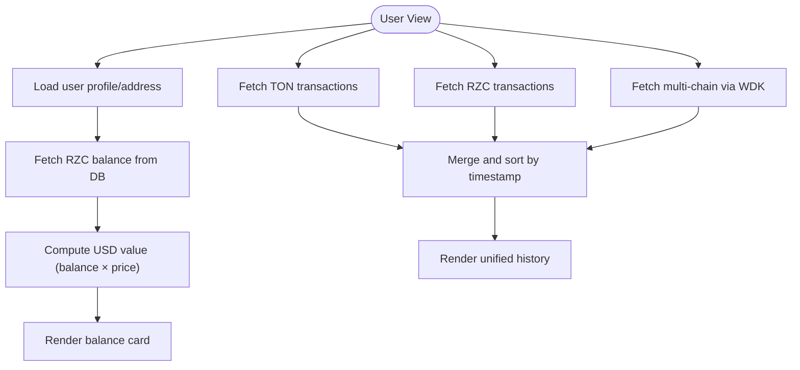

**Diagram sources**
- [hooks/useRZCBalance.ts:25-76](file://hooks/useRZCBalance.ts#L25-L76)
- [hooks/useTransactions.ts:27-240](file://hooks/useTransactions.ts#L27-L240)

**Section sources**
- [hooks/useRZCBalance.ts:6-85](file://hooks/useRZCBalance.ts#L6-L85)
- [hooks/useTransactions.ts:6-267](file://hooks/useTransactions.ts#L6-L267)

### Price Management and Overrides
- Admin-configurable fallback prices for TON, BTC, ETH persisted in localStorage.
- Live CoinGecko prices take priority; overrides act as fallbacks.

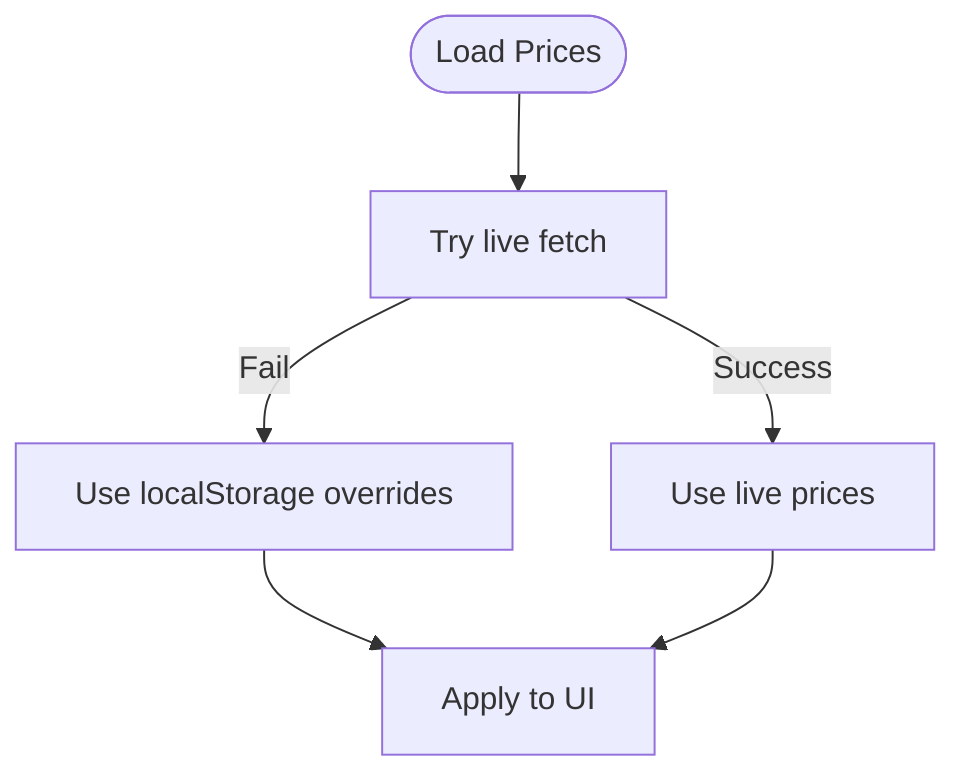

**Diagram sources**
- [utils/priceConfig.ts:24-40](file://utils/priceConfig.ts#L24-L40)

**Section sources**
- [utils/priceConfig.ts:1-41](file://utils/priceConfig.ts#L1-L41)

### Tokenomics Calculator and Modeling
- ROI calculator estimates token acquisition, staking rewards, total value, profit, and ROI.
- Tokenomics chart visualizes allocation segments with cumulative percentages.

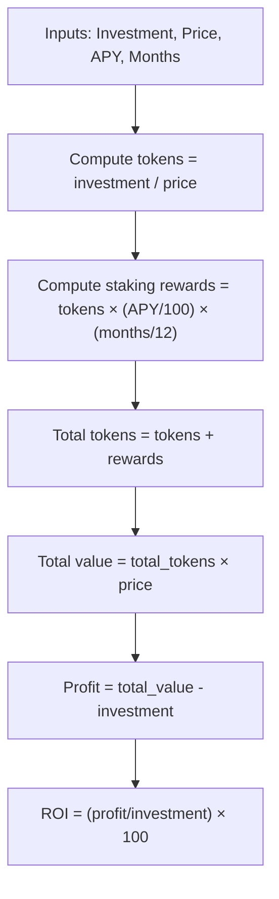

**Diagram sources**
- [components/TokenomicsCalculator.tsx:10-33](file://components/TokenomicsCalculator.tsx#L10-L33)

**Section sources**
- [components/TokenomicsCalculator.tsx:4-33](file://components/TokenomicsCalculator.tsx#L4-L33)
- [components/TokenomicsChart.tsx:4-98](file://components/TokenomicsChart.tsx#L4-L98)

### Staking Engine and Revenue Incentives
- Staking tiers: 30 days (5% APY), 90 days (10% APY), 180 days (15% APY).
- Calculator estimates rewards and total after staking period.
- Emphasizes passive income, security, and predictable returns.

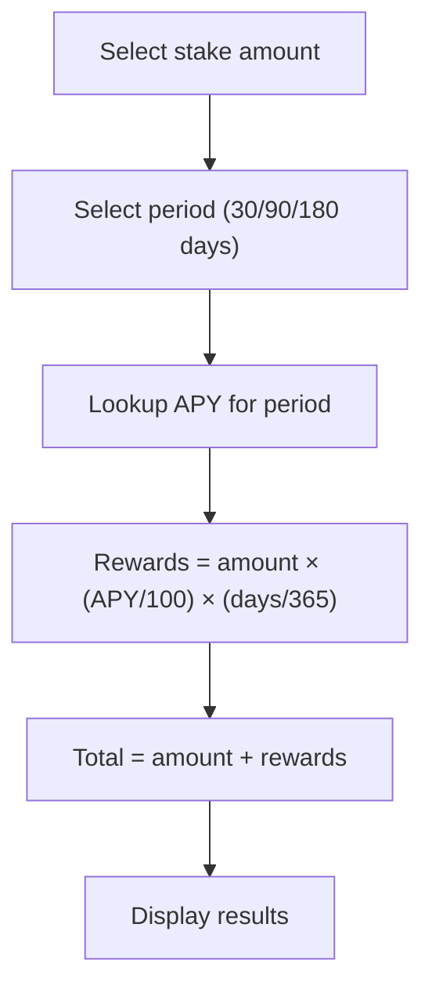

**Diagram sources**
- [pages/StakingEngine.tsx:9-19](file://pages/StakingEngine.tsx#L9-L19)

**Section sources**
- [pages/StakingEngine.tsx:5-21](file://pages/StakingEngine.tsx#L5-L21)
- [pages/StakingEngine.tsx:186-205](file://pages/StakingEngine.tsx#L186-L205)

### Marketplace Integration and Token Utilities
- Marketplace supports buying/selling with $RZC, escrow protection, and low fees.
- Utility hub aggregates payment, mining, staking, marketplace, and developer tools.
- Swap page lists supported tokens and introduces token profiles and roadmaps.

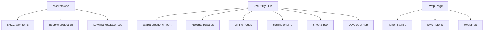

**Diagram sources**
- [pages/Marketplace.tsx:87-136](file://pages/Marketplace.tsx#L87-L136)
- [pages/RzcUtility.tsx:38-167](file://pages/RzcUtility.tsx#L38-L167)
- [pages/Swap.tsx:41-172](file://pages/Swap.tsx#L41-L172)

**Section sources**
- [pages/Marketplace.tsx:5-85](file://pages/Marketplace.tsx#L5-L85)
- [pages/Marketplace.tsx:174-227](file://pages/Marketplace.tsx#L174-L227)
- [pages/RzcUtility.tsx:38-167](file://pages/RzcUtility.tsx#L38-L167)
- [pages/Swap.tsx:41-172](file://pages/Swap.tsx#L41-L172)

### Reward Claims and Economic Incentives
- Eligibility checks enforce minimum claim amount and cooldown.
- Claim initiation creates a request; payout processing is placeholder for future hot wallet integration.
- Statistics summarize total earned, claimed, claimable, and pending/completed claims.

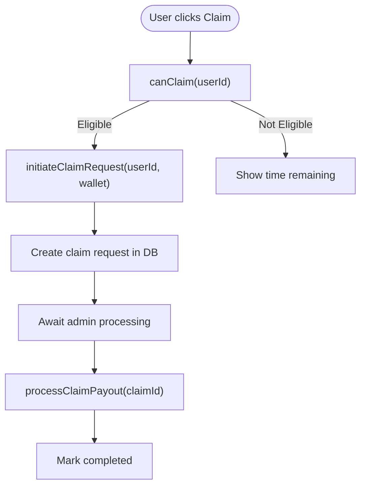

**Diagram sources**
- [services/rewardClaimService.ts:19-75](file://services/rewardClaimService.ts#L19-L75)
- [services/rewardClaimService.ts:81-133](file://services/rewardClaimService.ts#L81-L133)
- [services/rewardClaimService.ts:143-176](file://services/rewardClaimService.ts#L143-L176)
- [services/rewardClaimService.ts:181-233](file://services/rewardClaimService.ts#L181-L233)

**Section sources**
- [services/rewardClaimService.ts:9-13](file://services/rewardClaimService.ts#L9-L13)
- [services/rewardClaimService.ts:19-75](file://services/rewardClaimService.ts#L19-L75)
- [services/rewardClaimService.ts:81-133](file://services/rewardClaimService.ts#L81-L133)
- [services/rewardClaimService.ts:143-176](file://services/rewardClaimService.ts#L143-L176)
- [services/rewardClaimService.ts:181-233](file://services/rewardClaimService.ts#L181-L233)

## Dependency Analysis
- Configuration is consumed by hooks and UI components for display and conversions.
- Reward services depend on Supabase for token crediting and referral stats.
- Transfer service depends on RPC functions and username resolution.
- Referral utilities coordinate with reward services and notifications.
- Transaction hook integrates TON, RZC, and multi-chain data sources.

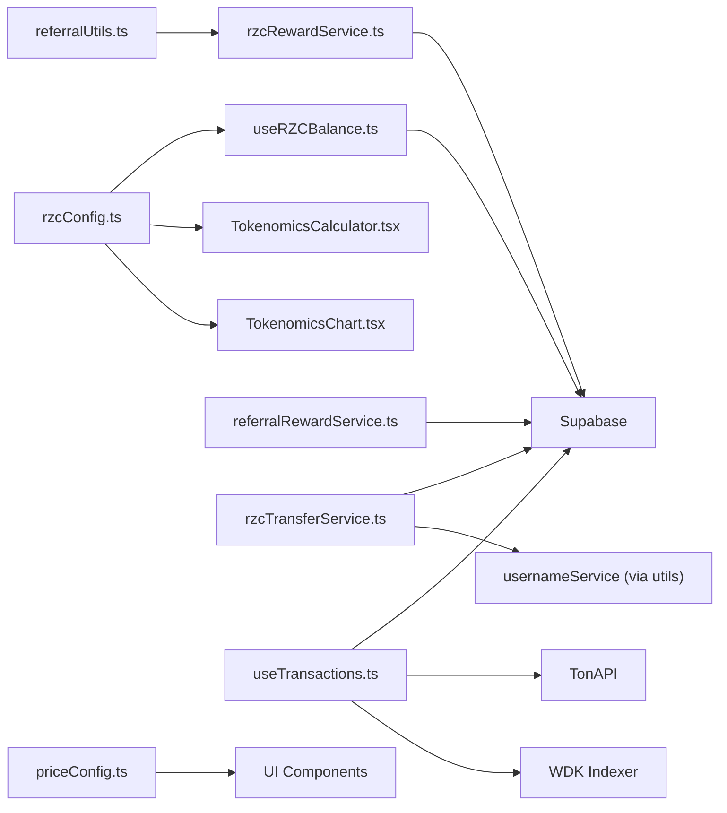

**Diagram sources**
- [config/rzcConfig.ts:17-96](file://config/rzcConfig.ts#L17-L96)
- [hooks/useRZCBalance.ts:14-23](file://hooks/useRZCBalance.ts#L14-L23)
- [components/TokenomicsCalculator.tsx:4-33](file://components/TokenomicsCalculator.tsx#L4-L33)
- [components/TokenomicsChart.tsx:4-17](file://components/TokenomicsChart.tsx#L4-L17)
- [services/rzcRewardService.ts:1-27](file://services/rzcRewardService.ts#L1-L27)
- [services/referralRewardService.ts:1-14](file://services/referralRewardService.ts#L1-L14)
- [services/rzcTransferService.ts:1-10](file://services/rzcTransferService.ts#L1-L10)
- [utils/referralUtils.ts:1-2](file://utils/referralUtils.ts#L1-L2)
- [utils/priceConfig.ts:1-41](file://utils/priceConfig.ts#L1-L41)
- [hooks/useTransactions.ts:38-95](file://hooks/useTransactions.ts#L38-L95)

**Section sources**
- [hooks/useRZCBalance.ts:14-23](file://hooks/useRZCBalance.ts#L14-L23)
- [hooks/useTransactions.ts:38-95](file://hooks/useTransactions.ts#L38-L95)
- [services/rzcTransferService.ts:1-10](file://services/rzcTransferService.ts#L1-L10)
- [services/rzcRewardService.ts:1-27](file://services/rzcRewardService.ts#L1-L27)
- [services/referralRewardService.ts:1-14](file://services/referralRewardService.ts#L1-L14)
- [utils/referralUtils.ts:1-2](file://utils/referralUtils.ts#L1-L2)
- [utils/priceConfig.ts:1-41](file://utils/priceConfig.ts#L1-L41)

## Performance Considerations
- Centralize conversions and formatting in configuration to avoid repeated computations.
- Batch database queries for transactions and balances to reduce round trips.
- Cache price overrides locally to minimize network calls.
- Use lazy loading for heavy UI components like charts and calculators.
- Debounce user inputs in calculators to prevent excessive recomputation.

## Troubleshooting Guide
- Transfer failures: Inspect RPC error codes and messages returned by the transfer function. Validate recipient resolution and ensure sufficient balance.
- Duplicate daily login claims: The reward service prevents claiming twice within a day; verify timestamp handling and UI messaging.
- Referral reward not credited: Confirm transaction fee meets minimum threshold, referrer exists, and rank-based commission is applied.
- Claim eligibility issues: Check minimum amount and cooldown; ensure last claim date is recorded and formatted correctly.
- Transaction sync problems: Verify TonAPI and WDK indexer endpoints, API keys, and error propagation in the transaction hook.

**Section sources**
- [services/rzcTransferService.ts:85-111](file://services/rzcTransferService.ts#L85-L111)
- [services/rzcRewardService.ts:214-231](file://services/rzcRewardService.ts#L214-L231)
- [services/referralRewardService.ts:36-40](file://services/referralRewardService.ts#L36-L40)
- [services/rewardClaimService.ts:38-62](file://services/rewardClaimService.ts#L38-L62)
- [hooks/useTransactions.ts:146-153](file://hooks/useTransactions.ts#L146-L153)

## Conclusion
The RZC token economy integrates robust configuration, reward distribution, transfer, and claim services with intuitive UI components. The system emphasizes transparency, scalability, and user control through non-custodial operations and layered economic incentives. Operators should monitor RPC responses, maintain accurate price overrides, and progressively enhance payout automation and analytics.

## Appendices

### Example Workflows

- Reward calculation example
  - Scenario: A user completes a qualifying transaction and refers a new user.
  - Steps: Transaction bonus credited → Referral bonus awarded → Milestone check → Optional milestone bonus → Notification sent.
  - Outcome: Updated balances and referral stats; UI reflects new rewards.

- Token transfer example
  - Scenario: User sends RZC to @username with a comment.
  - Steps: Recipient validation → RPC transfer → Balance updates → Transaction history retrieval.
  - Outcome: Successful transfer with updated sender/reciever balances.

- Staking example
  - Scenario: User stakes 10,000 RZC for 90 days at 10% APY.
  - Steps: Calculate rewards = amount × (APY/100) × (days/365) → Display total after period.
  - Outcome: Predictable returns and flexible lock terms.

- Marketplace purchase example
  - Scenario: Buyer pays 299 RZC for a course; funds held in escrow.
  - Steps: Payment accepted → Seller delivers → Escrow release → Fees deducted.
  - Outcome: Secure transaction with low marketplace fees.

**Section sources**
- [services/rzcRewardService.ts:178-204](file://services/rzcRewardService.ts#L178-L204)
- [services/rzcRewardService.ts:105-174](file://services/rzcRewardService.ts#L105-L174)
- [services/rzcTransferService.ts:37-130](file://services/rzcTransferService.ts#L37-L130)
- [pages/StakingEngine.tsx:9-19](file://pages/StakingEngine.tsx#L9-L19)
- [pages/Marketplace.tsx:249-287](file://pages/Marketplace.tsx#L249-L287)