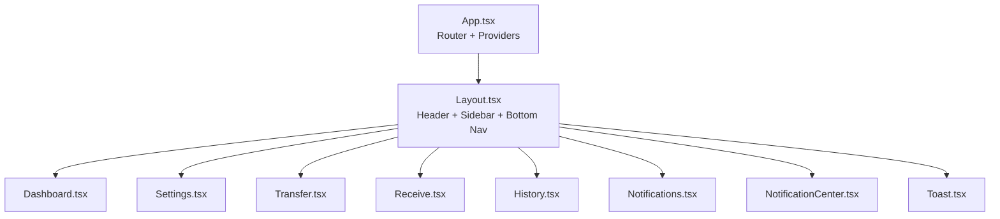
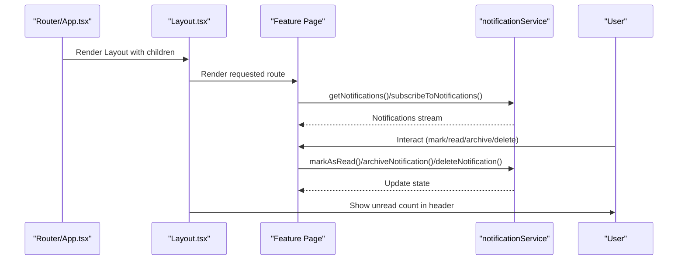
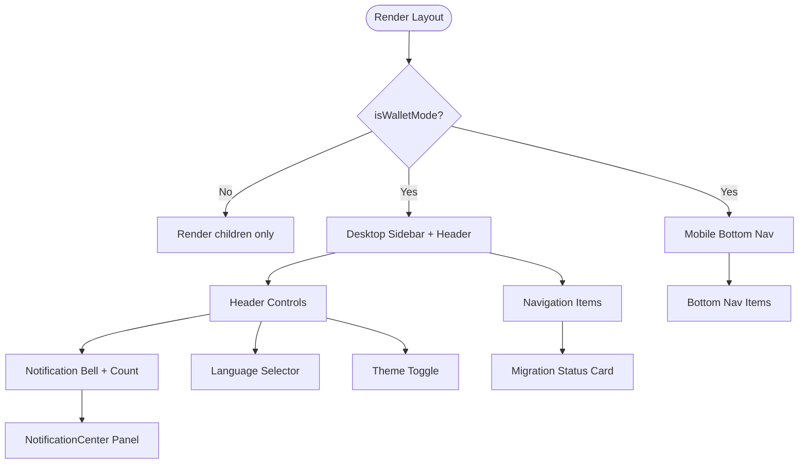
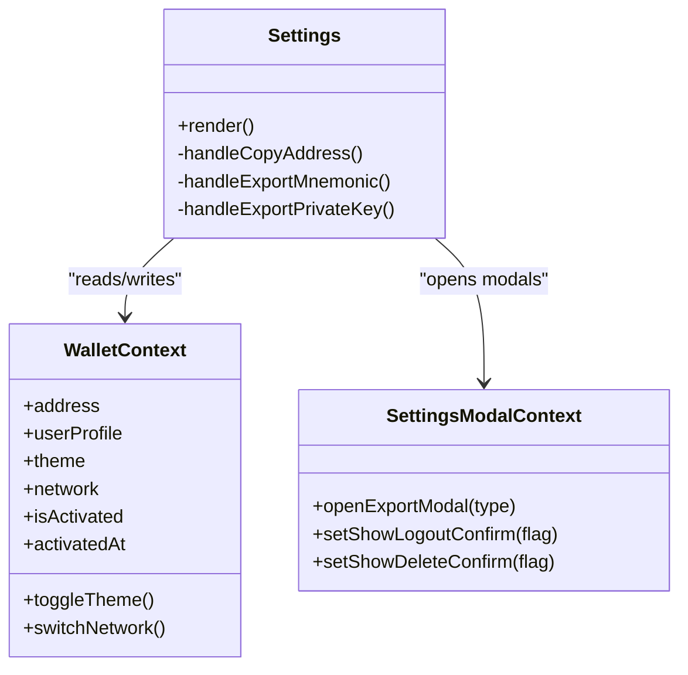
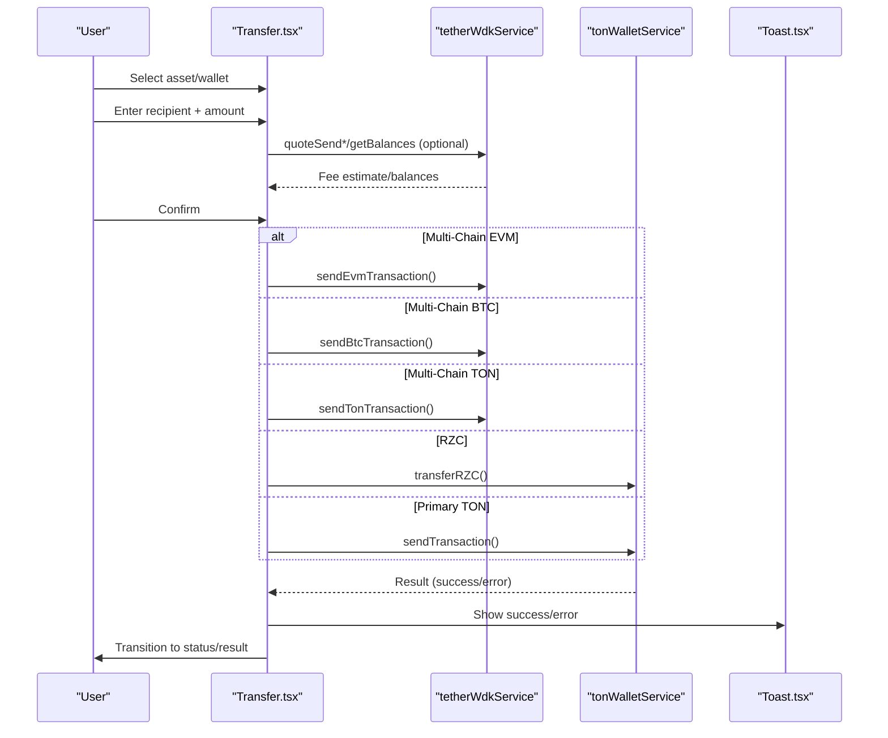
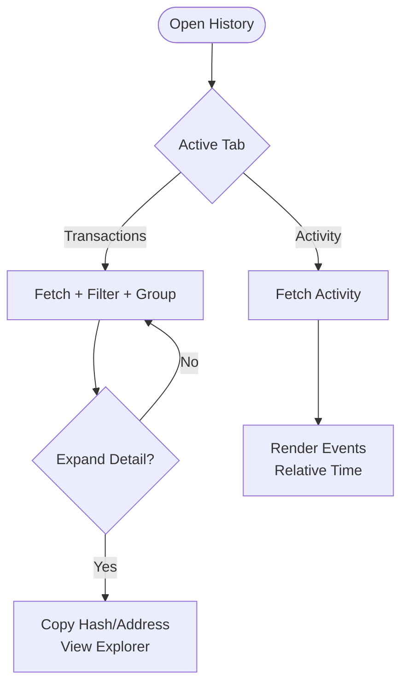
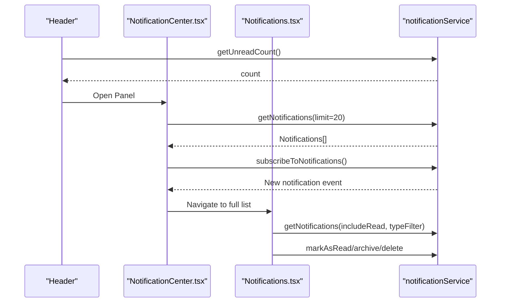
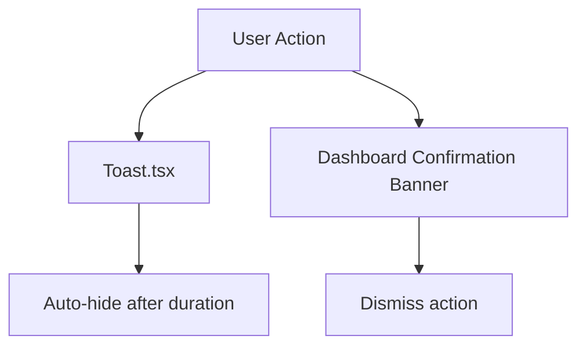
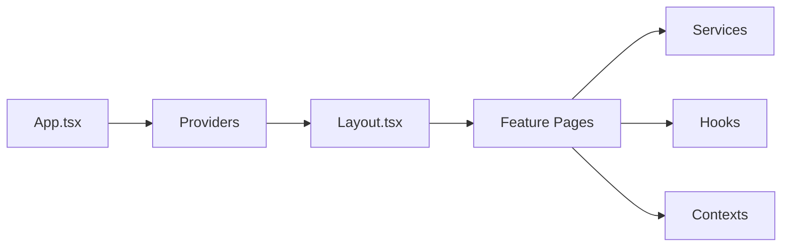

# User Interface and Experience

<cite>
**Referenced Files in This Document**
- [App.tsx](file://App.tsx)
- [Layout.tsx](file://components/Layout.tsx)
- [Dashboard.tsx](file://pages/Dashboard.tsx)
- [Settings.tsx](file://pages/Settings.tsx)
- [Transfer.tsx](file://pages/Transfer.tsx)
- [Receive.tsx](file://pages/Receive.tsx)
- [History.tsx](file://pages/History.tsx)
- [Notifications.tsx](file://pages/Notifications.tsx)
- [NotificationCenter.tsx](file://components/NotificationCenter.tsx)
- [Toast.tsx](file://components/Toast.tsx)
</cite>

## Table of Contents
1. [Introduction](#introduction)
2. [Project Structure](#project-structure)
3. [Core Components](#core-components)
4. [Architecture Overview](#architecture-overview)
5. [Detailed Component Analysis](#detailed-component-analysis)
6. [Dependency Analysis](#dependency-analysis)
7. [Performance Considerations](#performance-considerations)
8. [Troubleshooting Guide](#troubleshooting-guide)
9. [Conclusion](#conclusion)

## Introduction
This document explains the user interface and experience design of the RhizaWebWallet. It covers the dashboard layout architecture, navigation system, responsive design, settings and configuration, transaction interfaces (transfer and receive), transaction history management, notification system, activity tracking, and user feedback mechanisms. It also addresses accessibility, cross-platform compatibility, and performance optimization, along with component composition patterns, state management integration, and user workflow optimization.

## Project Structure
The application is a React-based single-page application using React Router for navigation and Tailwind CSS for styling. The UI is composed of:
- A central routing layer that wraps providers for wallet, toast, modals, and contexts
- A shared Layout component that renders the persistent header, sidebar, and bottom navigation
- Feature pages for dashboard, settings, transfers, receive, history, and notifications
- UI components for notifications, toasts, and reusable controls

**Diagram sources**
- [App.tsx:303-328](file://App.tsx#L303-L328)
- [Layout.tsx:119-800](file://components/Layout.tsx#L119-L800)
- [Dashboard.tsx:62-800](file://pages/Dashboard.tsx#L62-L800)
- [Settings.tsx:94-401](file://pages/Settings.tsx#L94-L401)
- [Transfer.tsx:27-800](file://pages/Transfer.tsx#L27-L800)
- [Receive.tsx:22-327](file://pages/Receive.tsx#L22-L327)
- [History.tsx:46-659](file://pages/History.tsx#L46-L659)
- [Notifications.tsx:39-343](file://pages/Notifications.tsx#L39-L343)
- [NotificationCenter.tsx:30-355](file://components/NotificationCenter.tsx#L30-L355)
- [Toast.tsx:1-62](file://components/Toast.tsx#L1-L62)

**Section sources**
- [App.tsx:1-328](file://App.tsx#L1-L328)
- [Layout.tsx:119-800](file://components/Layout.tsx#L119-L800)

## Core Components
- Routing and Providers: Central router with nested providers for wallet, toasts, modals, and contexts; protected routes for authenticated areas; global overlays and modals rendered at the app root.
- Layout: Desktop sidebar, mobile bottom navigation, header with profile, language selector, and notification bell; real-time unread count and notification subscription.
- Dashboard: Portfolio summary, balance visibility, currency switching, recent transaction confirmation banner, system announcements carousel, and action buttons.
- Settings: Theme toggle, language selection, network switch, wallet activation status, backup/export options, and security actions.
- Transfer: Multi-asset and multi-chain support, real-time fee estimation, recipient validation, send-all logic, and status transitions.
- Receive: Multi-wallet selector, QR generation, copy/share/download actions, and security tips.
- History: Transaction list with grouping, filtering, search, and expanded details; activity feed for user events.
- Notifications: Notification list with filters, mark-as-read/archive/delete, and deep-linking; NotificationCenter panel with real-time updates.

**Section sources**
- [App.tsx:70-328](file://App.tsx#L70-L328)
- [Layout.tsx:119-800](file://components/Layout.tsx#L119-L800)
- [Dashboard.tsx:62-800](file://pages/Dashboard.tsx#L62-L800)
- [Settings.tsx:94-401](file://pages/Settings.tsx#L94-L401)
- [Transfer.tsx:27-800](file://pages/Transfer.tsx#L27-L800)
- [Receive.tsx:22-327](file://pages/Receive.tsx#L22-L327)
- [History.tsx:46-659](file://pages/History.tsx#L46-L659)
- [Notifications.tsx:39-343](file://pages/Notifications.tsx#L39-L343)
- [NotificationCenter.tsx:30-355](file://components/NotificationCenter.tsx#L30-L355)
- [Toast.tsx:1-62](file://components/Toast.tsx#L1-L62)

## Architecture Overview
The UI architecture emphasizes:
- Provider-first composition: Wallet, Toast, Airdrop, Settings, Verification, and Purchase contexts wrap the app.
- Protected routing: Authentication guard ensures only logged-in users access wallet pages.
- Real-time integrations: Notification service handles fetching, subscriptions, and browser notifications.
- Modular layouts: Shared Layout composes desktop and mobile navigation with persistent controls.

**Diagram sources**
- [App.tsx:303-328](file://App.tsx#L303-L328)
- [Layout.tsx:151-195](file://components/Layout.tsx#L151-L195)
- [Notifications.tsx:50-125](file://pages/Notifications.tsx#L50-L125)
- [NotificationCenter.tsx:41-112](file://components/NotificationCenter.tsx#L41-L112)

## Detailed Component Analysis

### Dashboard Layout and Navigation
- Desktop layout includes a sidebar with navigation items, theme toggle, settings, RZC price display, community links, and a migration status card.
- Mobile layout features a persistent bottom navigation bar optimized for touch gestures.
- Header displays profile, language selector, network switcher, and notification bell with unread count.
- Activation banner overlays when wallet is not activated; Airdrop trigger appears on wallet routes.

**Diagram sources**
- [Layout.tsx:119-800](file://components/Layout.tsx#L119-L800)

**Section sources**
- [Layout.tsx:119-800](file://components/Layout.tsx#L119-L800)

### Settings and Configuration Interface
- Sections: Profile, Wallet Management (when multiple wallets), Activation Status, Preferences (theme/language/notifications), Network, Security (backup/export/private key), and Danger Zone (logout/delete).
- Integrates with WalletContext for theme/network/address and SettingsModalContext for export modals.
- Supports multi-chain wallet switching when available.

**Diagram sources**
- [Settings.tsx:94-401](file://pages/Settings.tsx#L94-L401)
- [Layout.tsx:119-800](file://components/Layout.tsx#L119-L800)

**Section sources**
- [Settings.tsx:94-401](file://pages/Settings.tsx#L94-L401)

### Transaction Interfaces: Transfer and Receive
- Transfer supports:
  - Asset selection (TON, RZC, Jettons, Multi-Chain EVM/BTC/TON)
  - Recipient validation (address/username)
  - Real-time fee estimation via WDK services
  - Send-all logic with gas buffers
  - Status transitions and toast feedback
- Receive supports:
  - Wallet selection (primary vs multi-chain)
  - QR generation with downloadable SVG
  - Copy/share actions
  - Security tips per network

**Diagram sources**
- [Transfer.tsx:27-800](file://pages/Transfer.tsx#L27-L800)

**Section sources**
- [Transfer.tsx:27-800](file://pages/Transfer.tsx#L27-L800)
- [Receive.tsx:22-327](file://pages/Receive.tsx#L22-L327)

### Transaction History Management
- Tabbed interface: Transactions and Activity.
- Transactions:
  - Filtering by type (send/receive/RZC/all)
  - Search by hash/address/comment/username
  - Grouping by Today/Yesterday/date
  - Expanded details with copyable hash/address, explorer link, timestamps, fees, comments
- Activity:
  - User activity feed with commission/reward/referral events
  - Relative time formatting and metadata rendering

**Diagram sources**
- [History.tsx:46-659](file://pages/History.tsx#L46-L659)

**Section sources**
- [History.tsx:46-659](file://pages/History.tsx#L46-L659)

### Notification System and Activity Tracking
- Centralized notification management:
  - Fetch notifications with filters (type/status)
  - Real-time subscription with browser notifications
  - Mark-as-read/archive/delete actions
  - Unread count in header and NotificationCenter panel
- Activity tracking:
  - User activity feed with commission/reward/referral events
  - Relative time formatting and metadata parsing

**Diagram sources**
- [Layout.tsx:151-195](file://components/Layout.tsx#L151-L195)
- [NotificationCenter.tsx:41-157](file://components/NotificationCenter.tsx#L41-L157)
- [Notifications.tsx:50-125](file://pages/Notifications.tsx#L50-L125)

**Section sources**
- [NotificationCenter.tsx:30-355](file://components/NotificationCenter.tsx#L30-L355)
- [Notifications.tsx:39-343](file://pages/Notifications.tsx#L39-L343)
- [Layout.tsx:151-195](file://components/Layout.tsx#L151-L195)

### User Feedback Mechanisms
- Toast component provides transient feedback with icons and colors for success/error/warning/info.
- Dashboard shows a transaction confirmation banner with dismiss action.
- Settings provides immediate feedback for copying address and exporting keys.

**Diagram sources**
- [Toast.tsx:1-62](file://components/Toast.tsx#L1-L62)
- [Dashboard.tsx:512-552](file://pages/Dashboard.tsx#L512-L552)

**Section sources**
- [Toast.tsx:1-62](file://components/Toast.tsx#L1-L62)
- [Dashboard.tsx:512-552](file://pages/Dashboard.tsx#L512-L552)

## Dependency Analysis
- Routing and guards:
  - ProtectedRoute checks wallet auth state and redirects unauthenticated users.
  - AppContent manages global overlays, modal triggers, and page-view logging.
- Layout dependencies:
  - Layout consumes WalletContext for theme, network, and user profile.
  - Layout subscribes to notifications and maintains unread counts.
- Feature pages depend on:
  - WalletContext for balances and settings
  - Services for blockchain operations and notifications
  - Hooks for data fetching (balances, transactions)
  - Contexts for modals and toasts

**Diagram sources**
- [App.tsx:303-328](file://App.tsx#L303-L328)
- [Layout.tsx:119-800](file://components/Layout.tsx#L119-L800)

**Section sources**
- [App.tsx:70-328](file://App.tsx#L70-L328)
- [Layout.tsx:119-800](file://components/Layout.tsx#L119-L800)

## Performance Considerations
- Lazy loading and dynamic imports are used for services to reduce initial bundle size and avoid circular dependencies.
- Real-time subscriptions are cleaned up on component unmount to prevent memory leaks.
- Debounced or throttled UI interactions (e.g., click-outside handlers) improve responsiveness.
- Skeleton loaders and minimal re-renders during long-running operations (e.g., fee estimation, transaction submission).
- Image and SVG generation (QR) are handled efficiently; downloads are triggered client-side.

[No sources needed since this section provides general guidance]

## Troubleshooting Guide
- Authentication and routing:
  - ProtectedRoute redirects unauthenticated users to login; ensure wallet context initializes properly.
- Notifications:
  - If unread count does not update, verify subscription setup and that wallet address is available.
  - Browser notifications require granted permissions.
- Transfers:
  - For multi-chain transfers, ensure the multi-chain wallet is configured and balances are fetched before sending.
  - Use send-all logic carefully to account for gas buffers.
- Receive:
  - QR download uses client-side blob creation; ensure clipboard/share APIs are available.
- Settings:
  - Export modals are controlled by SettingsModalContext; verify context providers are present.

**Section sources**
- [App.tsx:70-90](file://App.tsx#L70-L90)
- [NotificationCenter.tsx:85-112](file://components/NotificationCenter.tsx#L85-L112)
- [Transfer.tsx:44-57](file://pages/Transfer.tsx#L44-L57)
- [Receive.tsx:72-93](file://pages/Receive.tsx#L72-L93)
- [Settings.tsx:109-140](file://pages/Settings.tsx#L109-L140)

## Conclusion
The RhizaWebWallet UI prioritizes clarity, security, and efficiency across devices. The shared Layout provides consistent navigation and controls, while feature pages deliver focused workflows for transfers, receiving, and history. The notification and activity systems keep users informed, and the settings interface empowers customization and security. With real-time integrations, responsive design, and thoughtful UX patterns, the platform supports both novice and advanced users across web and mobile environments.