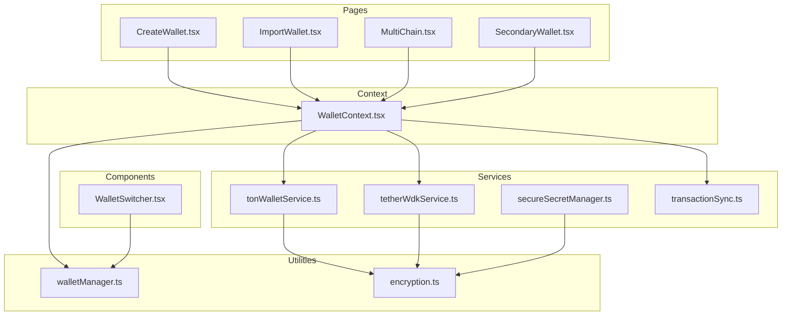
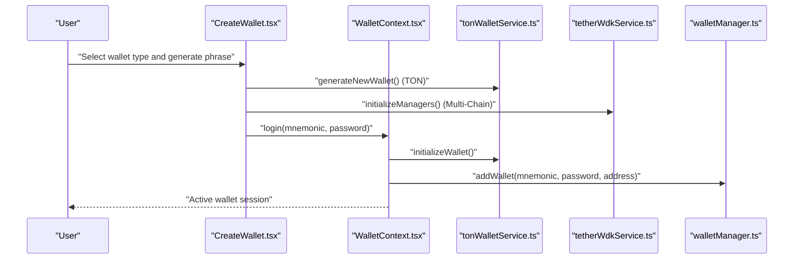
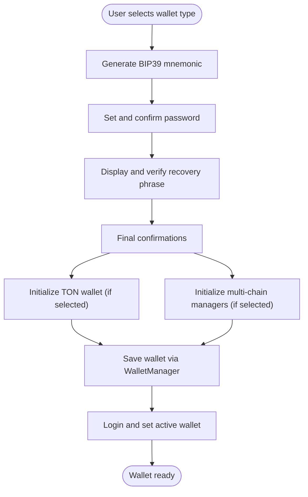
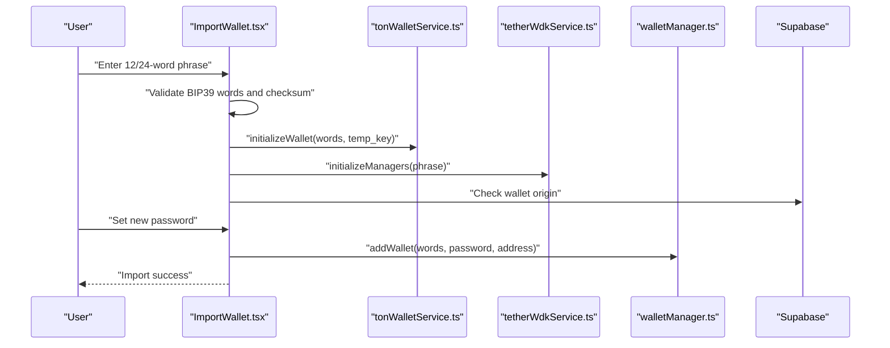
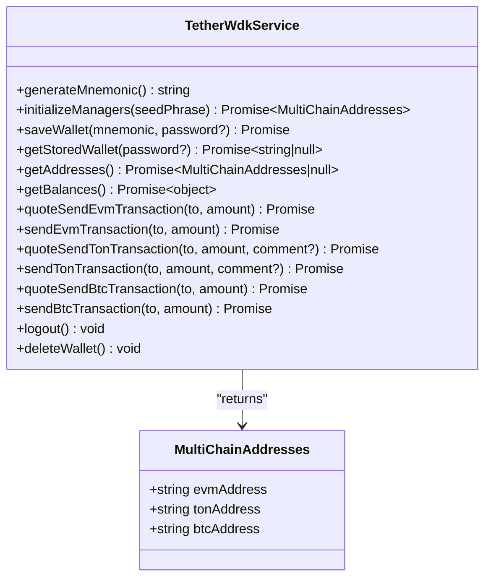
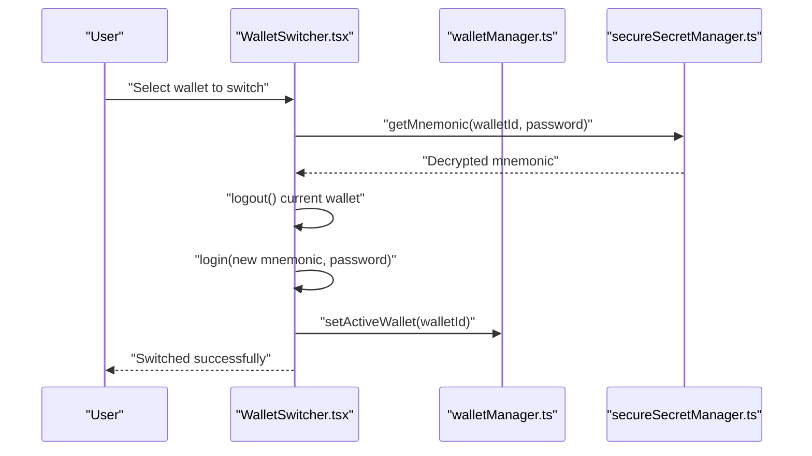
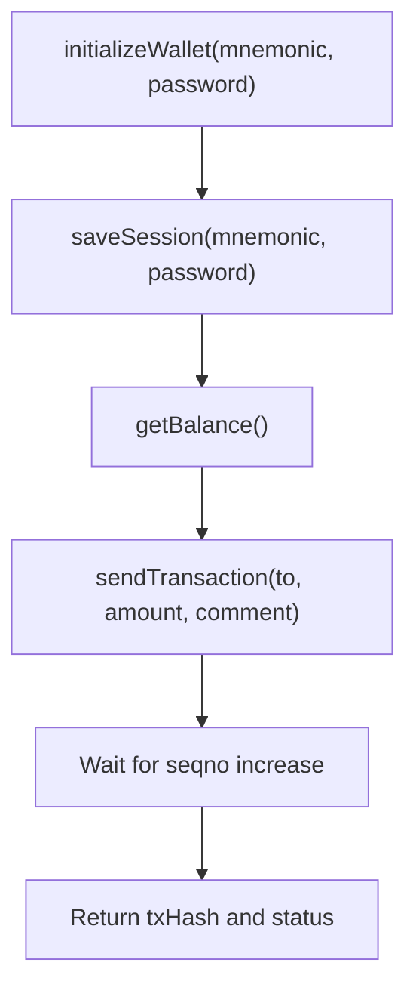
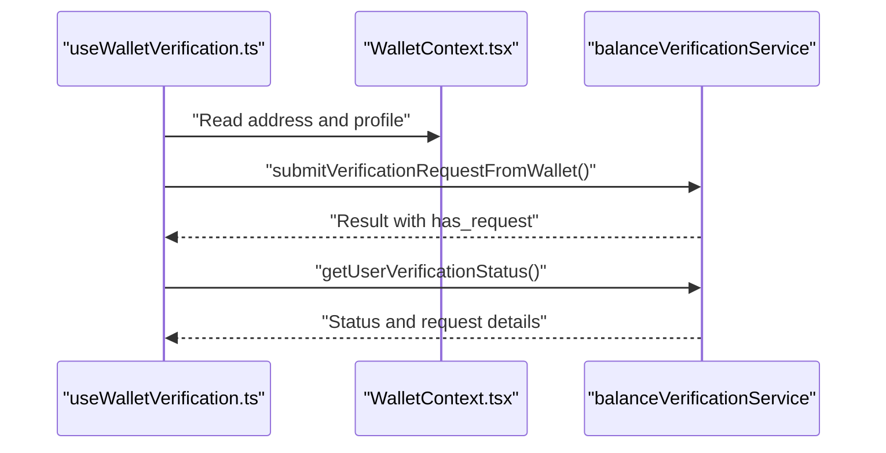
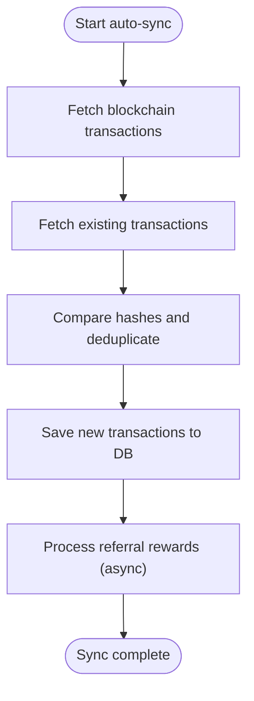
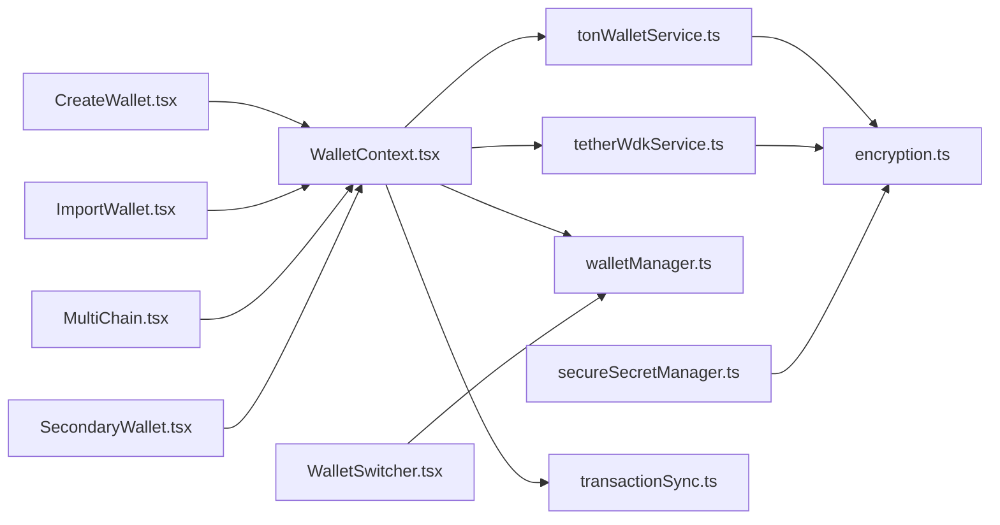

# Wallet Management System

<cite>
**Referenced Files in This Document**
- [CreateWallet.tsx](file://pages/CreateWallet.tsx)
- [ImportWallet.tsx](file://pages/ImportWallet.tsx)
- [WalletContext.tsx](file://context/WalletContext.tsx)
- [walletManager.ts](file://utils/walletManager.ts)
- [tonWalletService.ts](file://services/tonWalletService.ts)
- [tetherWdkService.ts](file://services/tetherWdkService.ts)
- [encryption.ts](file://utils/encryption.ts)
- [WalletSwitcher.tsx](file://components/WalletSwitcher.tsx)
- [MultiChain.tsx](file://pages/MultiChain.tsx)
- [secureSecretManager.ts](file://services/secureSecretManager.ts)
- [SecondaryWallet.tsx](file://pages/SecondaryWallet.tsx)
- [transactionSync.ts](file://services/transactionSync.ts)
- [useWalletVerification.ts](file://hooks/useWalletVerification.ts)
</cite>

## Table of Contents
1. [Introduction](#introduction)
2. [Project Structure](#project-structure)
3. [Core Components](#core-components)
4. [Architecture Overview](#architecture-overview)
5. [Detailed Component Analysis](#detailed-component-analysis)
6. [Dependency Analysis](#dependency-analysis)
7. [Performance Considerations](#performance-considerations)
8. [Troubleshooting Guide](#troubleshooting-guide)
9. [Conclusion](#conclusion)

## Introduction
This document provides comprehensive documentation for the wallet management system, covering wallet creation, import, multi-chain support, security features, session management, and state persistence. It explains BIP39 mnemonic generation, seed phrase handling, wallet derivation, verification processes, and recovery mechanisms. Practical examples and common use cases are included to help both developers and users understand how the system works.

## Project Structure
The wallet management system is organized around several key areas:
- Pages for wallet creation and import
- Context for global wallet state and session management
- Services for TON and multi-chain wallet operations
- Utilities for encryption and secure secret management
- Components for wallet switching and multi-chain dashboards
- Hooks for wallet verification workflows

**Diagram sources**
- [CreateWallet.tsx:1-764](file://pages/CreateWallet.tsx#L1-L764)
- [ImportWallet.tsx:1-619](file://pages/ImportWallet.tsx#L1-L619)
- [WalletContext.tsx:1-410](file://context/WalletContext.tsx#L1-L410)
- [walletManager.ts:1-341](file://utils/walletManager.ts#L1-L341)
- [tonWalletService.ts:1-846](file://services/tonWalletService.ts#L1-L846)
- [tetherWdkService.ts:1-446](file://services/tetherWdkService.ts#L1-L446)
- [encryption.ts:1-255](file://utils/encryption.ts#L1-L255)
- [WalletSwitcher.tsx:1-564](file://components/WalletSwitcher.tsx#L1-L564)
- [MultiChain.tsx:1-315](file://pages/MultiChain.tsx#L1-L315)
- [secureSecretManager.ts:1-339](file://services/secureSecretManager.ts#L1-L339)
- [SecondaryWallet.tsx:1-458](file://pages/SecondaryWallet.tsx#L1-L458)
- [transactionSync.ts:1-194](file://services/transactionSync.ts#L1-L194)

**Section sources**
- [CreateWallet.tsx:1-764](file://pages/CreateWallet.tsx#L1-L764)
- [ImportWallet.tsx:1-619](file://pages/ImportWallet.tsx#L1-L619)
- [WalletContext.tsx:1-410](file://context/WalletContext.tsx#L1-L410)
- [walletManager.ts:1-341](file://utils/walletManager.ts#L1-L341)
- [tonWalletService.ts:1-846](file://services/tonWalletService.ts#L1-L846)
- [tetherWdkService.ts:1-446](file://services/tetherWdkService.ts#L1-L446)
- [encryption.ts:1-255](file://utils/encryption.ts#L1-L255)
- [WalletSwitcher.tsx:1-564](file://components/WalletSwitcher.tsx#L1-L564)
- [MultiChain.tsx:1-315](file://pages/MultiChain.tsx#L1-L315)
- [secureSecretManager.ts:1-339](file://services/secureSecretManager.ts#L1-L339)
- [SecondaryWallet.tsx:1-458](file://pages/SecondaryWallet.tsx#L1-L458)
- [transactionSync.ts:1-194](file://services/transactionSync.ts#L1-L194)

## Core Components
- Wallet Creation Flow: Guides users through selecting wallet type, generating BIP39 phrases, setting a password, verifying backup, and finalizing creation. Integrates TON and multi-chain services.
- Wallet Import Flow: Allows restoring existing wallets using BIP39 phrases, validating checksums, and securing imported wallets with a new password.
- Wallet Context: Manages global wallet state, session synchronization across tabs, network switching, and user profile integration.
- Wallet Manager: Handles multiple encrypted wallets, switching, renaming, exporting backups, and password verification.
- TON Wallet Service: Provides TON-specific operations including balance retrieval, transaction sending, and session management with timeouts.
- Tether WDK Service: Enables multi-chain support (EVM, TON, BTC) using Tether's Wallet Development Kit, including balance fetching and transaction operations.
- Encryption Utilities: Implements secure AES-GCM encryption for mnemonic storage with PBKDF2 key derivation and automatic migration.
- Secure Secret Manager: Adds an additional layer of secure memory caching for mnemonics with automatic clearing and lifecycle management.
- Transaction Sync Service: Synchronizes blockchain transactions with the backend database and triggers referral reward processing.

**Section sources**
- [CreateWallet.tsx:82-293](file://pages/CreateWallet.tsx#L82-L293)
- [ImportWallet.tsx:121-322](file://pages/ImportWallet.tsx#L121-L322)
- [WalletContext.tsx:172-316](file://context/WalletContext.tsx#L172-L316)
- [walletManager.ts:80-134](file://utils/walletManager.ts#L80-L134)
- [tonWalletService.ts:226-263](file://services/tonWalletService.ts#L226-L263)
- [tetherWdkService.ts:82-139](file://services/tetherWdkService.ts#L82-L139)
- [encryption.ts:54-89](file://utils/encryption.ts#L54-L89)
- [secureSecretManager.ts:141-175](file://services/secureSecretManager.ts#L141-L175)
- [transactionSync.ts:18-156](file://services/transactionSync.ts#L18-L156)

## Architecture Overview
The system follows a layered architecture:
- Presentation Layer: Pages and components handle user interactions for creation, import, switching, and multi-chain views.
- Business Logic Layer: Context and services encapsulate wallet operations, encryption, and multi-chain integrations.
- Data Persistence Layer: Local storage and secure secret manager store encrypted wallet data and sensitive secrets.
- Blockchain Integration Layer: TON and multi-chain services interact with external APIs and SDKs.

**Diagram sources**
- [CreateWallet.tsx:82-217](file://pages/CreateWallet.tsx#L82-L217)
- [WalletContext.tsx:172-195](file://context/WalletContext.tsx#L172-L195)
- [tonWalletService.ts:215-263](file://services/tonWalletService.ts#L215-L263)
- [tetherWdkService.ts:82-139](file://services/tetherWdkService.ts#L82-L139)
- [walletManager.ts:80-134](file://utils/walletManager.ts#L80-L134)

**Section sources**
- [CreateWallet.tsx:82-217](file://pages/CreateWallet.tsx#L82-L217)
- [WalletContext.tsx:172-195](file://context/WalletContext.tsx#L172-L195)
- [tonWalletService.ts:215-263](file://services/tonWalletService.ts#L215-L263)
- [tetherWdkService.ts:82-139](file://services/tetherWdkService.ts#L82-L139)
- [walletManager.ts:80-134](file://utils/walletManager.ts#L80-L134)

## Detailed Component Analysis

### Wallet Creation Process
The creation flow supports two wallet types:
- TON Vault (24-word): Generates a TON-native wallet using BIP39 and initializes the TON contract.
- Multi-Chain Wallet (12-word): Derives addresses across EVM, TON, and BTC using Tether WDK.

**Diagram sources**
- [CreateWallet.tsx:82-293](file://pages/CreateWallet.tsx#L82-L293)
- [walletManager.ts:80-134](file://utils/walletManager.ts#L80-L134)
- [tonWalletService.ts:226-263](file://services/tonWalletService.ts#L226-L263)
- [tetherWdkService.ts:82-139](file://services/tetherWdkService.ts#L82-L139)

**Section sources**
- [CreateWallet.tsx:82-293](file://pages/CreateWallet.tsx#L82-L293)
- [walletManager.ts:80-134](file://utils/walletManager.ts#L80-L134)
- [tonWalletService.ts:226-263](file://services/tonWalletService.ts#L226-L263)
- [tetherWdkService.ts:82-139](file://services/tetherWdkService.ts#L82-L139)

### Wallet Import Procedures
The import flow validates BIP39 words and checksums, derives addresses, checks database origin, and secures the wallet with a new password.

**Diagram sources**
- [ImportWallet.tsx:121-322](file://pages/ImportWallet.tsx#L121-L322)
- [tonWalletService.ts:226-263](file://services/tonWalletService.ts#L226-L263)
- [tetherWdkService.ts:82-139](file://services/tetherWdkService.ts#L82-L139)
- [walletManager.ts:80-134](file://utils/walletManager.ts#L80-L134)

**Section sources**
- [ImportWallet.tsx:121-322](file://pages/ImportWallet.tsx#L121-L322)
- [tonWalletService.ts:226-263](file://services/tonWalletService.ts#L226-L263)
- [tetherWdkService.ts:82-139](file://services/tetherWdkService.ts#L82-L139)
- [walletManager.ts:80-134](file://utils/walletManager.ts#L80-L134)

### Multi-Chain Support with Tether WDK
The system integrates Tether WDK to manage EVM, TON, and BTC wallets from a single 12-word seed. It supports balance retrieval, transaction quoting, and sending across chains with safety guards.

**Diagram sources**
- [tetherWdkService.ts:59-446](file://services/tetherWdkService.ts#L59-L446)

**Section sources**
- [tetherWdkService.ts:59-446](file://services/tetherWdkService.ts#L59-L446)
- [MultiChain.tsx:1-315](file://pages/MultiChain.tsx#L1-L315)
- [SecondaryWallet.tsx:1-458](file://pages/SecondaryWallet.tsx#L1-L458)

### Wallet Switching and Security Features
Wallet switching requires unlocking with a password, after which the active wallet is updated. Security features include:
- Encrypted storage of mnemonics with PBKDF2 and AES-GCM
- Secure memory caching with automatic clearing
- Session timeouts and warnings
- Device-specific encryption for auto-login
- Password strength validation and verification challenges

**Diagram sources**
- [WalletSwitcher.tsx:59-97](file://components/WalletSwitcher.tsx#L59-L97)
- [walletManager.ts:140-182](file://utils/walletManager.ts#L140-L182)
- [secureSecretManager.ts:183-223](file://services/secureSecretManager.ts#L183-L223)

**Section sources**
- [WalletSwitcher.tsx:59-97](file://components/WalletSwitcher.tsx#L59-L97)
- [walletManager.ts:140-182](file://utils/walletManager.ts#L140-L182)
- [secureSecretManager.ts:183-223](file://services/secureSecretManager.ts#L183-L223)
- [encryption.ts:96-148](file://utils/encryption.ts#L96-L148)

### TON Wallet Integration
TON operations include balance retrieval, transaction sending with fee estimation, and multi-transaction support. The service manages session state, network switching, and security enhancements like comment sanitization and replay protection.

**Diagram sources**
- [tonWalletService.ts:226-287](file://services/tonWalletService.ts#L226-L287)
- [tonWalletService.ts:423-582](file://services/tonWalletService.ts#L423-L582)

**Section sources**
- [tonWalletService.ts:226-287](file://services/tonWalletService.ts#L226-L287)
- [tonWalletService.ts:423-582](file://services/tonWalletService.ts#L423-L582)

### Wallet Verification Processes
The verification hook enables users to submit RZC balance verification requests, check status, and manage verification history. It integrates with the wallet context and balance verification service.

**Diagram sources**
- [useWalletVerification.ts:27-94](file://hooks/useWalletVerification.ts#L27-L94)

**Section sources**
- [useWalletVerification.ts:27-94](file://hooks/useWalletVerification.ts#L27-L94)
- [WalletContext.tsx:1-410](file://context/WalletContext.tsx#L1-L410)

### Transaction Sync and Rewards
The transaction sync service periodically retrieves blockchain transactions, deduplicates them against the database, and saves new records. It also triggers referral reward processing for outgoing transactions.

**Diagram sources**
- [transactionSync.ts:18-156](file://services/transactionSync.ts#L18-L156)

**Section sources**
- [transactionSync.ts:18-156](file://services/transactionSync.ts#L18-L156)

## Dependency Analysis
The system exhibits clear separation of concerns:
- Pages depend on Context and Services for business logic
- Context coordinates state and delegates to Services
- Services encapsulate blockchain and encryption logic
- Utilities provide shared security primitives
- Components consume Context and Services for UI updates

**Diagram sources**
- [CreateWallet.tsx:1-764](file://pages/CreateWallet.tsx#L1-L764)
- [ImportWallet.tsx:1-619](file://pages/ImportWallet.tsx#L1-L619)
- [WalletContext.tsx:1-410](file://context/WalletContext.tsx#L1-L410)
- [walletManager.ts:1-341](file://utils/walletManager.ts#L1-L341)
- [tonWalletService.ts:1-846](file://services/tonWalletService.ts#L1-L846)
- [tetherWdkService.ts:1-446](file://services/tetherWdkService.ts#L1-L446)
- [encryption.ts:1-255](file://utils/encryption.ts#L1-L255)
- [secureSecretManager.ts:1-339](file://services/secureSecretManager.ts#L1-L339)
- [WalletSwitcher.tsx:1-564](file://components/WalletSwitcher.tsx#L1-L564)
- [MultiChain.tsx:1-315](file://pages/MultiChain.tsx#L1-L315)
- [SecondaryWallet.tsx:1-458](file://pages/SecondaryWallet.tsx#L1-L458)
- [transactionSync.ts:1-194](file://services/transactionSync.ts#L1-L194)

**Section sources**
- [CreateWallet.tsx:1-764](file://pages/CreateWallet.tsx#L1-L764)
- [ImportWallet.tsx:1-619](file://pages/ImportWallet.tsx#L1-L619)
- [WalletContext.tsx:1-410](file://context/WalletContext.tsx#L1-L410)
- [walletManager.ts:1-341](file://utils/walletManager.ts#L1-L341)
- [tonWalletService.ts:1-846](file://services/tonWalletService.ts#L1-L846)
- [tetherWdkService.ts:1-446](file://services/tetherWdkService.ts#L1-L446)
- [encryption.ts:1-255](file://utils/encryption.ts#L1-L255)
- [secureSecretManager.ts:1-339](file://services/secureSecretManager.ts#L1-L339)
- [WalletSwitcher.tsx:1-564](file://components/WalletSwitcher.tsx#L1-L564)
- [MultiChain.tsx:1-315](file://pages/MultiChain.tsx#L1-L315)
- [SecondaryWallet.tsx:1-458](file://pages/SecondaryWallet.tsx#L1-L458)
- [transactionSync.ts:1-194](file://services/transactionSync.ts#L1-L194)

## Performance Considerations
- Encryption iterations: New wallets use 600,000 PBKDF2 iterations for improved security; legacy wallets are auto-migrated on access.
- Session timeouts: TON service enforces 30-minute session limits with warnings to reduce exposure windows.
- Auto-sync intervals: Transaction sync runs every 30 seconds with a 10-second cooldown to prevent excessive API calls.
- Memory management: Secure secret manager clears cached mnemonics after 5 minutes to minimize in-memory exposure.
- Multi-chain initialization: WDK managers are lazily initialized and disposed to conserve resources.

[No sources needed since this section provides general guidance]

## Troubleshooting Guide
Common issues and resolutions:
- Session expired: If a session exceeds 30 minutes, the system clears it and prompts re-authentication.
- Invalid mnemonic: Validation checks BIP39 word lists and checksums; ensure the phrase is correctly formatted and spelled.
- Insufficient balance: Transaction functions check balances and estimated fees; ensure sufficient funds for gas/fees.
- Multi-chain engine not active: After page reloads, the WDK engine may need to be unlocked with the wallet password to fetch live balances.
- Sync cooldown: Transaction sync is throttled to prevent frequent API calls; wait for the cooldown period to pass.

**Section sources**
- [tonWalletService.ts:47-55](file://services/tonWalletService.ts#L47-L55)
- [ImportWallet.tsx:144-153](file://pages/ImportWallet.tsx#L144-L153)
- [SecondaryWallet.tsx:73-95](file://pages/SecondaryWallet.tsx#L73-L95)
- [transactionSync.ts:32-37](file://services/transactionSync.ts#L32-L37)

## Conclusion
The wallet management system provides a secure, user-friendly framework for creating, importing, and managing multiple wallets across TON and multi-chain environments. It emphasizes security through encryption, secure memory caching, session timeouts, and robust validation. The modular architecture enables extensibility for additional chains and features while maintaining a consistent user experience.