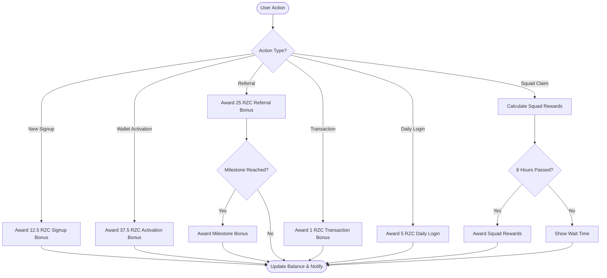

# User Bonus System Overview

## 📊 Complete Bonus System Analysis

This document provides a comprehensive overview of all bonus and reward systems implemented in the RhizaCore wallet application.

---

## 🎁 1. RZC Token Bonus System

### Bonus Types & Amounts

| Bonus Type | Amount | Trigger | Description |
|------------|--------|---------|-------------|
| **Signup Bonus** | 12.5 RZC | Wallet creation | Welcome bonus for new users |
| **Activation Bonus** | 37.5 RZC | $15 wallet activation | Reward for activating wallet |
| **Referral Bonus** | 25 RZC | Each successful referral | Reward for inviting new users |
| **Transaction Bonus** | 1 RZC | Per transaction | Small bonus per completed transaction |
| **Daily Login Bonus** | 5 RZC | Daily login | Once per day login reward |

### Referral Milestone Bonuses

Progressive rewards for reaching referral milestones:

| Milestone | Reward | Description |
|-----------|--------|-------------|
| **10 Referrals** | 250 RZC | First milestone bonus |
| **50 Referrals** | 1,250 RZC | Mid-tier milestone |
| **100 Referrals** | 5,000 RZC | Elite milestone |

**Note:** Signup and Activation bonuses were reduced 4x to maintain token economy balance. Other rewards remain at previous levels.

---

## 👥 2. Squad Mining System

### Overview
Squad mining allows users to earn RZC tokens every 8 hours based on their referral network (squad).

### Earning Structure

| Member Type | Reward per Claim | Description |
|-------------|------------------|-------------|
| **Regular Member** | 2 RZC | Standard squad member |
| **Premium Member** | 5 RZC | Premium/elite squad member |

### Key Features

- **Claim Frequency:** Every 8 hours
- **Calculation:** Automatic based on squad size
- **Tracking:** All claims recorded in `wallet_squad_claims` table
- **Leaderboard:** Public ranking by total squad earnings

### Database Schema

```sql
-- Squad mining fields in wallet_users
- last_squad_claim_at: TIMESTAMPTZ
- total_squad_rewards: NUMERIC
- is_premium: BOOLEAN

-- Squad claims tracking table
wallet_squad_claims:
  - user_id
  - wallet_address
  - squad_size
  - reward_amount
  - premium_members
  - transaction_id
  - claimed_at
```

### Functions

1. **claim_squad_rewards()** - Claims rewards with 8-hour cooldown enforcement
2. **get_squad_mining_stats()** - Returns squad size, potential rewards, eligibility
3. **squad_mining_leaderboard** - View for ranking top earners

---

## 💰 3. Referral Commission System

### Commission Tiers (Rank-Based)

| Rank | Commission Rate | Description |
|------|----------------|-------------|
| **Core Node** | 5% | Entry level referrer |
| **Silver Node** | 7.5% | Mid-tier referrer |
| **Gold Node** | 10% | Advanced referrer |
| **Elite Partner** | 15% | Top-tier referrer |

### How It Works

1. User completes a transaction with fees
2. System identifies referrer (if exists)
3. Calculates commission based on referrer's rank
4. Credits commission to referrer's account
5. Updates total earnings and statistics

### Minimum Requirements

- **Minimum Transaction Fee:** 0.001 TON
- Prevents spam and ensures meaningful rewards

---

## 🔍 4. Bonus Tracking & Verification

### Transaction Types

All bonuses are tracked in `wallet_rzc_transactions` table with these types:

- `signup_bonus`
- `activation_bonus`
- `referral_bonus`
- `milestone_bonus`
- `transaction_bonus`
- `daily_login`
- `squad_mining`

### Anti-Fraud Measures

1. **Duplicate Prevention**
   - Metadata tracking with `referred_user_id`
   - Database constraints prevent double-claiming
   - Daily login checks prevent same-day duplicates

2. **Verification Queries**
   - `check_and_claim_missing_rewards.sql` - Identifies missing bonuses
   - `cleanup_duplicate_bonuses.sql` - Removes duplicate entries
   - `claim_missing_activation_bonus.sql` - Retroactive bonus claims

3. **Referral Validation**
   - Validates referral codes before processing
   - Prevents self-referrals
   - Tracks referral chains

---

## 📈 5. Reward Distribution Flow



---

## 🛠️ 6. Service Architecture

### Core Services

1. **rzcRewardService.ts**
   - Handles all RZC token rewards
   - Methods:
     - `awardSignupBonus()`
     - `awardActivationBonus()`
     - `awardReferralBonus()`
     - `awardTransactionBonus()`
     - `awardDailyLoginBonus()`
     - `getNextMilestone()`

2. **referralRewardService.ts**
   - Processes referral commissions
   - Rank-based reward calculation
   - Transaction fee-based rewards

3. **referralRewardChecker.ts**
   - Detects missing bonuses
   - Auto-claims retroactive rewards
   - Compares expected vs actual bonuses

4. **supabaseService.ts**
   - Database operations
   - `awardRZCTokens()` - Core crediting function
   - Transaction recording
   - Balance updates

---

## 📊 7. Statistics & Analytics

### User Statistics

- Total referrals count
- Total RZC earned
- Squad size
- Squad mining earnings
- Referral rank/tier
- Next milestone progress

### System-Wide Metrics

- Total RZC distributed
- Active referrers count
- Squad mining participation
- Daily active users
- Milestone achievements

---

## 🔧 8. Database Functions

### Core Functions

```sql
-- Award RZC tokens
award_rzc_tokens(user_id, amount, type, description, metadata)

-- Claim squad rewards
claim_squad_rewards(user_id, wallet_address, squad_size, reward_amount, premium_members, transaction_id)

-- Get squad stats
get_squad_mining_stats(user_id)

-- Check missing bonuses
check_and_award_missing_referral_bonuses()
```

### RLS Policies

- Users can only view their own transactions
- Users can only claim their own rewards
- Admin roles have full access
- Public leaderboard views available

---

## 🎯 9. Bonus Claiming Process

### Automatic Bonuses

These are awarded automatically:
- ✅ Signup bonus (12.5 RZC on wallet creation)
- ✅ Activation bonus (37.5 RZC on $15 payment)
- ✅ Referral bonus (25 RZC when referred user signs up)
- ✅ Transaction bonus (1 RZC on each transaction)
- ✅ Milestone bonuses (when threshold reached)

### Manual Claims

These require user action:
- 🔘 Daily login bonus (click to claim)
- 🔘 Squad mining rewards (claim every 8 hours)
- 🔘 Missing/retroactive bonuses (via reward checker)

---

## 🚨 10. Troubleshooting & Maintenance

### Common Issues

1. **Missing Referral Bonuses**
   - Run: `check_and_claim_missing_rewards.sql`
   - Identifies users with referrals but no bonuses
   - Auto-awards missing rewards

2. **Duplicate Bonuses**
   - Run: `cleanup_duplicate_bonuses.sql`
   - Removes duplicate entries
   - Recalculates correct balances

3. **Activation Bonus Not Received**
   - Run: `claim_missing_activation_bonus.sql`
   - Awards retroactive activation bonuses
   - For users who activated before feature launch

### Diagnostic Queries

```sql
-- Check user's bonus history
SELECT type, amount, description, created_at 
FROM wallet_rzc_transactions 
WHERE user_id = 'USER_ID' 
ORDER BY created_at DESC;

-- Verify referral bonuses
SELECT 
  r.total_referrals,
  COUNT(t.id) as bonuses_received,
  (r.total_referrals - COUNT(t.id)) as missing_bonuses
FROM wallet_referrals r
LEFT JOIN wallet_rzc_transactions t ON t.user_id = r.user_id AND t.type = 'referral_bonus'
WHERE r.user_id = 'USER_ID'
GROUP BY r.total_referrals;

-- Check squad mining eligibility
SELECT * FROM get_squad_mining_stats('USER_ID');
```

---

## 📝 11. Configuration

### RZC Token Config

Located in: `config/rzcConfig.ts`

```typescript
export const RZC_CONFIG = {
  SYMBOL: 'RZC',
  NAME: 'RhizaCore',
  DECIMALS: 0,
  PRICE_USD: 0.01,
  MIN_TRANSFER: 1,
  MAX_TRANSFER: 1000000
};
```

### Reward Amounts

Located in: `services/rzcRewardService.ts`

```typescript
export const RZC_REWARDS = {
  SIGNUP_BONUS: 12.5,          // Reduced 4x
  ACTIVATION_BONUS: 37.5,      // Reduced 4x
  REFERRAL_BONUS: 25,
  REFERRAL_MILESTONE_10: 250,
  REFERRAL_MILESTONE_50: 1250,
  REFERRAL_MILESTONE_100: 5000,
  TRANSACTION_BONUS: 1,
  DAILY_LOGIN: 5
};
```

---

## 🎓 12. Best Practices

### For Users

1. **Maximize Earnings**
   - Refer friends to earn 25 RZC per referral
   - Claim squad mining every 8 hours
   - Login daily for 5 RZC bonus
   - Reach milestones for big bonuses

2. **Track Progress**
   - Check referral dashboard regularly
   - Monitor squad size growth
   - Review transaction history
   - Watch for milestone progress

### For Developers

1. **Testing Bonuses**
   - Use test user accounts
   - Verify all bonus types
   - Check duplicate prevention
   - Test cooldown enforcement

2. **Monitoring**
   - Track total RZC distribution
   - Monitor for anomalies
   - Review error logs
   - Audit large transactions

3. **Maintenance**
   - Run diagnostic queries weekly
   - Check for missing bonuses
   - Clean up duplicates
   - Update reward amounts as needed

---

## 📚 13. Related Documentation

- **Token Economy:** `.qoder/repowiki/en/content/Token Economy and RZC System/`
- **Referral System:** `.qoder/repowiki/en/content/Community and Referral System/`
- **Database Schema:** SQL migration files in root directory
- **Service Code:** `services/rzcRewardService.ts`, `services/referralRewardService.ts`

---

## ✅ 14. System Health Checklist

- [ ] All bonus types awarding correctly
- [ ] No duplicate bonuses being created
- [ ] Squad mining cooldown enforcing properly
- [ ] Milestone bonuses triggering at thresholds
- [ ] Referral commissions calculating correctly
- [ ] Daily login preventing same-day duplicates
- [ ] Transaction bonuses recording properly
- [ ] Balance calculations accurate
- [ ] Notifications sending for all rewards
- [ ] Leaderboards updating in real-time

---

## 🔗 Quick Links

### SQL Files
- `add_squad_mining_FINAL.sql` - Squad mining setup
- `check_and_claim_missing_rewards.sql` - Missing bonus recovery
- `cleanup_duplicate_bonuses.sql` - Duplicate removal
- `claim_missing_activation_bonus.sql` - Retroactive activation bonuses

### Service Files
- `services/rzcRewardService.ts` - Main reward service
- `services/referralRewardService.ts` - Referral commissions
- `services/referralRewardChecker.ts` - Bonus verification
- `services/supabaseService.ts` - Database operations

### Configuration
- `config/rzcConfig.ts` - Token configuration
- `utils/priceConfig.ts` - Price management

---

**Last Updated:** April 11, 2026  
**Version:** 2.0  
**Status:** ✅ All systems operational
